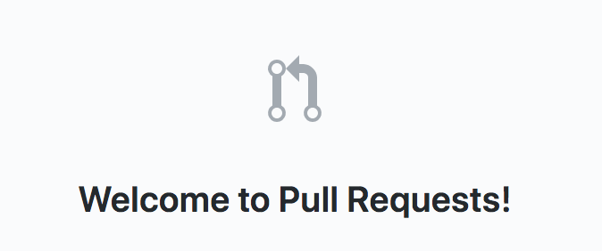
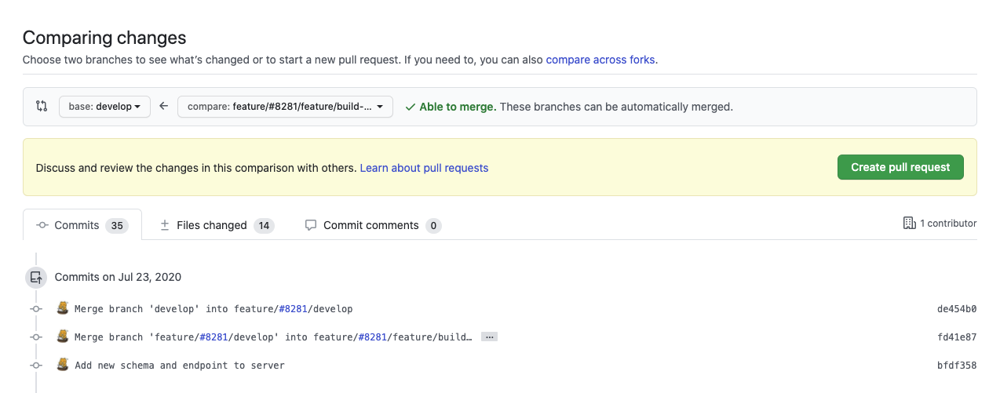
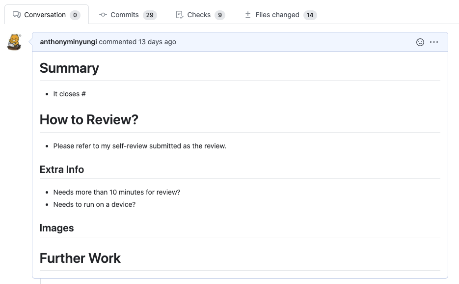

> 본 게시물은 <a target="_blank" href="https://medium.com/hayanmind-tech-blog-kr/%EC%A2%8B%EC%9D%80-pr%EC%97%90-%EB%8C%80%ED%95%9C-%EB%8B%A8%EC%83%81-6586c3f757ac">하얀마인드 기술블로그</a>에 본인이 기고한 글을 옮겨 작성했습니다.  

## 이 글을 쓰게 된 이유

이 내용은 영어로 작성하고 싶었으나, 좋지 못한 영어 실력때문에 남기고자 하는 의미가 왜곡될 수도 있고, 올바른 표현과 어휘를 찾기 위한 시간을 들이기 보다는 글을 더 잘 작성하는 데 집중하고자 한국어로 작성하려고 한다.  

우선 이 주제는 지난 겨울 인턴 시절(당시 나는 Github와 Git을 능숙하게 다루지 못해 이들에 익숙해지기 위한 노력에만 급급했다.)부터 혼자서 계속해서 분투하고 고민하던 것이지만 “계속 하다보면 늘겠지”, “어떻게 처음부터 잘하겠어” 라는 안일한 생각으로 나에게만 편한 PR을 작성하며(당시에는 몰랐지만 지금 생각해보니 그랬던 것 같다.) 시간이 흘렀고, 스스로의 문서 작성 능력과 커뮤니케이션 능력은 전혀 발전하지 못한 채로 지금에 이르게 되었다.

때문에 현재 진행중인 프로젝트에 대한 PR 관리에도 미흡한 자신을 보며 이 문제는 꼭 되짚고 넘어 가야겠다 라는 생각에 작성하게 되었다.

PR을 작성함에 있어, 가장 우선이 되는 요소는 그 PR에 포함된 코드인데, 이 점에 대해서도 고민이 많다. 개인적으로 낯선 분야에 대한, 혹은 낯선 방식으로 작성된 코드는 읽고 이해하는 데에도 많은 시간이 소요되며, 이를 바탕으로 새로운 코드를 작성하려 해도 선행되어야 할 이해가 완벽히 되지 않았으니 그를 되짚고 작성하기를 반복하며 또 많은 시간이 소요된다. 시간 뿐만 아니라 코드의 퀄리티에 대한 고민 또한 자주 하게 된다. 이 고민에 대해서는 이 문서에서는 다루지 않기로 하고, 나중에 기회가 되어 별도의 문서로 남기게 됐으면 좋겠다.

이 문서에서 나는 어떻게 하면 좋은 PR을 작성할 수 있을지에 대한 가르침을 준다거나, 구체적인 가이드라인 및 교육을 제공하려는 것이 아니다. 다만 조금 이기적일 수 있지만 이렇게 글로 남김으로써 스스로 이 고민에 대한 내용들을 머릿속에서 정리하고, 가능하다면 돌파구를 찾아 성장의 발판으로 삼고자 이 글을 남기게 되었다.  

## 좋은 PR이란 무엇인가?

- **먼저, PR이란?**

    

    좋은 PR에 대한 고민을 하다보니, 이 PR이라는 것의 본질과 역할에 대해서도 다시 생각해보게 되었다.  

    PR이란, **Pull Request**의 약자로, 기존 깃허브 저장소에 보관된 코드 베이스에서 내 작업으로 인해 생긴 변경사항들, 즉 코드 라인들의 추가와 삭제를 코드 베이스에 **포함시켜달라고 보내는 요청**이다.  

    우리 회사는 이슈(**issue**)를 통해 작업하고자 하는, 혹은 수행되어야 하는 하위 작업들에 대한 명세를 하고, 그 이슈를 통해 작업 내용을 제한한다. 때문에 이슈 제목과 설명을 통해 이 개발자가 무엇을 하려는 것인지를 알 수 있다. 이를 바탕으로 개발자는 병합의 단위가 되는 기존 코드와 동일하게 복제된 브랜치(**branch**)를 생성해 그 브랜치의 이름을 이슈 번호와 제목으로 구성하여 이 브랜치에서 무슨 작업이 진행되는지를 알게 한다.

    작업을 마치게 되면, 작업 브랜치(사내에서는 `feature/` 라는 디렉토리 형식의 컨벤션을 사용하고 있다)를 베이스 브랜치(`develop`이라는 이름의 개발이 완료된 단계의 코드가 모여있는 브랜치)에 병합(**merge**)하기 위한 요청을 보낸다. 이를 Pull Request라고 하며, 앞서 서술한 내용대로, 작업 내용을 명세하는 이슈를 바탕으로 브랜치를 생성 후 PR을 열기 때문에, 대개 1 branch 1 PR로 작업한다(명시적인 컨벤션인지는 잘 모르겠으나 개인적으로 생각하기에 그렇다). 이 PR에서는 아무렇게나 작성된 혹은 제대로 동작하지 않는 코드가 포함되거나 기존 코드의 무분별한 삭제 등을 막기 위해 회사에서는 코드 리뷰(**review**)를 거쳐 이 코드가 베이스 브랜치에 포함되어도 될지 승인(**approve**)하거나 변경 요청(**change request**)를 통해 결정되도록 하는 검증 절차를 통과하도록 규정하고 있다.

- **코드 검증 절차**

    

    앞서 설명한 것처럼, 자신의 작업 내용이 반영되어야 한다면 반드시 자신의 작업 브랜치로부터 베이스 브랜치로의 PR을 열고 작업 내용에 대한 리뷰를 통해 승인을 받은 뒤 병합해야 한다.

    > **그럼 누구에게 review를 요청해야 하는가?**
    >
    > *이는 생각보다 간단한 문제이다. 자신이 Github를 통해 작업하기로 한 내용에 대해서 사전에 논의한, 혹은 작업을 배정한 이가 있을 것인데, 그 분에게 리뷰를 요청하면 될 것이다. 혹여 그런 사람이 없다면, 본인을 담당하고 있는 매니저나 임원분들과 논의를 통해 리뷰어를 지정하는 과정이 필요할 것이다. 만약 코드를 추가하는 것이 아니라 변경하는 경우에는 Github 저장소 내 커밋 기록, 에디터의 Git 플러그인(예: GitLens) 등을 통해 그 코드의 최초 작성자를 리뷰어에 포함시키는 것도 하나의 방법으로 생각해볼 수 있다.*

    위 사진에서 보이듯이, 우리 회사는 저장소 내에 Pull Request에 대한 템플릿을 가지고 있다. 이 양식은 **리뷰어를 위한 첫 번째 가이드라인**이다. 이 브랜치와 작업 내용이 어떤 이슈와 연결되어 있는지, 어떤 작업을 어떤 식으로 진행했으니 무엇을 중점적으로, 혹은 어떤 순서에 의거하여 리뷰를 진행하면 되는지에 대한 안내와 관련 부가 정보들을 포함한 간략한 설명을 리뷰를 요청하는 사람이 작성하게 된다.

    이어서, **리뷰어를 위한 두 번째 가이드라인**으로, 변경 사항이 적지 않거나 구조가 복잡해진 경우에는 리뷰를 요청하는 사람이 자신의 작업 내용을 ‘셀프 리뷰’하면서 **리뷰 가이드**(Review guide)를 작성하는 것이다. PR 웹페이지 내에서 자신의 변경사항 한 줄 혹은 몇 줄마다 자신이 작성한 코드에 대한 조금 더 자세한 설명을 적는다. 보통은 이 코드에 사용된 기법, 혹은 추가된 위치에 대한 근거, 특정 라이브러리를 사용한 이유 등에 대해 적고, 그에 대한 결과(client 단의 작업이라면 UI상의 변화, server 단의 작업이라면 로그 등)를 보여주는 것이 좋다. 이를 위해서라도 자신이 수행한 작업에 대한 내용은 **반드시 의도한 바대로 동작하는지 테스트**를 해보고, 기존 프로덕트의 성능에 영향을 주지 않는지를 점검해야 한다.

    경험해본 이들은 알겠지만 코드 변경 사항을 리뷰하는 것은 꽤나 골치아픈 일이다. 이러한 사전 정보들조차 없다면 이 부분을 왜 이렇게 변경했는지에 대한 의도와 근거 등을 문답하는 데에만 매우 길고 불필요한 시간이 소모될 것이다. 때문에 리뷰를 요청하는 사람에게도 리뷰어를 배려하는 태도를 바탕으로 한 구체적인 설명을 작성하려는 노력이 필요하고(물론 리뷰 요청을 하기 전에 먼저 코드를 명확하고 근거있게 작성해야 한다.), 리뷰어에게도 정확히 부가적인 논의 혹은 수정이 필요한 부분에 대해 정확하게 지적할 수 있는 능력과 이를 잘 전달하기 위한 노력이 필요할 것이다. 간혹 크기가 큰 PR이거나 논의가 필요한 사안을 포함하고 있는 경우, 아예 리뷰어와 시간을 따로 잡고 공동 리뷰(Co-review)를 진행하는 경우도 있다.

    방금 이야기 한 것처럼 PR 내에서의 리뷰이와 리뷰어 **모두에게 필요한 공통적인 노력은 의사소통**이다. 작성된 코드를 매개로 서로의 시간을 절약해주기 위해 절제되어 있으면서도 구체적인 의사소통을 통해 작업 내용에 대한 검토를 빠르고 정확하게 마치는 것이 바람직한 검토 과정이라 할 수 있다. 이를 달성하기 위한 방법에 대해서는 뒤에서 조금 더 자세히 고민해보도록 하겠다.

## 평소 내가 하던 방식 (+ 어떤 PR이 안 좋은 것인가?)

이 부분을 어떻게 작성하면 좋을까 생각하다가, 내가 작성했던 지난 PR들 중 대표적인 사례 몇 개를 골라 돌이켜 보면서 구체적으로 어떤 점이 미흡했는지, 무엇이 어떻게 잘못됐는지에 대한 회고와 논평을 해보려고 한다.
> 원문에는 PR 링크가 포함되어 있지만, Private 저장소의 PR이기 때문에 링크를 제거하였다.

- **#6954**

    이 PR은 약 반년 전 회사 내 백오피스인 TMS에 검색 기능을 도입하면서 검색 입력부 UI와 Algolia를 활용한 API 동작 및 결과를 보여줄 화면 UI를 구성하기 위해 작업했던 PR이었다. 이 PR에서의 문제는 무엇이냐면, **PR의 규모를 너무 크게 가져갔다는 것**이다. 당시엔 Github를 능숙하게 다루지 못하던 시절이고 어떤 효율적인 작업 흐름이나 기법에 대해서 크게 고민을 하지 않고 무작정 하던 시기여서 그런 점도 있는 것 같다.  

    그런데 이러한 방식을 취할 때의 단점은, 결론부터 말하자면 리뷰어와 리뷰이 모두가 힘들어진다는 것이다. 왜냐하면 변경사항의 규모가 크기 때문에(이 PR은 추가된 라인이 800여 줄에 이른다. 상당히 많은 양이다.) 리뷰이의 입장에서는 아무리 코드를 완전하게 작성하려고 해도, 한번에 많은 양의 코드를 작성하게 되면 자신이 테스트 해본 부분 이상의 예상치 못한 오류가 무더기로 발견되는 경험을 할 가능성이 높아진다. 그렇게 되면 수정하고 반영해야할 사항들이 많아지고, 그만큼 PR은 계속해서 커져만 가게 된다.  

      > <i>여기서 **PR이 커진다** 라는 문장의 의미를 단순히 변경사항의 수치로만 판단하지 않고, Conversation의 개수와 그 내용의 퀄리티에도 영향을 받는다고 생각했다. 왜냐하면 변경사항은 예를들어 dependency들의 무더기 업데이트로 인해 `yarn.lock` file에 추가된 변경사항이 천 단위로 많은 경우도 있을 수 있고, 코드를 무성의하게 작성하는 등의 이유로 변경 요청 등의 리뷰어와의 논쟁이 길어지는 경우 Conversation의 개수는 계속 늘어만 갈 것이기 때문이다.</i>

    리뷰어의 입장에서는, 대량의 변경사항을 한 곳에서 보고 코드의 적합성을 판단해야 하기 때문에 전체적인 시각에서 볼 수 없게 되는 경우가 있을 수 있다. 코드의 동작 여부는 해당 브랜치로 이동해 직접 실행을 시켜보면 알수 있겠지만, 변경사항은 PR 페이지 내에서 확인하고 검토해야 하기 때문에 한 PR에 장시간을 투자해야 하며, 한 번의 리뷰로는 끝나지 않을 것이기 때문에 이 과정을 반복하게 되어 쉽게 피로해질 수 있을 것이다.

    이 부분에 대해서는 최근을 돌이켜봐도 아직도 잘 지켜지지 않고 있는 것 같다. 이 부분의 개선 방향은 뒤에 나올 본론에서 더 자세하게 정리된 생각을 적어보도록 하겠다.

- **#7255**

    이 PR은 겨울 인턴 끝자락에 검색 기능 구현 당시 함께 작업한 내용이다. 닫힌 채로 무덤에 들어가있던 PR을 다시 입사하면서 되살려내어 작업했다. 이 PR에서는 두 가지를 살펴볼 수 있는데, 우선 이들는 나의 기초적인 부분에서의 실수들로부터 기인하였다. 무엇이냐면, 기존 코드에 부가적인 내용을 추가하면서, 컨벤션과 벗어나게 변경될 수 있는 자동 코드 포맷팅을 비활성화 하지 않았고, 리뷰를 반영 중일 때 다시 작업중이라는 표시를 하지 않았다는 것이다. 이들을 제외하고는 이 PR내에서 큰 어려움을 겪지는 않았고, 여기서 하고싶은 말은 아래에서 자세하게 정리하겠다.

- **#7253**

    이 PR도 위의 것과 연관된 내용이다. 이제 와서 말이지만, 다시 인턴을 시작하자마자 이 코드들을 다루게 되면서 이 코드의 원래 동작을 파악하는 데 많은 시간을 소모하면서도 한편으로는 빨리 끝내고 싶은 마음에 억지로 끼워맞춘 감이 없지 않아 있다. 스스로가 무엇을 하고 있는지도 모르는데 어떻게 좋은 PR을 작성할 수 있겠는가? 이 PR에서 내가 적은 *"알 수 없는 오류가 발생해서 다른 방식을 취했다"*와 같은 말은 **절대로** 밖으로 뱉어내서는 안 될 아마추어같은 생각이다.

## 어떻게 하면 더 잘 할 수 있을까?  

사실상 이 부분이 본론이다. 스스로의 고민 과정을 정리하고 돌이키다 보니 서론이 길어졌다. 본론에서는 **어떻게 하는 것이 옳은 방향인가** 에 대한 내용을 나 자신에게 하는 말이기도 하므로 명령문을 함께 포함하여 작성하겠다.

### 리뷰어를 배려하라

- **코드 컨벤션을 잘 지켜라.** 깔끔하고 잘 동작하는 코드를 만들기 위해서 정해 놓은 규칙인데 이를 무시하거나 인지하지 못한 채로 커밋을 작성하게 되면 이에 대한 리뷰가 먼저 들어올 것이다. 이는 불필요한 코멘트이고 시간 낭비가 될 수 있으니 지양하는 것이 좋다.  

- **리뷰 가이드라인을 잘 작성해라.** 모든 코드 변경사항에는 의도가 필요하다. 의도치 않게 변경된 부분이 있다면 되돌려 놓아야 하고, 줄바꿈과 같이 아주 단순한 변경사항이라도 그 부분을 리뷰어가 볼 필요가 없다면 “Just line change” 와 같은 코멘트를 달아 명시하여 리뷰 시간을 줄여줄 수 있을 것이다. 또는 사용된 라이브러리 업데이트가 포함되었다면 해당 라이브러리의 릴리즈 노트 링크나 스크린샷을 첨부하는 것도 좋은 방법이다.  

- **작업중, 리뷰 가능 여부를 잘 명시해라.** 아직 코드를 작성 중일 때에는 \[WiP\] 를 타이틀 앞에 추가하고, 만약 작업이 끝났으면 이를 제거하고 review-needed 태그를 설정해라. 그러나 한 번 작업을 마쳤다고 끝난 것이 아니기 때문에 리뷰를 반영하는 중에도 이 과정을 반복하여 명시하라.

### 내가 쓴 코드는 내가 책임져라

- **자신이 작성한 코드에 대해서는 100% 이해하라.** 위에서 언급한 것처럼 모든 변경사항에는 근거가 필요하다. 내가 만들어낸 변경사항임에도 스스로 납득하고 있지 못하거나 남에게 설명할 수 없다면, 그것은 스스로 짠 코드라고 할 수 없다. 기존에 존재하는 소스코드를 복사 붙여넣기 한 뒤 세부사항만 바꿔 넣는 상황이더라도 그 기존의 코드가 어떻게 동작하는지에 대해서는 당연히 이해하고 있어야 할 것이다. 자신이 완벽하게 이해는 못했지만 정상적으로 동작하며 필요한 코드라면 해당 라이브러리의 공식 문서를 참조해 자신의 코드에 대한 근거를 획득하고 나아가 코드를 이해하는 데에도 도움이 될 것이다.  

- **무엇을 알고 무엇을 모르는지를 명확히 해라.** 위에서 서술한 내용과 같은 흐름이지만 조금 다르다. 자신이 어디까지 알고, 어디부터는 모르겠는지를 스스로 파악할 수 있다면 머릿속으로 정리가 명확해질 것이다. 아는 부분에 대해서는 자신의 근거를 들어 설명하면 되고, 모르는 부분에 대해서는 신빙성 있는 문서들과 자료들에 의해 학습을 한 뒤 그들을 근거로써도 활용할 수 있다. 이 내용은 경험을 통해 힘들지만 코드 작업을 함에 있어 꼭 필요한 과정이라고 생각했다.  

### 반드시 테스트하라

- 베이스 브랜치에 포함되기 위한 코드는 모두 **정상적으로 동작**해야 한다. 너무도 당연한 얘기지만 리뷰어가 내 코드를 직접 돌려보고 테스트하도록 만드는 것보다 내가 직접 돌려본 결과 이상이 없다는 것을 증명하는 것이 더 빠르고 효율적인 방법이다. 예를 들어, 앞서 셀프리뷰에 대해 이야기할 때에도 언급한 것처럼 PR에 포함된 결과물에 대한 스크린샷, GIF, 혹은 라이브 데모가 가능하도록 샘플API를 첨부할 수도 있다. 만약 직접 실행을 통해 확인이 필요한 기능이라도 스스로 검증한 내용은 첨부하되, 어떻게 테스트하면 될지에 대한 가이드라인을 리뷰어에게 주는 것 또한 하나의 방법일 것이다.  

### 자신의 예상 작업량을 잘 측정하라

- **잘 재고, 잘 쪼개라.** 자신이 해야할 업무 분량에 대해서 명확하게 계산이 되어야 한다. 그래야만 큰 PR을 만들지 않고 일정 단위로 잘 분리된 여러 개의 PR을 빠르고 정확하게 리뷰받고 병합할 수 있다. 예를 들어 작업이 UI 컴포넌트 개발이라면 그 내부에 필요한 하위 컴포넌트들을 먼저 성질 단위로 나누어 작업할 수도 있고, API 개발이라면 그 기능과 동작에 따라 분리하여 작업할 수도 있을 것이다. 이 부분은 나에게도 연습이 더 필요할 것 같다.  

- **이슈 베이스 브랜치를 활용하라.** 잘 분리한다 하더라도 결국에는 그 전체가 합해져야만 정상적으로 동작하는 완성된 하나의 기능일 경우가 있다. 그럴 경우에는 이슈에 전체 기능에 대한 명세와, 그 분리될 작업에 대해서도 상세히 기술한다. 그 뒤에 `feature/#1234` 처럼 브랜치를 만든 뒤, 이 하위에 `feature/#1234/develop` 과`feature/#1234/feature/separate-task`  와 같이 새로운 베이스 브랜치와 세부 작업에 대한 브랜치를 두고 작업하게 되면, 작은 크기의 PR을 만드는 데 도움이 될 것이다.

## 결론

글을 두서없이 작성하다 보니 길어지게 되었다. 이 또한 고쳐 나가야 할 점 중 하나라고 생각한다. 본론에서 언급한 여러 개선사항들은 나에게도 더 연습이 필요한 것들이 대부분이다. 사실 PR을 통한 커뮤니케이션에 있어 나에게 어떤 문제가 있긴 한데 그 문제가 무엇인지 머릿속에서 명확하지가 않아 답답했다. 그래서 이 글을 작성하게 되었으며, 정리하고 보니 스스로의 문제가 무엇인지 조금 더 명확해졌고, 어떻게 고쳐나가야 할 지도 더 생각해볼 수 있게 되었다. 이 글은 사실 회사의 미래의 주니어 개발자에게 전하는 이야기에 더 초점이 맞춰져 있긴 하지만, 당장은 스스로에 대한 고민을 정리한 글이기 때문에 많은 분들에게 생각해볼만 한 주제가 된다면 좋겠다.  

긴 글 읽어주셔서 감사합니다 😂
