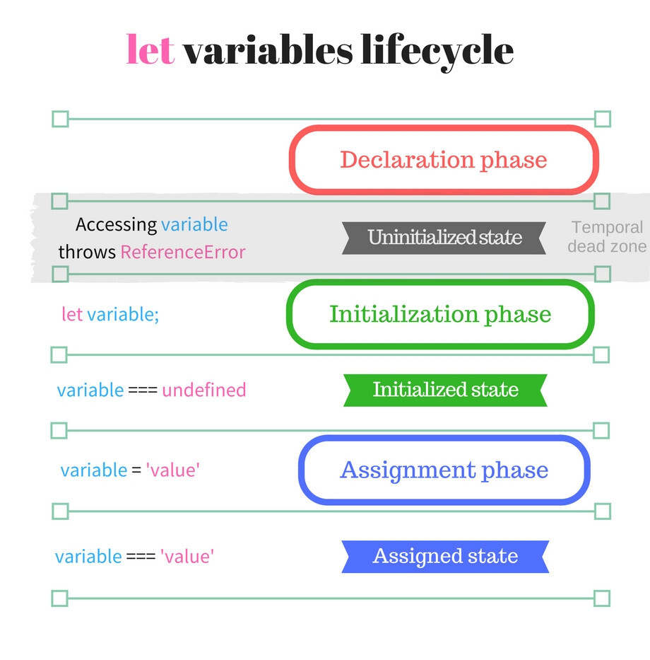
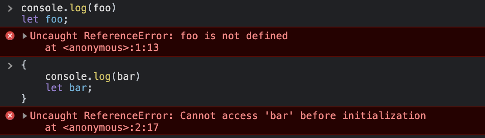
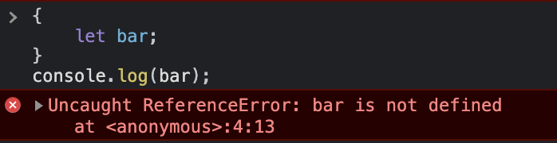
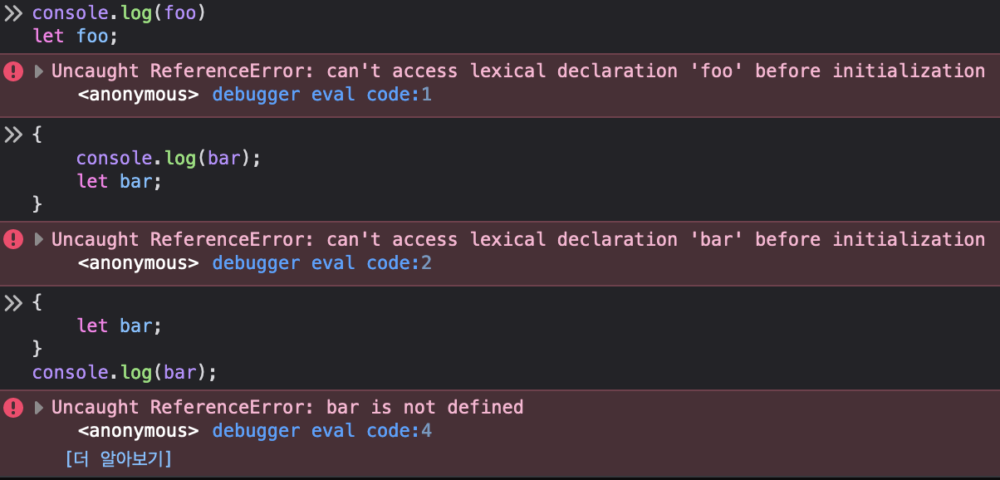
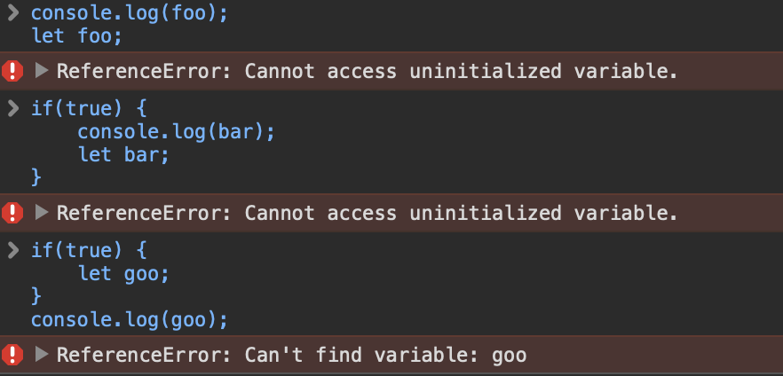
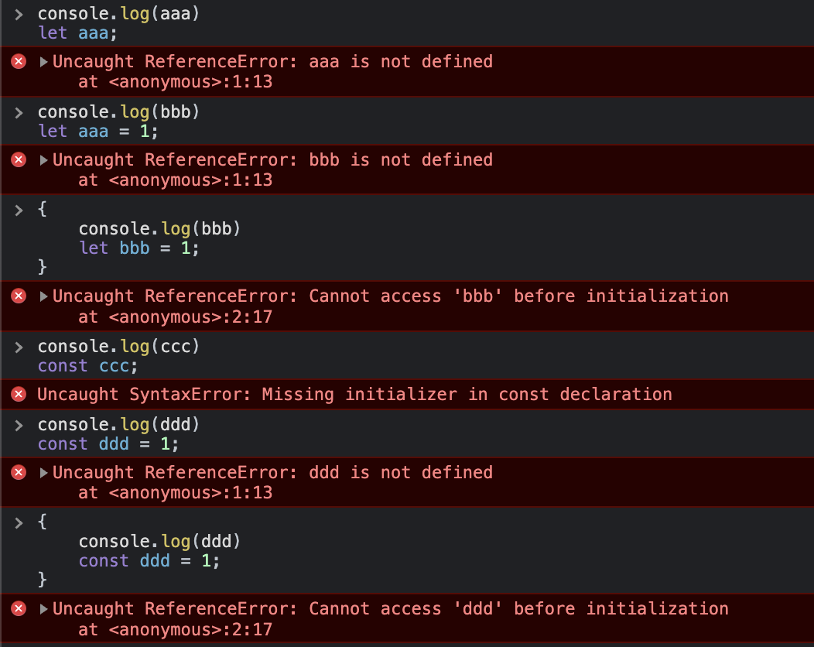

## 의문의 출발점

최근 모던 자바스크립트 Deep Dive 책의 15챕터 ‘let, const 키워드와 블록 레벨 스코프’를 공부하다 보니 아래와 같은 두 가지 예제를 만나게 되었다.

```js
// 런타임 이전에 선언 단계가 실행된다. 아직 변수가 초기화되지 않았다.
// 초기화 이전의 일시적 사각지대에서는 변수를 참조할 수 없다.
console.log(foo) // (#1) ReferenceError: foo is not defined

let foo // 변수 선언문에서 초기화 단계가 실행된다.
console.log(foo) // undefined

foo = 1 // 할당문에서 할당 단계가 실행된다.
console.log(foo) // 1
```

let 키워드와 var 키워드와의 차이점 중 변수 호이스팅에 대해 비교하여 설명하는 흐름 중간에 나온 내용으로,

> var 키워드는 자바스크립트 엔진에 의해 스코프의 최상단으로 호이스팅 되며 선언과 (암묵적) 초기화 단계가 함께 수행되어 선언 이전에 참조하더라도 오류가 발생하지 않고 `undefined`를 출력하게 되고,
> let 키워드는 선언 단계와 초기화 단계가 분리되어 진행되기 때문에 스코프의 시작 지점부터 초기화 단계가 수행되는 변수 선언문 이전까지 변수를 참조할 수 없는 구간이 생기고, 이를 일시적 사각지대, **TDZ**라고 부른다.

라는 내용을 설명하다가 등장한 예시였다.

아래는 let 변수의 생명주기와 일시적 사각지대, 그리고 TDZ에 대해 설명하는 그림이다. ([출처](https://noogoonaa.tistory.com/78))


이어서, let 키워드로 선언한 변수는 변수 호이스팅이 발생하지 않는 것처럼 보이지만, 실제로는 그렇지 않다는 것을 보여주는 다음의 예제이다.

```js
let foo = 1 // 전역 변수

{
  console.log(foo) // (#2) ReferenceError: Cannot access 'foo' before initialization.
  let foo = 2 // 지역변수
}
```

let 키워드로 선언한 변수에서 변수 호이스팅이 발생하지 않는다면 전역 변수 foo의 값을 출력해야 하지만, 블록 스코프에서도 최상단으로 호이스팅이 발생하기 때문에, 두 번째 foo에 대한 참조 에러가 발생한다.

그런데 나는 여기서 문득 위 두 예제의 각 **#1**, **#2** 에 해당하는 참조 에러의 차이가 왜 발생하는지 궁금해졌다.

위 2가지 예제에서 의문의 핵심이 되는 부분만 축약하면 아래와 같다.

```js
console.log(foo) // ReferenceError: foo is not defined
let foo = 1

// -----

{
  console.log(bar) // ReferenceError: Cannot access 'foo' before initialization.
  let bar = 213
}
```

한차례 이상 블록으로 래핑된 스코프에서건, 전역 스코프에서건 var 키워드와 달리 전역 객체의 영향을 받지 않는 let 키워드를 사용한 변수에서는 동일한 생명주기와 동일한 TDZ를 가지게 되어야 할 텐데, 출력되는 에러는 동일하지만 메시지가 다르다는 점이 의아했다.

에러 메시지를 각각 내 나름대로 해석해보면

- `foo is not defined`
  - foo 라는 변수가 정의되지 않았다, 즉 스코프 내에서 해당 식별자를 아예 찾을 수 없다는 의미.
- `Cannot access ‘foo’ before initialization`
  - 위에서 살펴본 것처럼, let 키워드는 선언과 초기화 단계가 분리되어 있기 때문에 호이스팅 이후, 초기화 되기 이전에 참조할 수 없다는 의미.
  - 내가 이해한 대로면 이 오류가 발생하는 영역이 TDZ인 것으로 해석된다.

예제의 오류인지 아닌지를 체크해보기 위해 이를 직접 출력해보기로 했다.

## 콘솔 출력 테스트

### Chrome 콘솔


예제와 동일하게 출력된다. 그렇다면 예제가 잘못된 것이 아니라는 얘기가 되는데…
그런데, 위에서 내가 해석하는 메시지의 의미대로 살펴보면 아래의 경우 반증이 된다.

블록 내에서 선언한 블록 스코프 변수를 블록 외부에서 참조하려고 했을 때, 내가 생각한 것처럼 “해당 스코프에서 식별자를 찾을 수 없기 때문에” not defined가 출력되고 있다.
그러면 왜 전역 스코프에서는 “정의되지 않았다” 라는 메시지가 출력되고, 명시적인 블록 스코프 내에서는 “초기화 이전에 접근할 수 없다”고 나오는걸까?

위 결과를 보고 다른 브라우저에서도 동일한 결과를 나타내는지 궁금해서 출력해 비교해보기로 했다.

### Firefox 콘솔


내 가설과 동일하게, 블록 여부와 관계 없이 동일 스코프 내의 TDZ 구간에서 초기화되지 않은 변수를 참조할 경우 초기화 관련된 참조 오류 메시지가 발생하고
스코프를 벗어난 영역에서 변수를 참조하려고 하는 경우에는 정의되지 않았다는 메시지가 발생한다.

### Safari 콘솔


마찬가지로 Safari에서도 FireFox와 동일하게 지역 스코프인지 전역 스코프인지에 관계 없이 동일 스코프에서 TDZ 구간에 있는 변수를 참조할 때는 초기화 관련 메시지를, 다른 스코프의 변수를 참조하는 경우 정의되지 않았다는 메시지를 출력한다.

> Safari에서는 다른 브라우저와 달리 단순 `{ }` 블록은 정상적은 블록으로 인식하지 않는 것 같아 (참조 오류가 아닌 별개의 오류를 뱉음) 정상적인 블록 구문인 if문을 활용해 예시를 출력했다.



혹시나 싶은 마음에 여러 경우의 수를 테스트해봤지만 역시나 전역 스코프에서의 TDZ는 예상했던것과는 다르게 동작하는 것 같았다.

> const 키워드의 경우에는 var, let과 달리 변수에 값을 재할당하는 것이 불가능하기 때문에 선언과 동시에 초기화 하는 문이 함께 작성되어야 해서 “Missing initializer”라는 오류를 출력하고 있다.
> 하지만 정상적으로 초기화된 경우라면 let의 경우와 마찬가지로 전역 스코프에서는 "정의되지 않음", 블록 스코프에서는 "초기화되지 않은 변수에 접근" 오류가 발생하고 있다.

## 잠정적 결론

이쯤 살펴보고 나니 처음과 질문이 조금 달라졌다.

**왜 크롬에서만 예상했던것과 다르게 동작할까?**

위에서 실험해본 것처럼 브라우저마다 콘솔에서 각기 다른 결과와 에러 메시지를 출력하게 되는 것은 브라우저마다 각기 다른 자바스크립트 엔진을 사용하기 때문인데, 크롬은 [V8](https://github.com/v8/v8) 엔진을 채택하고 있다.

즉, 이는 Chrome 브라우저의 V8 엔진에서 let 키워드의 스코프에 대해서 FireFox의 SpiderMonkey, Safari의 Webkit과는 다르게 처리하고 있다는 것을 의미한다.

이 궁금증을 명쾌하게 해결하기 위해 V8엔진의 코드에서 스코프를 처리하는 부분을 살펴보면 좋을 것 같은데, 나는 V8엔진의 코드가 작성된 주력 언어인 C++에 대해서 잘 알지 못하기도 하고, V8 자체가 워낙 거대한 코드베이스를 가지고 있다보니 쉽사리 뜯어볼 엄두가 나지 않는 것이 사실이다.

우선은 현재는 이 궁금증을 정리한 것으로 만족하도록 하고, 가능하다면 가까운 미래에 V8 엔진의 스코프 관련 에러 처리의 프로세스를 함께 살펴보는 2편으로 돌아오기로 하자.

_Comming Someday…_
