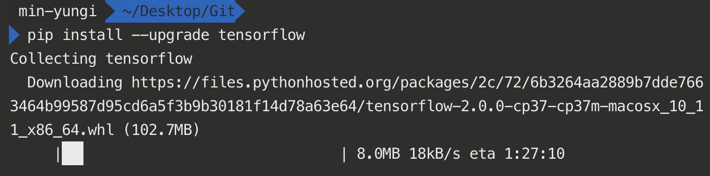

> 이 포스팅은 <a target="_blank" href="https://www.inflearn.com/course/%EA%B8%B0%EB%B3%B8%EC%A0%81%EC%9D%B8-%EB%A8%B8%EC%8B%A0%EB%9F%AC%EB%8B%9D-%EB%94%A5%EB%9F%AC%EB%8B%9D-%EA%B0%95%EC%A2%8C#">인프런 머신러닝 강좌</a>를 수강하며 공부한 내용을 정리한 것입니다.
>
> > 사실 이 강좌에 대해서 접한 지는 꽤 오랜 시간이 지났는데, 수강하게 된 것도, 이 분야를 접하게 된 것도 지금에 와서야 라서 아쉬운 감이 있다.

##섹션1. 머신러닝의 개념과 용어

###머신러닝이란 무엇인가?  
머신러닝은 일종의 소프트웨어, 프로그램.  
우리가 보는 앱과 같은 프로그램은 explicit programming.  
주어진 환경에서 특정한 반응을 하도록 만들어 두었기 때문에.  
스팸 필터, 자율 주행과 같은 경우에는 Too many rules에 부딪히는 한계.  
1959년 Arthur Samuel에 의하여 제안된 개념으로  
명시적으로 프로그래밍 하지 않고 컴퓨터가 스스로 학습할수 있는 능력을  
부여하는 것에 대해 연구하는 분야를 머신 러닝이라고 한다.

###학습하는 방법  
####Supervised learning  
어떤 레이블들이 정해져 있는 데이터(=Training set이라고도 함)를 갖고 학습하는 것.  
일례로, 이미지를 주고, cat, dog, mug, hat 등등을 식별하게 하는 것도  
각 이미지에 식별 대상에 대한 정보인 label를 달아서 데이터를 제공 받아서 학습한 것이다.

####Unsupervised learning  
일일히 label을 주어서 학습할 수 없는 경우.  
supervised learning과 반대되는 개념이다.  
예로, 구글 뉴스는 자동적으로 유사한 뉴스들을 그루핑해주는데,  
이 경우에는 그 전에 미리 label을 정해주기 어렵다.
word clustering과 같은 경우에도 마찬가지.

> 이 강좌에서는 주로 지도 학습(Supervised learning)에 대하여 다룰 것아다.

####ML에서의 일반적인 문제 유형

- Image labeling
- Email spam filter
- Predicting exam score

####Training data set
특정한 입력 값 x와 결과 값 y로 이루어진 label을 제공하여  
어떠한 임의의 입력을 주었을 때, 그에 맞는 결과가 나오게끔  
ML 모델이 학습하도록 하는 data set, 즉 앞서 말한 label을 말한다.
반드시 필요하다.

AlphaGo를 예로 들면, 기존에 존재하던 바둑 기보들이 학습을 위한 training data set이  
될 것이고, 이세돌 9단과 대국 중에 놓여진 바둑판의 정보가 입력이 되며, 알파고가 돌을 두는 위치가
출력이라고 할 수 있다.

####지도 학습의 유형
Predicting final exam score based on time spent 을 기준으로 예를 들어

- 이를 넓은 점수 범위에 대해서 예측하는 것을 **regression** 이라고 한다.

* regression model

| <center>x(hours)</center> | <center>y(score)</center> |
| :-----------------------: | ------------------------: |
|    <center>10</center>    |       <center>90</center> |
|    <center>9</center>     |       <center>80</center> |
|    <center>3</center>     |       <center>50</center> |
|    <center>2</center>     |       <center>30</center> |

- 혹은 pass/fail과 같은 이분법적으로 나누어 예측하는 것을  
  **binary-classification**이라고 한다.

* binary-classification model

| <center>x(hours)</center> | <center>y(score)</center> |
| :-----------------------: | ------------------------: |
|    <center>10</center>    |        <center>P</center> |
|    <center>9</center>     |        <center>P</center> |
|    <center>3</center>     |        <center>F</center> |
|    <center>2</center>     |        <center>F</center> |

- 문자화된 grade를 매기려고 하는데, A,B,C,D,F와 같이 점수를 매기는 것을 예측하려고 한다면  
  **multi-label classification**이라고 한다.

* regression model

| <center>x(hours)</center> | <center>y(score)</center> |
| :-----------------------: | ------------------------: |
|    <center>10</center>    |        <center>A</center> |
|    <center>9</center>     |        <center>B</center> |
|    <center>3</center>     |        <center>D</center> |
|    <center>2</center>     |        <center>F</center> |

###TensorFlow
Tensorflow란 Machine intelligence를 위한 Open source library이다.  
당시(꽤 오래 전 강좌이므로) Github 내에서 여러 딥러닝 오픈소스 라이브러리들을 컨트리뷰션과 이슈, 포크 수 등으로  
점수를 매겨서 나열했을 때, 여러 방식으로 점수를 매겨봐도 TensorFlow가 단연 일등이다.

####TesnorFlow란 무엇인가?

> data flow graph를 사용하여 numerical computation을 할 수 있는 오픈소스 소프트웨어 라이브러리다.(그리고 Python 사용!)

####What is data flow graph?

_그래프 안의 노드들은 각각 어떠한 수학적 연산을 의미한다._  
_그 노드들 사이의 edge들 (다른 말로 tensor들)은 다차원의 data array를 의미하며_  
_상호작용하는 데이터라고 볼 수 있다. 이처럼 DFG내에서 Tensor들이 흐른다고 하여_  
_TensorFlow라고 부른다고 한다._

####Installing TensorFlow

```bash
(sudo -H) pip install --upgrade tensorflow
```



꽤 오래걸린다. 한시간 내외 가량 소요되는 듯하다.  
이건 예상 못했기 때문에 이 부분에 대한 실습 관련 내용은  
추가적인 포스팅으로 다루도록 해야겠다.

> 실습과 관련된 코드는 이 코스를 운영하시는 <a target="_blank" href="https://github.com/hunkim/DeepLearningZeroToAll">교수님의 Repository</a>에 있다고 한다.

##섹션2. Linear Regression의 개념.

###Linear Regression의 Hypothesis와 cost

####Predicting exam score: regression
(앞서 예로 들었던) 어떠한 학생이 공부한 시간 만큼 어떠한 성적(0~100)이 나온다는 데이터를 가지고 Supervised learning을 시킨다고 하자.

- regression model

| <center>x(hours)</center> | <center>y(score)</center> |
| :-----------------------: | ------------------------: |
|    <center>10</center>    |       <center>90</center> |
|    <center>9</center>     |       <center>80</center> |
|    <center>3</center>     |       <center>50</center> |
|    <center>2</center>     |       <center>30</center> |

Regression이란 모델이 Training data를 가지고 Regression model이 학습을 하게 되었을 때,  
7시간 공부한 학생에 대한 점수를 요청하면, 그에 대한 y값을 준다는 맥락이다.

| <center>x</center> | <center>y</center> |
| :----------------: | -----------------: |
| <center>1</center> | <center>1</center> |
| <center>2</center> | <center>2</center> |
| <center>3</center> | <center>3</center> |

위와 같은 training data가 있다고 했을 때, regression 모델을 학습시킨다고 하면  
다음과 같은 형태의 그래프가 만들어진다.


####(Linear) Hypothesis

Regression Model을 학습시킨다는 것은 하나의 **가설**을 세울 필요가 있는데

_어떤 Linear한 Model이 우리가 가지고 있는 데이터에 맞을 것이다_

와 같은 것이 **Linear Regression**이라고 한다.  
이것은 굉장히 효과적인데, 세상에 있는 많은 데이터와 현상들이  
이처럼 Linear한 것으로 드러나거나 설명될 수 있는 것이 많기 때문이다.

> 가설을 세운다는 것은 어떠한 데이터가 있다면 거기에 잘 맞는 선을 찾는 과정으로 생각할 수 있다.
> 아래의 그림과 같이 어떤 선이 우리가 가지고 있는 데이터에 잘 맞을까를 찾는 것이 바로 학습을 한다는 것이라고 할 수 있다.


위 그림에서 `H(x)`는 우리가 세운 가설이고, 각 직선들은 `W`와 `b`에 의해서 결정된다.  
이처럼 우리는 우리의 데이터가 이차원 평면에서 일차방정식 `H(x) = Wx + b`  
형태를 따르는 직선이 될 것이라는 가설을 세웠다고 한다.

####어떠한 선이 가장 잘 맞는가?
어떤 `W`와 `b`값이 더 좋은지를 알아낼 수 있어야 한다.
가장 기본적으로는 어떤 가설이 좋은가를 알려면
실제 데이터와 가설이 나타내는 선 사이의 거리를 측정, 비교하여
거리가 멀면 나쁜 것, 가까우면 좋은 것이라 할 수 있다.
이를 Linear Regression에서는 Cost function이라고 한다.

####Cost(or Loss) function
_우리가 세운 가설과 실제 데이터가 얼마나 차이를 보이는가를 나타내는 함수._
`H(x) - y` 로 생각할 수 있지만, +가 될수도, -가 될 수도 있기 때문에
보통 Distance를 계산할 때에는 `(H(x) - y)^2`와 같은 형태로 작성하여
차이를 일정하게 양수로 표현해주고 제곱을 통해 큰 차이는 큰 페널티를 부여하는 중요한 값을 나타내게 된다.
조금 더 formal하게 정리하면 아래와 같다.


여기서, 우리의 가설인 `H(x) = Wx + b`와 같이 주어진다고 했으므로 이를 **cost function**에 직접적으로 대입하게 되면
아래와 같이 `W`와 `b`의 함수로 만들 수 있다.


여기서 Linear Regression의 숙제는, 가장 작은 결과값을 가지도록 하는
`W`와 `b`를 구하도록 하는 것이 Linear Regression의 학습의 목표라고 한다.
