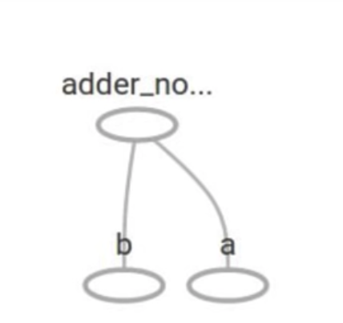
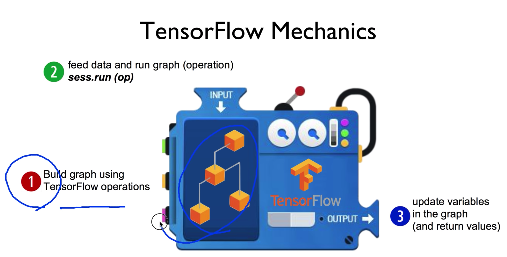
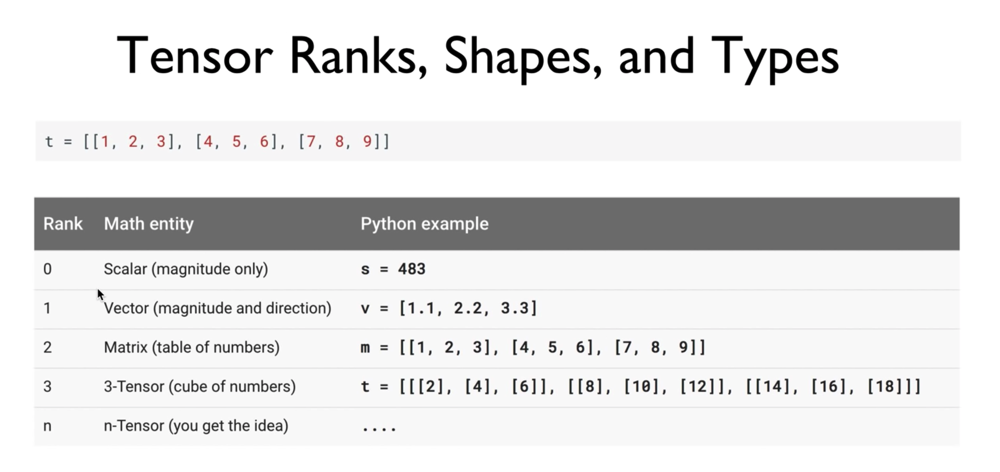
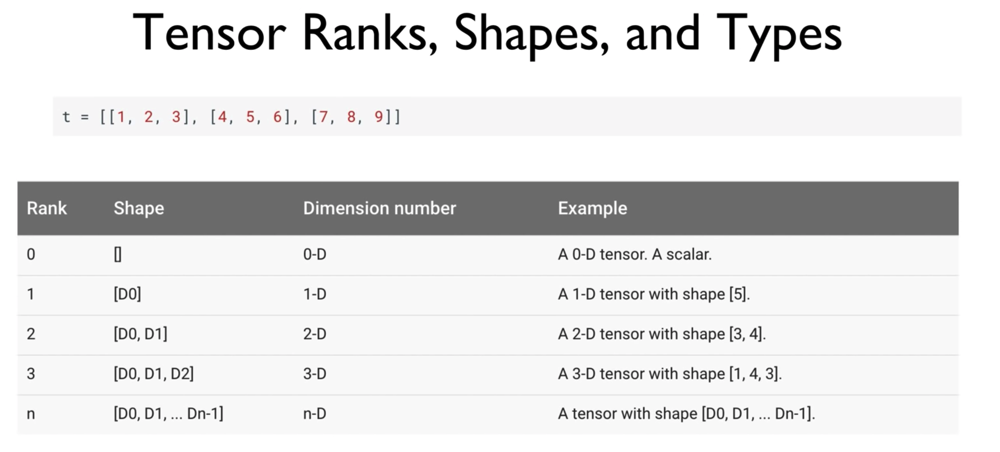
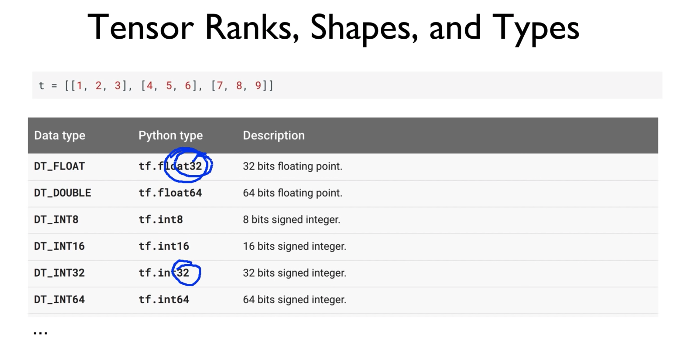

> 이 포스팅은 <a target="_blank" href="https://www.inflearn.com/course/%EA%B8%B0%EB%B3%B8%EC%A0%81%EC%9D%B8-%EB%A8%B8%EC%8B%A0%EB%9F%AC%EB%8B%9D-%EB%94%A5%EB%9F%AC%EB%8B%9D-%EA%B0%95%EC%A2%8C#">인프런 머신러닝 강좌</a> 를 수강하며 공부한 내용을 정리한 것입니다.

###지난 시간에 못한 TensorFlow 실습

###섹션 1 실습 (기본적인 operations)

```python
import tensorflow as tf

hello = tf.constant("Hello, TensorFlow!")

sess = tf.Session()

print(sess.run(hello))
```

위의 코드는 우리가 프로그래밍을 배우면서 가장 흔히 알고, 가장 기본적인 `hello world`를 텐서플로에서 실행하는 코드이다.  
정말 간단하지만, 나 스스로도 텐서플로와 머신러닝을 처음 접하기 때문에, 하나하나 살펴보자면  
_tensorflow_ 를 import 하여 `tf`라는 이름으로 사용하기로 했었다.  
`tf.constant`라는 함수를 호출하여 `"Hello, TensorFlow!"`라는 문자열을 `hello`라는 변수에 저장하는 것이다.  
이렇게 되면 앞서 배운 것과 같이 아무 Edge도 없는 **Data Flow Graph**에 `hello`라는 이름의 하나의 **노드** 가 생긴 것이다.  
여기서 그냥 출력을 해도 되지만, `Computational Graph`를 실행하기 위해서는 `Session`이라는 것을 만들어야 하고  
이 세션을 통해 `.run`을 호출하여 `sess`라는 이름의 텐서플로 세션을 통해 `hello`라는 노드를 실헹하겠다는 것을 의미한다.

이러한 과정을 통해 출력된 결과는 다음과 같다.

```bash
b'Hello, TesorFlow!'
```

여기서 `b`는 **Byte literals**라는 것임을 의미한다.  
바이트 스트링에 대한 자세한 예는 [이 곳](https://stackoverflow.com/questions/6269765/)에 나와있다고 한다.


다음 예제는 위와 같은 Computational Graph를 구현하는 것이다.  
`a`라는 노드와 `b`라는 노드를 하나의 다른 노드로 연결시키는 것이다.  
아래와 같이 작성해보자.

```python
node1 = tf.constant(3.0, tf.float32)
node2 = tf.constant(4.0) #also tf.float32 implicitly
node3 = tf.add(node1, node2) #node3 = node1 + node2

print("node1:", node1, "node2:", node2)
print("node3:", node3)
```

이에 대한 출력 결과는 아래와 같다.

```bash
node1: Tensor("Const_1:0, shape=(), dtype=float32) node2: Tensor("Const_2:0, shape=(), dtype=float32)
node3: Tensor("Add:0, shape=(), dtype=float32)
```

이를 출력하면 텐서플로가 이들은 그저 그래프 안의 **요소(Tensor)**라고 대답한다.  
일반적인 경우처럼 연산에 대한 결과값이 나오는 것이 아니라, 각 Tensor들의 속성에 대한 정보만 출력한다.

> 그렇다면 연산을 실행하려면 어떻게 해야할까?

앞서 `Hello TensorFlow!`를 출력했던 것과 같이 `Session`을 만들어 주어야 한다.

```python
sess = tf.Session()
print("sess.run([node1, node2]): ", sess.run([node1, node2]))
print("sess.run(node3): ", sess.run(node3))
```

이렇게 작성해야 비로소 우리가 얻고 싶은 결과를 얻을 수 있다.

```bash
sess.run([node1, node2]): [3.0, 4.0]
sess.run(node3): 7.0
```

여기까지 공부하면서, 우리는 다음과 같이 정리해볼 수 있다.



텐서플로우는 기존에 우리가 생각하는 프로그램과 약간 다르게 동작한다.

1. 첫 번째로, TensorFlow Operation을 이용해서 **Graph(Tensors)를 빌드**해야 한다.
2. 그 다음, `sess.run`을 통해 data를 넣은 뒤 우리가 만든 **Graph를 실행**시킨다.
3. 그 결과로, 그래프 안에 있는 어떠한 값들이 `update`되거나, 어떠한 값을 `return`하게 된다.

> 그래프는 미리 만들어두고 실행시키는 단계에서 입력을 줄 수는 없을까?

```python
a = tf.placeholder(tf.float32)
b = tf.placeholder(tf.float32)
adder_node = a + b

print(sess.run(adder_node, feed_dict={a: 3, b:4.5}))
print(sess.run(adder_node, feed_dict={a: [1, 3], b: [2,4]}))
```

```bash
7.5
[ 3.  7. ]
```

이처럼 placeholder를 활용하여 처음에 값을 지정하지 않은 노드를 만들 수 있고,  
`feed_dict`를 통해 `sess.run`을 실행하는 과정 중에 동적으로 값을 전달할 수 있다.
**`sess.run(op, feed_dict={x: x_data})`** 와 같은 용법으로 사용할 수 있다.

> Tensor란 그래서 정확히 무엇인가?

기본적으로 배열로 표현되는 모든 것이 Tensor라고 한다.

**Tensor**는 _Rank_, _Shape_, _Types_ 로 나누어 이야기 할 수 있는데,



- **Rank**란 _몇 차원 배열이냐_ 라는 의미에 해당한다.
  - `s = 483` 은 `Rank 0`이며 수학적으로는 _Scala_ 라고 불린다.  
    1차원은 _Vector_, 2차원은 _Matrix_ ...



- **Shape**란 _각 Element에 몇 개씩 들어있는가?_
  - 다시 말해, 각 Rank에 해당하는 element들이 몇 개씩인지를 의미한다.
  - Tensor 설계 시 Shape는 매우 중요한 개념이라고 한다...
  - 예를 들면 아래의 배열은 [2,2,3] Shape이다.

```python
[
    [
        [1,2,3],[4,5,6]
    ],
    [
        [7,8,9],[10,11,12]
    ]
]
```



- **Type**이란 말 그대로 data type을 말한다.
  - 주로 `tf.float32`, `tf.int32`를 주로 사용한다고 한다.

---

내용이 조금 길어지는 것 같아서 나누어 다루어야 할 것 같다.  
~~실습 한 강좌인데 정리하면서 들으려니까 왜이렇게 오래걸리는지...~~
