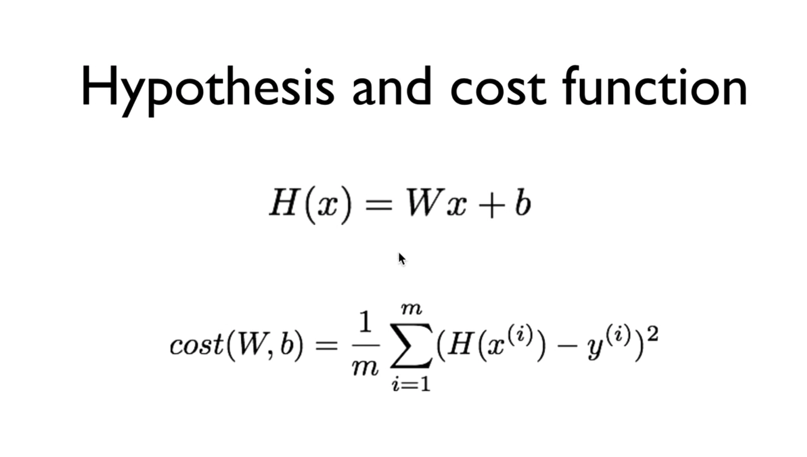
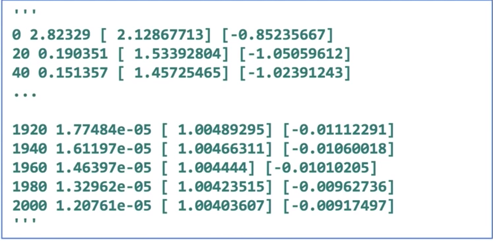

> 이 포스팅은 <a target="_blank" href="https://www.inflearn.com/course/%EA%B8%B0%EB%B3%B8%EC%A0%81%EC%9D%B8-%EB%A8%B8%EC%8B%A0%EB%9F%AC%EB%8B%9D-%EB%94%A5%EB%9F%AC%EB%8B%9D-%EA%B0%95%EC%A2%8C#">인프런 머신러닝 강좌</a> 를 수강하며 공부한 내용을 정리한 것입니다.

###섹션 2 실습 (Linear regression 구현)

####실습하기 전에, Hypothesis와 Cost function 복습!



**Hypothesis**란, 주어진 `x`에 대하여 우리가 <u>예측을 어떻게 할 것인가</u> 라는 것을 말한다.  
이는 `W`와 `x` 의 곱, 그리고 bias와의 합으로 결정된다.  
그리고 이 것을 <u>얼마나 잘 예측했는가를 측정</u>하기 위해 *예측 값*과 *참 값*의 차이의 제곱을 전체 데이터의 개수로 나눈 평균이 바로 **Cost function**이라고 한다.  
따라서 Cost function은 `W`와 `b`에 대한 함수이며, <b><u>학습을 한다</u></b>라는 것은 이 `W`와 `b`를 조작하여 Cost function을 가장 작은 값이 되도록(Minimize) 하는 것이라고 볼 수 있다.

또한 TensorFlow로 실습을 할 때에는 다음과 같은 과정을 진행하는 것이다.(지난 시간 복습)

1. 첫 번째로, TensorFlow Operation을 이용해서 **Graph(Tensors)를 빌드**해야 한다.
2. 그 다음, `sess.run`을 통해 data를 넣은 뒤 우리가 만든 **Graph를 실행**시킨다.
3. 그 결과로, 그래프 안에 있는 어떠한 값들이 `update`되거나, 어떠한 값을 `return`하게 된다.

####1. Build graph using TF operations

```python
# X and Y data
x_train = [1, 2, 3]
y_train = [1, 2, 3]

W = tf.Variable(tf.random_normal([1]), name='weight') # [1] -> 값이 하나인 1차원 array (shape)
b = tf.Variable(tf.random_normal([1]), name='bias')

# Our hypothesis Wx + b
hypothesis = x_train * W + b
```

위의 코드에서 보는 것처럼, `H(x)`를 만들기 위해서 `W`와 `b`를 정의해야 하는데, 이는 TensorFlow의 `Variable`이라는 함수로 정의할 수 있다.  
그런데 이 `Variable`이라는 것은 우리가 기존에 알던 프로그래밍에서의 변수와는 조금 다른 개념인데,
우리가 사용하는 것이 아닌, TensorFlow가 사용하는 변수이고, 텐서플로를 실행시키면 텐서플로가 학습하는 과정에서 자체적으로 변경시키는 값이라고 보면 된다. (**Trainable**한 변수이다.)

텐서플로에서 Variable을 만들 때, 그 변수의 `shape`을 결정하고, 값을 주면 된다.  
여기서는 `W`와 `b`의 값을 모르기 때문에, `tf`의 함수 `random_normal`을 이용해서 shape을 결정하여 정의한다.

```python
# cost/loss function
cost = tf.reduce_mean(tf.square(hypothesis - y_train))
```

위 코드 또한 마찬가지로 위의 그림에서와 같이 Cost function에 해당하는 수식을 그대로 옮긴 것이다.  
`square`라는 함수를 이용하여 예측 값에서 참 값을 뺀 것을 제곱하고, `reduce_mean` 함수를 통해 값을 평균내준다.


그리고 여기서 우리의 목적은 이 <u>Cost를 Minimize</u> 하는 것이기 때문에, TensorFlow에는 여러가지 방법이 있지만 여기서는 **GradientDescent** 라는 것을 이용한다. 지금 단계에서는 그냥 Magic이라고 생각하면 된다.

```python
# Minimize
optimizer = tf.train.GradientDescentOptimizer(learning_rate=0.01)
train = optimizer.minimize(cost)
```

즉, `GradientDescent`를 사용하여 `optimizer`를 정의하고, 그것의 `minimize`라는 함수를 호출하여 우리가 정의한 `cost`를 주면, 텐서플로가 우리가 앞서 정의한 `W`와 `b`를 조정하여 스스로 Minimize하게 된다.  
아직 이 부분은 매직이라고 생각하고, 여기까지가 Graph를 만드는 과정이었다.  
<br />

---

<br />
####2,3 Run/update graph and get results  
그래프를 만들었다고 실행되는 것이 아니므로 아래와 같은 과정을 거쳐야 한다.

```python
# Launch the graph in a session.
sess = tf.Session();
# Initializes global variables in the graph.
sess.run(tf.global_variables_initializer())

# Fit the line
for step range(2001):
    sess.run(train)
    if step % 20 == 0:
        print(step, sess.run(cost), sess.run(W), sess.run(b))
```

앞서 우리는 `W`와 `b`라는 Tesnorflow Variable을 만들어 주었는데, 이를 사용하여 실행하기 전에는 <u><b>반드시</b></u> `global_variables_initializer`을 실행시켜 주어야 한다.

또, 코드의 아랫부분을 확인해보면, `sess.run(train)`을 통해 train 노드만 실행시키는 것을 확인할 수 있는데,  
이는 우리가 위에서 만든 그래프의 대강의 모양새가 아래와 같기 때문이다.


`train`이 루트 노드에 해당하고, 그래프를 따라 들어가서 `W`와 `b`에 어떠한 값을 저장할 수 있게 연결되어 있기 때문에 이러한 방식으로 학습이 일어나게 되는 것이다.

전체의 코드를 실제로 실행시켰을 때의 결과는 아래와 같다.



처음에는 정말 Random한 값이었지만, 학습을 반복할수록 cost는 매우 작은 값으로,  
`W`와 `b`의 값이 우리가 원하는 값(1과 0)으로 수렴하는 것을 볼 수 있다.

####Placeholders

지난 시간에 배운 것처럼, Placeholder라는 개념이 있었는데, 이를 활용해서도 Linear regression을 실행해볼 수 있다.

[관련 자료(스택오버플로우)](https://stackoverflow.com/questions/36693740)

```python
# Now we can use X and Y in place of x_data and y_data
# placeholders for a tensor that will bre always fed using feed_direct
X = tf.placeholder(tf.float32)
Y = tf.placeholder(tf.float32)
...

# Fit the line
for step in range(2001):
    cost_val W_val, b_val, _ = \
        sess.run([cost, W, b, train],
            feed_dict={X: [1, 2, 3], Y: [1, 2, 3]})

    if step % 20 == 0:
        print(step, cost_val, W_val, b_val)
```

위에서 보던 코드와의 차이점은, `X`와 `Y`의 값을 초기에 선언하지 않고, `placeholder`로 선언하여  
`feed_dict`를 통해 실행 도중에 넘겨준다는 점이다.  
그리고 `cost`와 `W`, `b`, `train`에 대해서 각각 `sess.run`을 적용시키는 것이 아닌, *리스트*롤 통해 한번에 넘겨주어 실행할 수 있다.

**placeholder**를 사용하는 가장 큰 이유중 하나는, 우리가 만들어진 모델에 대하여 <u>값을 따로 넘겨줄 수 있다는 것</u>이다.
placeholder를 사용할 때, 물론 `shape`도 부여할 수 있는데,

```python
X = tf.placeholder(tf.float32, shpae=[None])
```

이렇게 작성함으로써, 1차원 array의(`[]`) 개수가 무관하게(`None`) 부여한다는 의미를 갖는다.

다른 학습 모델을 예시로 들어보면,

```python
for step in range(2001):
    cost_val W_val, b_val, _ = \
        sess.run([cost, W, b, train],
            feed_dict={X: [1, 2, 3, 4, 5], Y: [2.1, 3.1, 4.1, 5.1, 6.1]})

    if step % 20 == 0:
        print(step, cost_val, W_val, b_val)
```

`feed_dict`로 넘겨준 값을 통해 유추해 보았을 때, 이는 `1 * x + 1.1`에 대한, 즉 `W = 1` `b = 1.1`를 갖는 Hypothesis를 의미한다고 생각할 수 있다.

학습 결과도 마찬가지로 예상한 결과를 도출한다.


학습 결과에 대해서 **테스팅**을 할 경우에는 아래와 같이 시행할 수 있다.

```python
print(sess.run(hypothesis, feed_dict={X: [5]}))
# [6.10045338]
print(sess.run(hypothesis, feed_dict={X: [2.5]}))
# [3.59963846]
print(sess.run(hypothesis, feed_dict={X: [1.5 3.5]}))
# [2.59931231 4.59996414]
```

<br />

---

<br />

###총 정리


> 아마 이 그림을 통한 텐서플로우의 동작 과정을 이해하는 것이 가장 중요하기 때문에 반복적으로 설명하시는 것 같다. 그런 의미에서 다시 한번 복습!

1. _첫 번째로, TensorFlow Operation을 이용해서 **Graph(Tensors)를 빌드**해야 한다._
2. _그 다음, `sess.run`을 통해 data를 넣은 뒤 우리가 만든 **Graph를 실행**시킨다._
3. _그 결과로, 그래프 안에 있는 어떠한 값들이 `update`되거나, 어떠한 값을 `return`하게 된다._

~~ 다음엔 꼭 한 섹션(이론 + 실습)을 한 편으로 구성해서 작성해야겠다... ~~
