> 이 포스팅은 <a target="_blank" href="https://www.inflearn.com/course/%EA%B8%B0%EB%B3%B8%EC%A0%81%EC%9D%B8-%EB%A8%B8%EC%8B%A0%EB%9F%AC%EB%8B%9D-%EB%94%A5%EB%9F%AC%EB%8B%9D-%EA%B0%95%EC%A2%8C#">인프런 머신러닝 강좌</a> 를 수강하며 공부한 내용을 정리한 것입니다.  
> <a target="_blank" href="https://github.com/hunkim/DeepLearningZeroToAll">코드 출처</a>

~~이론 부분에 해당하는 내용은 수식을 표현하는 플러그인을 잘 다룰줄 몰라서 사진으로 찍을수밖에 없어 길어진다...~~

## Lecture 3. Linear Regression cost 함수 최소화

### How to minimize cost

#### Cost(W)은 어떻게 생겼을까?

---

설명을 위해, Hypothesis를 간소화시켜 살펴보자.

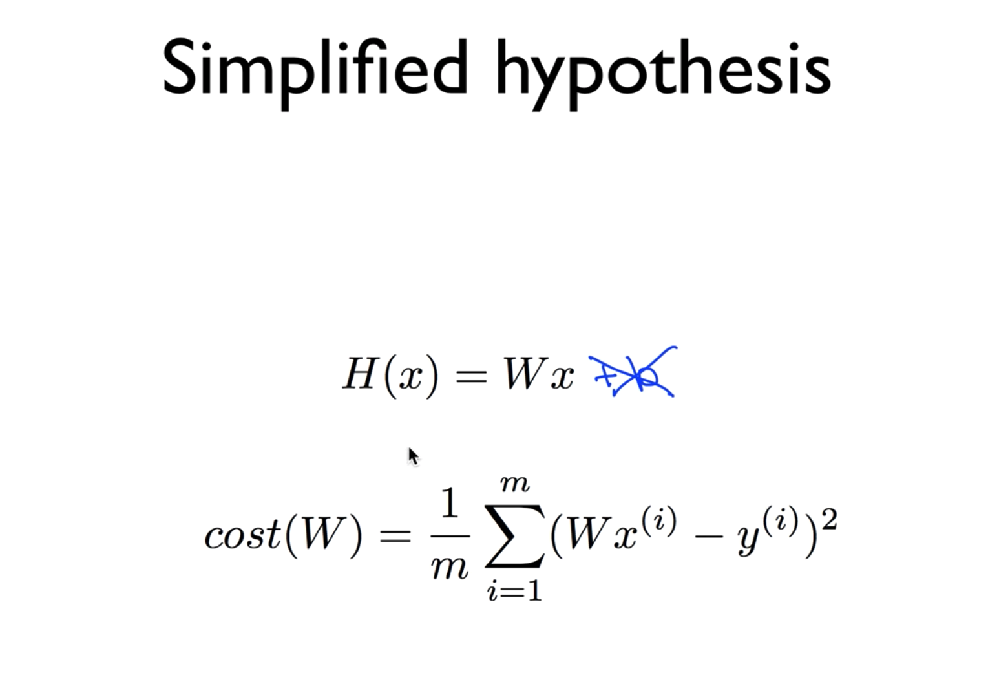

**bias** 를 의미하는 `b`를 0이라고 생각하고, Cost function을 `W`의 함수라고 생각하고  
아래의 표와 같은 데이터가 있다고 생각해보자.

| <center>x</center> | <center>y</center> |
| :----------------: | -----------------: |
| <center>1</center> | <center>1</center> |
| <center>2</center> | <center>2</center> |
| <center>3</center> | <center>3</center> |

이와 같은 데이터를 가지고, Cost function에 대입해보면, 아래와 같은 결과를 도출할 수 있다.

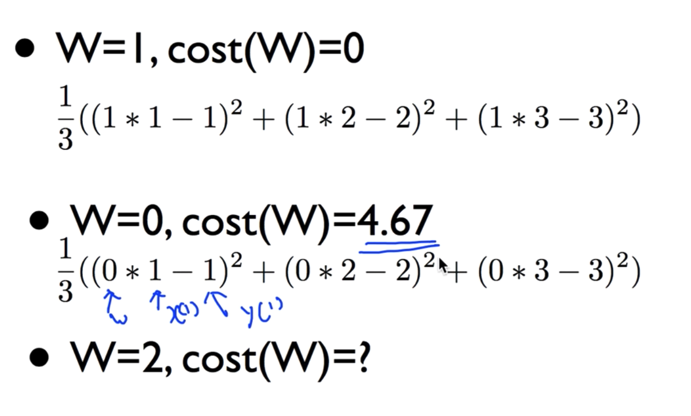

`W`가 2일 경우에도 마찬가지로 4.67과 같은 값을 결과로 갖는다.  
이를 토대로 여러 값을 대입하여 cost 결과값을 구해보면  
우리가 기존에 가정한 `H(x) = Wx`는 위의 표와 같은 데이터에 대해  
y축을 `cost`, x축을 `W`로 둔 그래프에서 아래와 같은 Cost의 분포를 가진다고 할 수 있다.

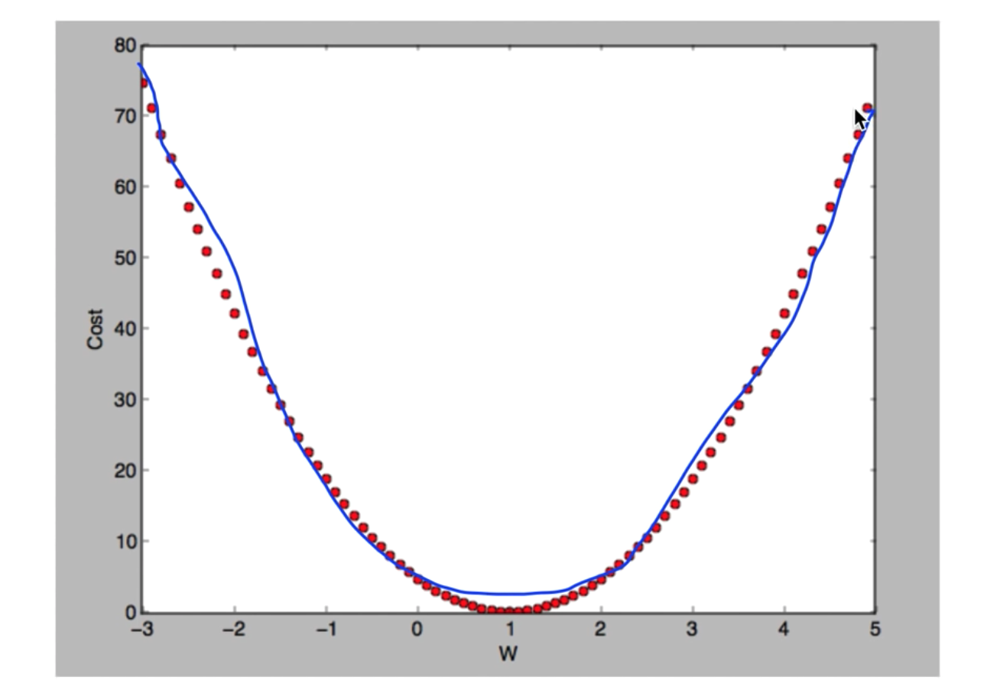

우리가 목적하는 **Cost가 최소가 되는 지점**의 `W`값은 1이 된다는 것을 직관적으로 알 수 있다.  
하지만 이를 눈으로 보고 아는 것이 아닌, 기계적으로 찾아내려고 한다면 어떻게 해야 할까?

#### Gradient descent algorithm

> 직역하면, "경사를 따라 내려가는" 알고리즘이다.

---

특징

- Minimize cost function
- Gradient descent is used many minimization problems
- For a given cost function, _cost(W, b)_, it will find W, b to minimize cost
- It can be applied to more general function: cost(w1, w2, ...)

<br>
이 알고리즘은 어떻게 동작할까?

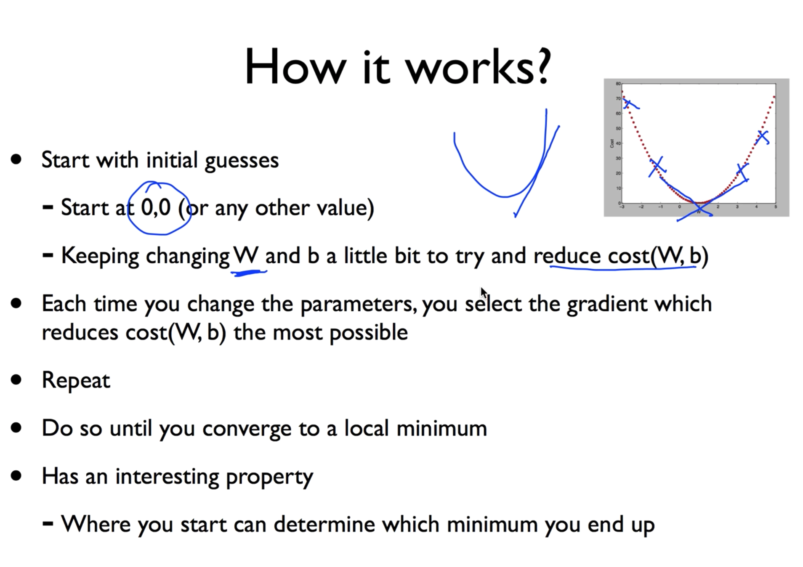

- 어느 점에서나 시작할 수 있고
- cost를 줄이는 방향으로`W`와 `b` 값을 아주 조금씩 변경한다.
- 최소가 되는 지점을 만날 때까지 계속해서 반복한다.  
  <br>

경사도(Gradient)에 대해서 설명하기 위해 **미분**의 개념을 도입할텐데,  
적용하기에 앞서 기울기에 대한 공식을 먼저 정리한다.

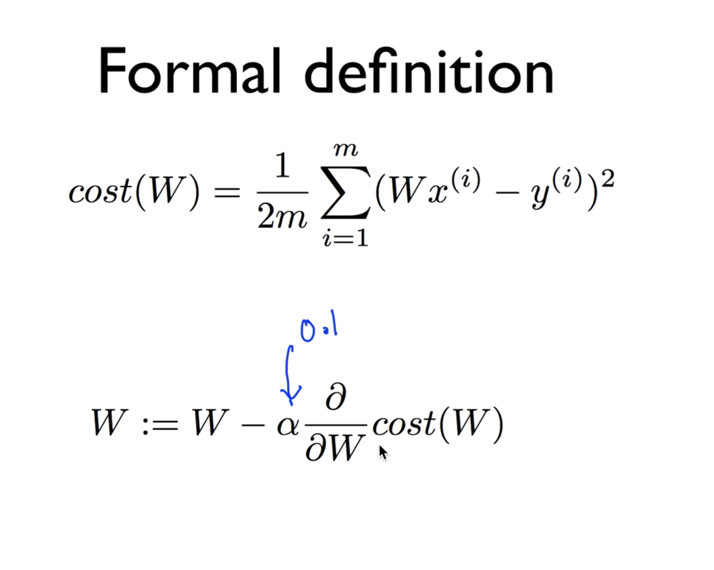

- 우선, 원래의 Cost function에서 2를 더 나눈 이유는, 사실상 2로 나눈 것이 값에 큰 차이를 주지는 않으나, 뒤에서 도출될 수식을 간단하게 하기 위해서라고 한다.
- 아래의 공식은, 최저점을 찾기 위해 `W`에서 cost를 미분한 값을 빼서 아주 작은 좌표이동을 하겠다는 의미라고 생각하면 된다. (여기서 *alpha*는 **learning rate**를 가리키며 매우 작은 상수 값을 의미한다고 한다.)

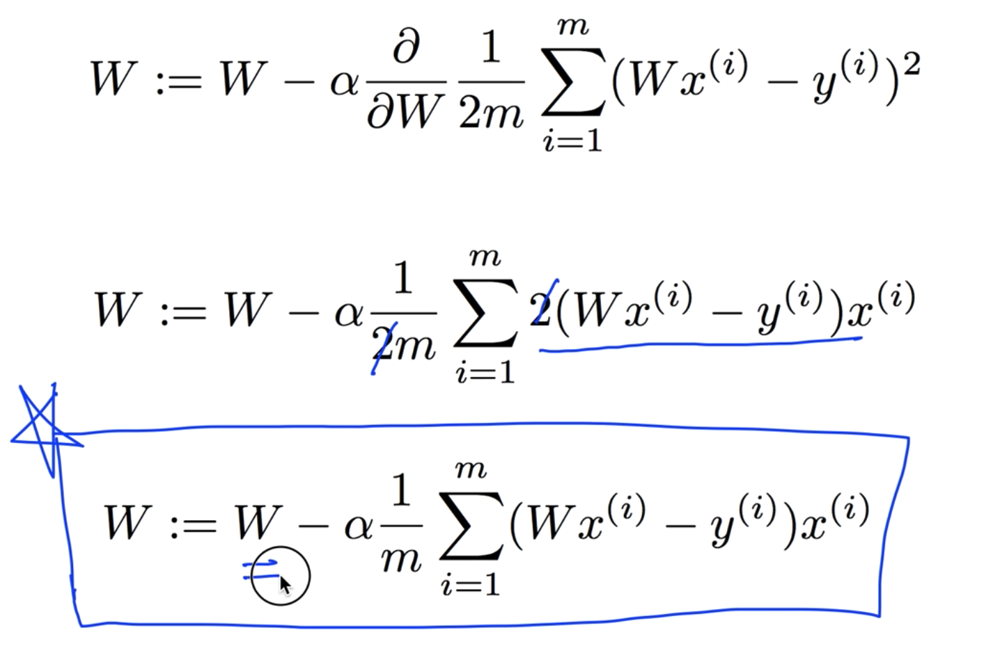

이 알고리즘을 여러 번 실행 시켜 `W`값이 계속해서 변화되면, 그 값이 초반에 살펴보았던 cost를 minimize하는 값이 되는 것이다.

아래의 파란 박스로 표시한 수식이 최종적인 **Gradient descent algorithm**이다.  
이 알고리즘을 기계적으로 적용하면, cost function을 최소화 하는 `W` 값을 구할 수 있고  
그 것이 바로 Linear Regression의 핵심인 학습을 통해 model을 만드는 과정이라고 이해하면 되겠다.

#### 끝으로

---

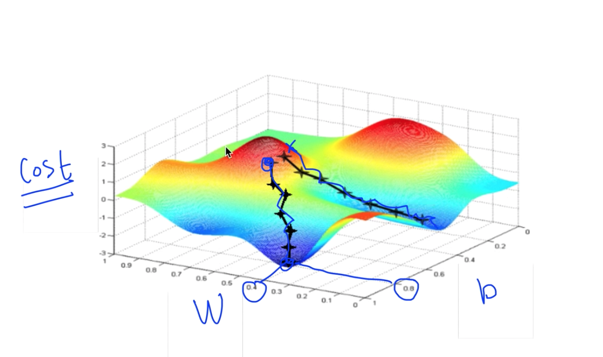

위의 그림에서와 같은 그래프를 갖는 cost function에서는 우리가 지금까지 생각한 알고리즘이  
정상적으로 동작하지 않는다. 왜냐하면 시작점을 다르게 잡았을 때, 경사를 타고 최종 도착하는  
최저점이 다른 위치가 되기 때문이다.

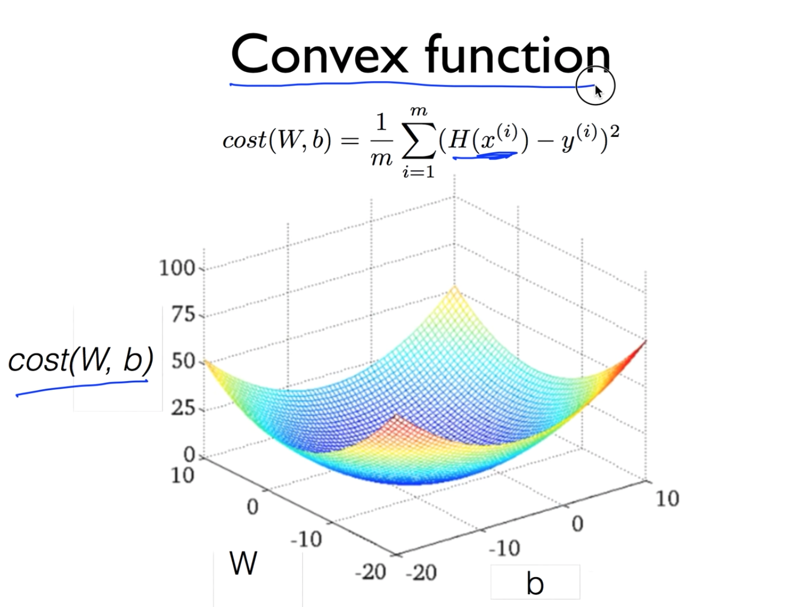

다행히도, 우리의 Hypothesis와 Cost function을 가지고 그래프를 그리게 되면 위와 같은  
그래프를 얻을 수 있는데, 이와 같은 그래프를 **Convex Function**이라고 한다.  
이런 경우에는 어느 점에서 시작하든, 도착하는 지점이 우리가 원하는 지점이고  
우리의 Gradient descent algorithm이 항상 답을 찾는다는 것을 보장해주게 된다.

**Cost function을 설계할 때, 반드시 모양이 Convex function이 되는지를 확인하는 것이 굉장히 중요하다.**

---

### TensorFlow 실습

```python
import tensorflow as tf
import mathplotlib as plt
X = [1, 2, 3]
Y = [1, 2, 3]

W = tf.placeholder(tf.float32)
# Our hypothesis for linear model X * W
hypothesis = X * W

# cost/loss function
cost = tf.reduce_mean(tf.square(hypothesis - Y))
# Launch the graph in a session.
sess = tf.Session()
# Initialize global variables in the graph.
sess.run(tf.global_variables_initializer())
# Variables for plotting cost function
W_val = []
cost_val = []
for i in range(-30, 50):
    feed_W = i * 0.1
    curr_cost, curr_W = sess.run([cost, W], feed_dict={W: feed_W})
    W_val.append(curr_W)
    cost_val.append(curr_cost)

# Show the cost function
plt.plot(W_val, cost_val)
plt.show()
```

위의 코드는 주어진 데이터 `X`와 `Y`에 대하여 우리의 가설 함수 `H(x) = W * X`의  
cost function의 그래프를 그리는 프로그램이라고 할 수 있겠다.  
-3에서부터 5까지 `W`를 0.1만큼씩 변화하도록 실행하여 현재의 `cost`, 그리고 `W` 값을  
리스트에 저장하여 그 리스트로 하여금 어떠한 그래프를 나타내는지를 시각화해주는 코드이다.  
(mathplot이라는 라이브러리가 그러한 동작을 하도록 하는 모양이다.)

`plot.show()`를 통해 나타나는 결과는 아래와 같다.

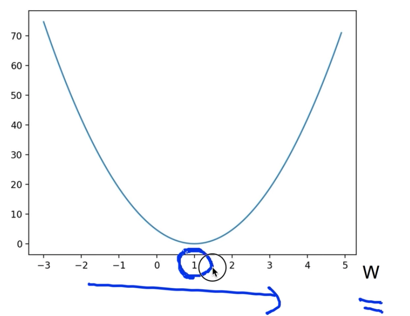

이제 Gradient descent를 적용할 단계인데, 그에 대한 설명이 이어진다.

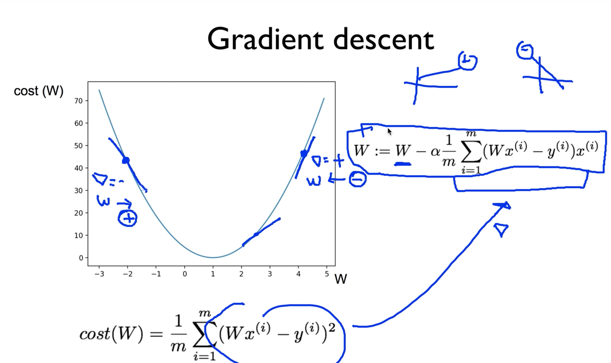

이론 시간에 학습했던 것처럼, 경사를 타고 내려가는 알고리즘이 동작하는 방식은  
현재의 `W` 값에서 cost function을 미분한 값(그래프의 기울기)를 빼줌으로서 조정하여  
그래프의 면을 타고 내려가는 방식이다. (기울기가 음수일때는 커지는 방향으로)

이를 tensorflow로 구현하는 것은 수식을 그대로 옮겨서 표현하면 된다.

```python
learning_rate = 0.1
gradient = tf.reduce_mean((W * X - Y) * X) # cost를 미분한 기울기값.
descent = W - learning_rate * gradient
update = W.assign(descent) # 새로운 W 획득 (할당), =으로 assign 할 수 없음.
```

전체 코드를 살펴보면 다음과 같다.

```python
import tensorflow as tf
x_data = [1, 2, 3]
y_data = [1, 2, 3]

W = tf.Variable(tf.random_normal([1]), name='weight')
X = tf.placeholder(tf.float32)
Y = tf.placeholder(tf.float32)
# Our hypothesis for linear model X * W
hypothesis = X * W

# cost/loss function
cost = tf.reduce_sum(tf.square(hypothesis - Y))

# Minimize: Gradient Descent using derivative: W -= learning rate * derivative
learning_rate = 0.1
gradient = tf.reduce_mean((W * X - Y) * X)
descent = W - learning_rate * gradient
update = W.assign(descent)

# Launch the graph in a session.
sess = tf.Session()
# Initialize global variables in the graph.
sess.run(tf.global_variables_initializer())
for step in range(21):
    sess.run(update, feed_dict={X: x_data, Y: y_data})
    print(step, sess_run(cost, feed_dict={X: x_data, Y: y_daa}), sess.run(W))
```

이 코드에 대한 결과는 아래와 같다.

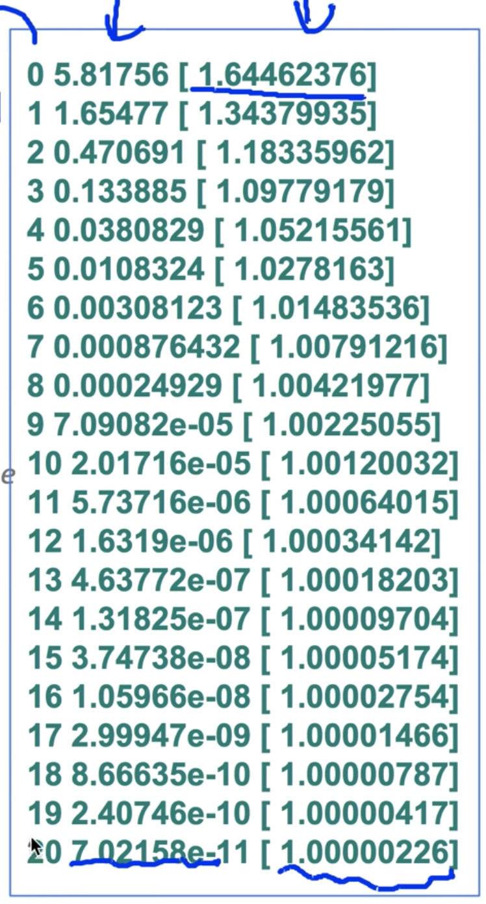

프린트 문에 의해 한 라인에 출력된 내용은 `step`, `cost`, `W`의 순서인데  
수동으로 직접 구현해서 실행해보았는데도 매우 잘 동작하는 것을 확인할 수 있었다.

Gradient Descent의 원리를 직접 실습하기 위해 직접 미분하여 결과를 도출했지만  
우리의 cost function이 간단하게 주어졌기 때문에 간단하게 미분하여 작성할 수 있었고  
이는 매우 복잡해질 수 있기 때문에 TensorFlow를 사용할 때 이를 일일히 작성하는 것은 힘든 일이다.

아래와 같이 코드를 작성하면 TensorFlow가 일을 직접 자동으로 실행해준다.

```python
# Minimize: Gradient Descent Magic
optimizer = tf.train.GradientDescentOptimizer(learning_rate=0.1)
train = optimizer.minimize(cost)
```

위의 전체 코드에서 `W = tf.Variable(tf.random_normal([1]), name='weight')`  
을 `5.0` 혹은 `-3.0`과 같이 멀리 떨어진 값으로 직접 값을 지정해 주어도  
올바른 결과를 도출하는 모습을 확인할 수 있었다.

---

#### Optional: compute_gradient and apply_gradient

만약에 TensorFlow가 제공하는 gradient 값을 임의로 조정하고 싶다면 아래와 같은 로직을  
확인해볼 수 있다.

```python
import tensorflow as tf
x_data = [1, 2, 3]
y_data = [1, 2, 3]

# Set  wrong model weights
W = tf.Variable(5.)

# Our hypothesis for linear model X * W
hypothesis = X * W
# Manual gradient
gradient = tf.reduce_mean((W * X - Y) * X) * 2
# cost/loss function
cost = tf.reduce_mean(tf.square(hypothesis - Y))
optimizer = tf.train.GradientDescentOptimizer(learning_rate=0.01)

# Get gradients
gvs = optimizer.compute_gradients(cost)
# Apply gradients
apply_gradients = optimizer.apply_gradients(gvs)

# Launch the graph in a session.
sess = tf.Session()
sess.run(tf.global_variables_initializer())

for step in range(100):
    print(step, sess_run([gradient, W, gvs]))
    sess.run(apply_gradients)
```

위 코드는 직접 수식으로 작성한 gradient와 실제로 minimize를 할 때 optimizer가  
도출하는 gradient 값이 차이를 보일지를 실험해보기 위한 코드이다.

> compute_gradient를 통해 gradient를 조작할수 있다고 한다.
> 여기서는 조작 없이 값을 원래대로 넣어 비교 실험을 위해 작성하였다.

결과는 아래와 같다.

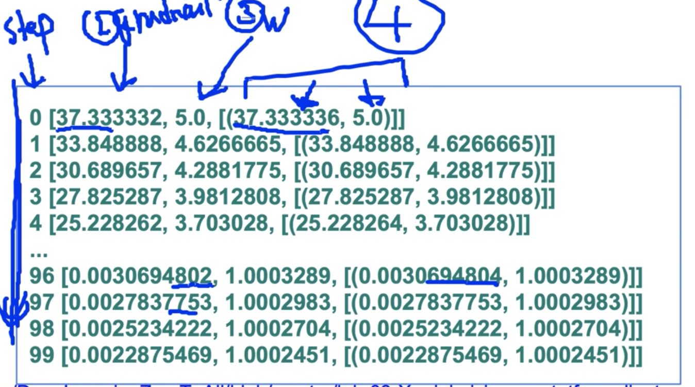

수식을 직접 작성한 gradient와 optimizer가 생성하는 gradient의 값,  
그리고 그로 인해 연산된 `W` 값은 소수점 정밀도의 미미한 차이만 있을 뿐 같은 값을 가진다는  
것을 확인할 수 있었다.

결과와 출력문의 구조가 혼동될 수도 있을 것 같아 덧붙이자면,  
`print(step, sess.run([gradient, W, gvs]))`와 같이 작성하였는데 출력의 첫 줄과 비교해보면  
0 은 `step`에 해당하고, 37.333332는 `gradient`, 5.0은 `W`, 그 뒤에 뒤따르는 배열 내의  
두 원소는 c`ompute_gradient`에 의한 `gradient`와 `W`값을 의미한다.
