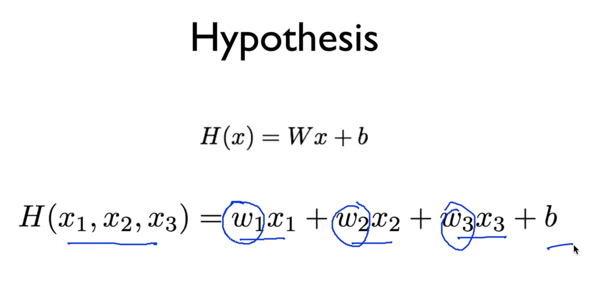
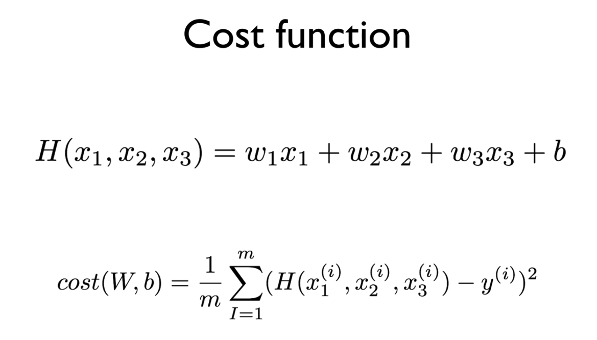
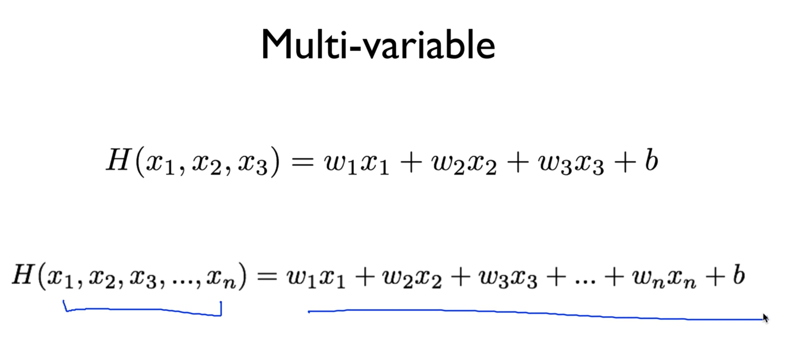
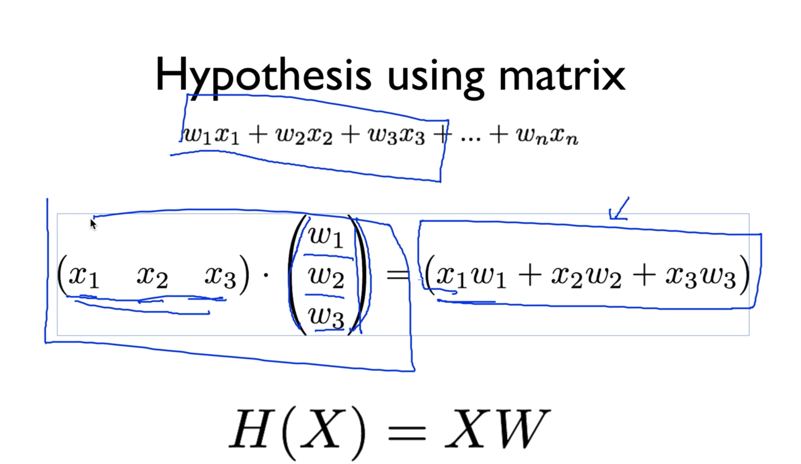
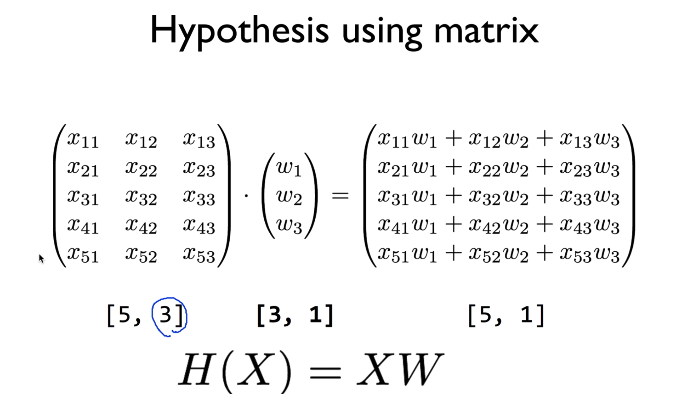
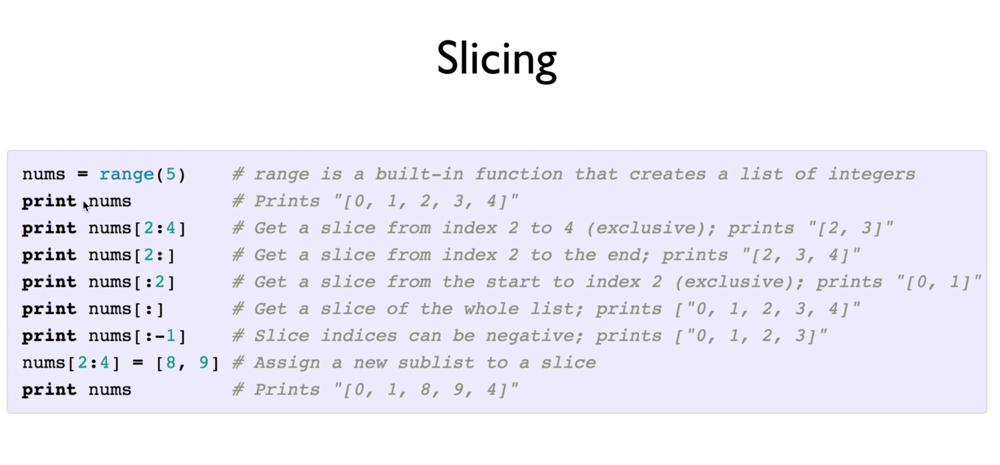
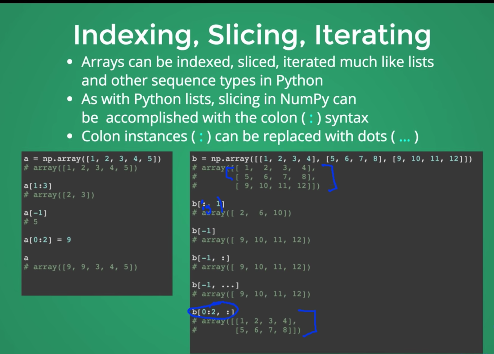
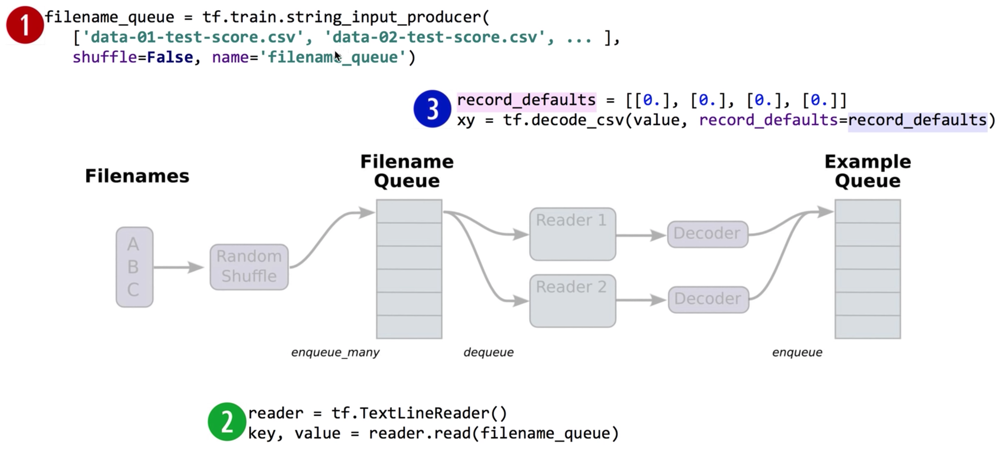

> 이 포스팅은 <a target="_blank" href="https://www.inflearn.com/course/%EA%B8%B0%EB%B3%B8%EC%A0%81%EC%9D%B8-%EB%A8%B8%EC%8B%A0%EB%9F%AC%EB%8B%9D-%EB%94%A5%EB%9F%AC%EB%8B%9D-%EA%B0%95%EC%A2%8C#">인프런 머신러닝 강좌</a> 를 수강하며 공부한 내용을 정리한 것입니다.

## Lecture 4. Multi-Variable Linear Regression

### How to handle multi-variable

#### Predicting exam score

- regression using one input (x)
  - one-variable, one-feature

| <center>x(hours)</center> | <center>y(score)</center> |
| :-----------------------: | ------------------------: |
|    <center>10</center>    |       <center>90</center> |
|    <center>9</center>     |       <center>80</center> |
|    <center>3</center>     |       <center>50</center> |
|    <center>2</center>     |       <center>60</center> |
|    <center>11</center>    |       <center>40</center> |

기존에 수행하던 방식은 위와 같은 단일 변수에 의한 데이터에 기반하고 있다.

- regression using three inputs (x1, x2, x3)
  - multi-variable/feature

| <center>x1 (quiz 1)</center> | <center>x2 (quiz 2)</center> | <center>x3 (midterm)</center> | <center>y(final)</center> |
| :--------------------------: | ---------------------------: | :---------------------------: | ------------------------: |
|     <center>73</center>      |          <center>80</center> |      <center>75</center>      |      <center>152</center> |
|     <center>93</center>      |          <center>88</center> |      <center>93</center>      |      <center>185</center> |
|     <center>89</center>      |          <center>91</center> |      <center>90</center>      |      <center>180</center> |
|     <center>96</center>      |          <center>98</center> |     <center>100</center>      |      <center>196</center> |
|     <center>73</center>      |          <center>66</center> |      <center>70</center>      |      <center>142</center> |

이처럼 여러 개의 변수를 다뤄야 하는 경우 **Hypothesis**는 어떻게 구할까?



위처럼 간단히 생각해서 각각에 대한 `W`와 `x`의 값을 곱해서 모두 더해주면 된다.  
그렇지만 기존의 방식과 달리 학습시켜야 할 내용이 늘어난 것이다.

그렇다면 **Cost function**의 경우는 어떨까?



Cost function의 틀은 결국 같으나 바뀐 것은 우리의 가설, 즉 Hypothesis이다.

변수가 두세개가 아닌 훨씬 더 많을 때에도 마찬가지이다.



그저 마찬가지로 변수의 개수를 늘려주면 되는데, 변수가 많으면 많아질수록  
항의 개수에 따라 수식을 길게 늘어뜨려 써야 해서 불편함이 발생하게 된다.  
이것을 처리하기 위해서 **Matrix**의 개념을 도입하게 되는데, Matrix의 곱셈만을 사용할 것이다.

#### Hypothesis using matrix



Matrix를 사용하게 되면 길게 늘어진 수식을 위와 같이 간단하게 표현하고 연산할 수 있다.  
`X`에 대한 집합을 1\*3 Matrix, `W`에 대한 집합을 3\*1 Matrix로 두고  
곱셈을 수행하면 우리가 원하던 수식을 연산할 수 있으며 하단과 같이 Matrix간의  
곱셈 식으로 우리의 Hypothesis를 표현할 수 있다. _(Matrix에서는 보통 `X`를 앞에 둔다.)_

이 개념을 도입해서 위의 표에서 살펴본 `x`변수가 세 개인 성적 예측 문제를 다뤄볼 수 있다.  
그런데 위의 표에서 확인한 것처럼 x1, x2, x3로 이루어진 한 묶음의 데이터 셋이
하나가 아니고 여러 줄로 이루어진 것을 알 수 있는데,  
이 한 줄의 묶음을 **instance**라고 부르며, 이 instance들이 지금처럼 많을 때에는  
물론 이를 반복적으로 수행하는 것도 방법이겠지만, 효율성 면에서 좋지 않다고 판단할 수 있다.  
이 상황에서 Matrix의 굉장히 놀라운 장점은, `x` 변수들로 이루어진 각 인스턴스들에  
대하여 표의 모양 그대로 하나의 Matrix를 줄 수 있다는 점이다.

다시말해, Hypothesis를 구성할 때, 아래처럼 `x` 변수에 대한 인스턴스들을  
전부 하나의 Matrix로 만들고 하나의 `W`와 곱셈을 수행하기만 하면 되는 것이다.



그러면 이러한 형태의 Matrix 연산을 많이 하게 될 텐데  
`x`에 대한 Variable의 개수와 Instance의 개수는 이미 주어진 상태이므로  
Matrix `X`가 주어진 상태라고 볼 수 있게 된다.  
또한 곱셈의 결과인 `H`는 행의 개수가 instance의 개수이고  
`y`값은 하나이므로 이 또한 마찬가지로 주어진다고 볼 수 있다.  
대부분의 경우 이러한 상황에서 `W`에 대한 매트릭스의 크기를 결정하는 것이  
가설 설정의 일부분이라고 할 수 있다.

이는결국 행렬 곱셈의 원리를 알고 있다면 충분히 직관적으로 떠올릴 수 있는데  
`W`는 곱셈의 우측에 해당하므로 행의 크기로 `X`의 Variable 개수,  
그리고 열의 크기로는 결과에 해당하는 `y`의 개수이므로 1이 됨을 알 수 있다.
출력의 개수가 한 개가 아니더라도, 우리가 원하는 출력의 개수에 대해서는  
우리가 이미 알고 있다는 가정이 존재하므로 그에 따라서  
`W`의 열의 개수를 결정할 수 있다.

또한 위 예젱서는 우리가 instance의 개수를 5개로 두었지만, 이는  
데이터의 개수가 늘어남에 따라 가변적으로 달라질 수 있기 때문에 `n`으로 둔다.  
(Numpy에서는 `-1`, TensorFlow에서는 `None`이라는 값으로 표현)  
<br/>

---

<br/>
### lab 04-1: Multi-Variable linear regression을 TensorFlow로 구현

이론 시간에 표와 함께 살펴본 것과 같이 `x` 변수가 세 개로 구성된  
성적 예측 문제를 실습할 것이다.

```python
import tensorflow as tf
tf.set_random_seed(777)  # for reproducibility

x1_data = [73., 93., 89., 96., 73.]
x2_data = [80., 88., 91., 98., 66.]
x3_data = [75., 93., 90., 100., 70.]

y_data = [152., 185., 180., 196., 142.]

# placeholders for a tensor that will be always fed.
x1 = tf.placeholder(tf.float32)
x2 = tf.placeholder(tf.float32)
x3 = tf.placeholder(tf.float32)

Y = tf.placeholder(tf.float32)

w1 = tf.Variable(tf.random_normal([1]), name='weight1')
w2 = tf.Variable(tf.random_normal([1]), name='weight2')
w3 = tf.Variable(tf.random_normal([1]), name='weight3')
b = tf.Variable(tf.random_normal([1]), name='bias')

hypothesis = x1 * w1 + x2 * w2 + x3 * w3 + b

# cost/loss function
cost = tf.reduce_mean(tf.square(hypothesis - Y))

# Minimize. Need a very small learning rate for this data set
optimizer = tf.train.GradientDescentOptimizer(learning_rate=1e-5)
train = optimizer.minimize(cost)

# Launch the graph in a session.
sess = tf.Session()
# Initializes global variables in the graph.
sess.run(tf.global_variables_initializer())

for step in range(2001):
    cost_val, hy_val, _ = sess.run([cost, hypothesis, train],
                                   feed_dict={x1: x1_data, x2: x2_data, x3: x3_data, Y: y_data})
    if step % 10 == 0:
        print(step, "Cost: ", cost_val, "\nPrediction:\n", hy_val)
```

이론 시간에 살펴봤던 표를 바탕으로 코드를 위와 같이 작성할 수 있다.  
이전과 크게 다를 것이 없으나, `x_data`와 `placeholder`, `weight`를  
정의하는 부분이 개수가 늘어남에 따라 확장되었다는 것이 차이점이 되겠다.

결과는 아래와 같다.

```
0 Cost: 19614.8
Prediction:
[ 21.69748688 39.10213089 31.82624626 35.14236832 32.55316544]
10 Cost: 14.0682
Prediction:
[ 145.56100464 187.94958496 178.50236511 194.86721802 146.08096313]
...
1990 Cost: 4.9197
Prediction:
[ 148.15084839 186.88632202 179.6293335 195.81796265 144.46044922]
2000 Cost: 4.89449
Prediction:
[ 148.15931702 186.8805542 179.63194275 195.81971741 144.45298767]
```

이론 시간에 배웠던 내용을 떠올려 보면, 위와 같은 코드는 아름답지 않다는 알 수 있을 것이다.
만약 `x_data`가 지금은 3개이지만, 100개가 된다면? 매우 복잡해질 것이므로  
이러한 방법은 권장되지 않고 사용되지 않는다. 따라서 **Matrix**를 사용한다.

```python
import tensorflow as tf
tf.set_random_seed(777)  # for reproducibility

x_data = [[73., 80., 75.],
          [93., 88., 93.],
          [89., 91., 90.],
          [96., 98., 100.],
          [73., 66., 70.]]
y_data = [[152.],
          [185.],
          [180.],
          [196.],
          [142.]]


# placeholders for a tensor that will be always fed.
X = tf.placeholder(tf.float32, shape=[None, 3])
Y = tf.placeholder(tf.float32, shape=[None, 1])

W = tf.Variable(tf.random_normal([3, 1]), name='weight')
b = tf.Variable(tf.random_normal([1]), name='bias')

# Hypothesis
hypothesis = tf.matmul(X, W) + b # matrix multiplication.

# Simplified cost/loss function
cost = tf.reduce_mean(tf.square(hypothesis - Y))

# Minimize
optimizer = tf.train.GradientDescentOptimizer(learning_rate=1e-5)
train = optimizer.minimize(cost)

# Launch the graph in a session.
sess = tf.Session()
# Initializes global variables in the graph.
sess.run(tf.global_variables_initializer())

for step in range(2001):
    cost_val, hy_val, _ = sess.run(
        [cost, hypothesis, train], feed_dict={X: x_data, Y: y_data})
    if step % 10 == 0:
        print(step, "Cost: ", cost_val, "\nPrediction:\n", hy_val)
```

Matrix를 사용하게 되면 data를 표현하는 부분에 행렬식으로 표현을 해야해서  
복잡해 보이는 것을 제외하면 나머지 부분들은 매우 간소화된 것을 확인할 수 있다.  
몇 가지 짚고 넘어가면, `X`와 `Y`의 `placeholder`를 정의하는 부분에서  
`shape`을 지정할 때, 변수 `x`에 대한 인스턴스의 개수는 5개로 위에서 정의했지만  
몇 개가 되든 표현할 수 있게 하기 위해서 `None`이라는 필드를 통해  
**n개**의 인스턴스를 표현할 수 있다.

또한 `hypothesis`를 지정하는 부분에서 보듯이, 행렬의 곱셈을  
TensorFlow 함수인 `matmul`을 활용할 수 있음을 알 수 있다._(matrix multiplication)_

실행 결과는 기존과 동일하다.  
<br />

---

<br />

### lab 04-2: Loading data from file

데이터가 점점 많아질수록, 데이터를 일일히 코드에 직접 적어서 사용하는 것이  
불편하고 천개, 만개가 된다면 더더욱 불가능한 일이 될 것이다.  
그래서 text file에 미리 데이터를 정의해두고 사용하는 방식을 채택하는데,  
주로 많이들 사용하는 형식이 `,csv`라는 확장자이다.  
코드를 살펴보기 전에, Python에서 제공하는 list의 강력한 기능 중 하나인  
Slicing에 대해서 살펴본다.



사실 필자도 이 강의를 보면서 처음 접한 내용이기도 한데  
살펴보면 이러한 내용인 것 같다.  
0,1,2,3,4 를 원소로 갖는 리스트가 있는데 `nums[2:4]`라고 작성하게 되면,  
index 2번에서부터 4번째 위치한 원소까지를 리스트로 반환한다.
_(개인적으로 왜 이렇게 하는지 모르겠다.)_  
또한 `nums[:]`와 같이 작성하게 되면 리스트 전체를 반환하고,  
`nums[:-1]`과 같이 작성하면 마지막 원소를 제외하고 반환한다고 한다.



또한 Numpy에서는 더 강력한 slicing과 indexing을 제공한다고 하는데,  
이는 기본 기능과 유사하며 사진을 참고하고 나중에 더 자세히 살펴보면 될 것 같다.

- data-01-test-score.csv

```python
# EXAM1,EXAM2,EXAM3,FINAL
73,80,75,152
93,88,93,185
89,91,90,180
96,98,100,196
73,66,70,142
53,46,55,101
```

위와 같은 데이터를 `.csv` 확장자를 활용하여 파일 형태로 정의한 뒤,  
아래와 같은 코드를 통해 다루는 실습을 해보자.

```python
import tensorflow as tf
import numpy as np
tf.set_random_seed(777)  # for reproducibility

xy = np.loadtxt('data-01-test-score.csv', delimiter=',', dtype=np.float32)
x_data = xy[:, 0:-1] # 전체 n개의 행과 마지막을 제외한 열 전체를 취하겠다는 의미.
y_data = xy[:, [-1]] # 전체 n개의 행과 마지막 열에 해당하는 리스트를 반환.

# Make sure the shape and data are OK --> 학습시키기 전 가져온 데이터가 맞는지 확인.
print(x_data, "\nx_data shape:", x_data.shape)
print(y_data, "\ny_data shape:", y_data.shape)

# placeholders for a tensor that will be always fed.
X = tf.placeholder(tf.float32, shape=[None, 3])
Y = tf.placeholder(tf.float32, shape=[None, 1])

W = tf.Variable(tf.random_normal([3, 1]), name='weight') # W의 shape은 X와 Y의 shape의 조합.
b = tf.Variable(tf.random_normal([1]), name='bias')

# Hypothesis
hypothesis = tf.matmul(X, W) + b

# Simplified cost/loss function
cost = tf.reduce_mean(tf.square(hypothesis - Y))

# Minimize
optimizer = tf.train.GradientDescentOptimizer(learning_rate=1e-5)
train = optimizer.minimize(cost)

# Launch the graph in a session.
sess = tf.Session()
# Initializes global variables in the graph.
sess.run(tf.global_variables_initializer())

for step in range(2001):
    cost_val, hy_val, _ = sess.run([cost, hypothesis, train],
                                   feed_dict={X: x_data, Y: y_data})
    if step % 10 == 0:
        print(step, "Cost:", cost_val, "\nPrediction:\n", hy_val)
```

위와 같은 코드를 통해 학습을 시킨 후, 아래와 같이 실행하여 학습 여부를 확인해볼 수 있다.

```python
# Ask my score
print("Your score will be ", sess.run(hypothesis,
                                      feed_dict={X: [[100, 70, 101]]}))

print("Other scores will be ", sess.run(hypothesis,
                                        feed_dict={X: [[60, 70, 110], [90, 100, 80]]}))
```

```
Your score will be  [[ 181.73277283]]
Other scores will be  [[ 145.86265564]
 [ 187.23129272]]
```

이처럼 Numpy를 활용하여 파일을 통해 데이터를 가져오고, 그것을 처리하는 실습을 진행했다.  
그런데 File이 크거나 많아서 메모리에 한번에 올릴 수 없는 경우가 있을 수도 있다.  
그래서 TensorFlow에서는 **Queue Runners**라는 것이 존재하는데,
이러한 문제를 TensorFlow 내에서 알아서 처리해주도록 만들어준 프로세스라고 한다.  
그 동작 과정이 대략 아래와 같다.



1. 처리하고자 하는 파일들의 리스트를 만들어준다.
2. 사용할 File Reader를 정의한다.
3. 읽어온 value 값을 어떻게 파싱할지를 결정한다. (예시에서는 `decode_csv`)

이러한 과정들을 거친 뒤 TensorFlow에서 제공하는 `batch`라는 함수를 통해서
분류하고 한 번에 묶어주는 작업을 진행한다. _(batch의 사전적 의미가 "일괄"이다.)_
(교수님은 이 `batch`를 펌프에 비유하심.)

Queue Runners 방식으로 학습 데이터를 가져오는 전체 실습 코드는 아래와 같다.

```python
import tensorflow as tf
tf.set_random_seed(777)  # for reproducibility

filename_queue = tf.train.string_input_producer(
    ['data-01-test-score.csv'], shuffle=False, name='filename_queue')

reader = tf.TextLineReader()
key, value = reader.read(filename_queue)

# Default values, in case of empty columns. Also specifies the type of the
# decoded result.
record_defaults = [[0.], [0.], [0.], [0.]]
xy = tf.decode_csv(value, record_defaults=record_defaults)

# collect batches of csv in
train_x_batch, train_y_batch = \
    tf.train.batch([xy[0:-1], xy[-1:]], batch_size=10)

# placeholders for a tensor that will be always fed.
X = tf.placeholder(tf.float32, shape=[None, 3])
Y = tf.placeholder(tf.float32, shape=[None, 1])

W = tf.Variable(tf.random_normal([3, 1]), name='weight')
b = tf.Variable(tf.random_normal([1]), name='bias')

# Hypothesis
hypothesis = tf.matmul(X, W) + b

# Simplified cost/loss function
cost = tf.reduce_mean(tf.square(hypothesis - Y))

# Minimize
optimizer = tf.train.GradientDescentOptimizer(learning_rate=1e-5)
train = optimizer.minimize(cost)

# Launch the graph in a session.
sess = tf.Session()
# Initializes global variables in the graph.
sess.run(tf.global_variables_initializer())

# Start populating the filename queue.
coord = tf.train.Coordinator()
threads = tf.train.start_queue_runners(sess=sess, coord=coord)

for step in range(2001):
    x_batch, y_batch = sess.run([train_x_batch, train_y_batch])
    cost_val, hy_val, _ = sess.run(
        [cost, hypothesis, train], feed_dict={X: x_batch, Y: y_batch})
    if step % 10 == 0:
        print(step, "Cost: ", cost_val, "\nPrediction:\n", hy_val)

coord.request_stop()
coord.join(threads)

# Ask my score
print("Your score will be ",
      sess.run(hypothesis, feed_dict={X: [[100, 70, 101]]}))

print("Other scores will be ",
      sess.run(hypothesis, feed_dict={X: [[60, 70, 110], [90, 100, 80]]}))
```

결과는 Numpy로 데이터를 가져왔을 때와 동일하다.
