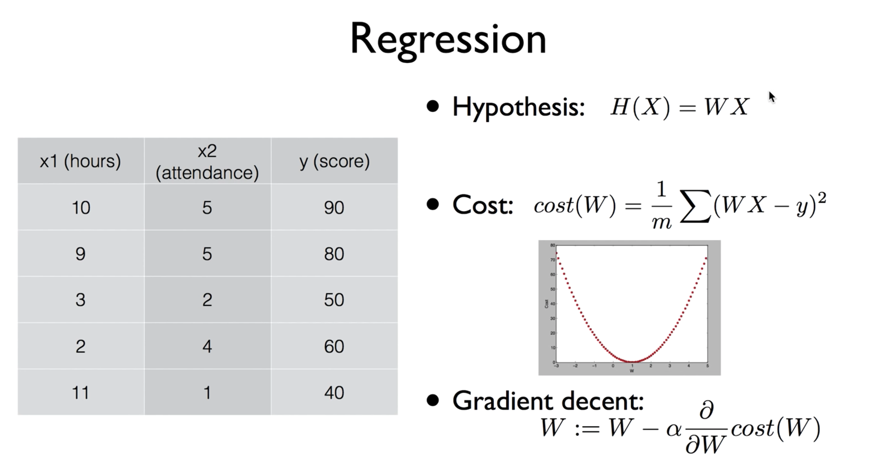

> 이 포스팅은 <a target="_blank" href="https://www.inflearn.com/course/%EA%B8%B0%EB%B3%B8%EC%A0%81%EC%9D%B8-%EB%A8%B8%EC%8B%A0%EB%9F%AC%EB%8B%9D-%EB%94%A5%EB%9F%AC%EB%8B%9D-%EA%B0%95%EC%A2%8C#">인프런 머신러닝 강좌</a> 를 수강하며 공부한 내용을 정리한 것입니다.

## Lecture 5. Logistic Classification

> **Logistic classification**은 classification algorithm들 중에서 정확도가 높은 것으로 알려져 있다.
> 때문에 실제 문제에도 바로 적용해볼 수 있고, *Neural Network와 Deep learning*을 이해하는 데 중요한 컴포넌트이다.



Logistic Classification에 대해 이야기를 도입하기 앞서,  
지난 시간까지의 Linear Regression에 대한 정리를 하고 넘어가자.

1. 우선 가장 먼저 가설을 세운다. 가설은 변수 `x`에 대하여 선형적이며  
   우리가 가진 데이터가 어떠한 방식으로 나타날지를 가정하는 일차 함수이다.
2. 비용 함수를 정의한다. 비용 함수는 학습 목표인 `W`에 대한 함수이며  
   가정한 값과 참값 `y`값의 차의 제곱을 평균을 취한 것이다.
3. 이 비용 함수는 그림으로 그려보면 밥그릇을 뒤집은 모양으로 나타남을 알 수 있는데,  
   이러한 그래프를 띠는 함수를 **Convex function**이라고 한다.
4. 그리고 이러한 비용 함수에 대하여 결국 *비용*이 가장 작은 값을 갖게 되는  
   `W` 값을 찾는 것이 목적인데, 이를 찾는 알고리즘이 경사를 내려간다는 의미의  
   **Gradient descent**알고리즘이다.
5. 이 알고리즘은 현재의 `W`깂에서 그 점에서의 *기울기*를 뺀 값으로 나타나고,  
   이를 반복 적용함으로서 결과를 도출한다. 기울기는 Cost function을 미분한  
   값이며 `alpha` 값은 *learning rate*라고 불리는 작은 상수 값이다.

### Classification

**Linear Regression**은 어떠한 *숫자*를 예측하는 것이었다면,  
오늘 다룰 **Classification**은 *Binary*의 개념 (둘 중 하나를 고르는)  
이라고 할 수 있다. 예를 들면 이러한 것이다.

- 스팸 메일인지 아닌지를 탐지하는 것
- Facebook에서 News feed 선별 알고리즘
- 신용 카드 학습 패턴 분류를 통한 도난 여부 식별
- 두뇌 이미지 분석을 통해 종양 악성 여부 판별
- 주식 시장 동향 분석을 통해 매입,매도 여부 판별

#### pass(1)/fail(0) based on study hours

아래와 같은 그림과 함께 생각해보자.  
어떤 학생이 공부한 시간에 따라서 시험에 합격과 불합격을 분류하도록  
학습 모델을 만들려고 할 때, 직관적으로 생각하면  
그냥 Linear regression으로도 가능할 것이라는 생각이 들 수 있다.


그러나 여기에는 몇 가지 오류가 존재한다.  
기존에 3개의 합격, 3개의 불합격 데이터를 가지고 합,불 여부를  
결정짓는 어떤 지점을 찾았다고 가정하면  
만약에 50시간을 공부해 합격한 학생이 있다고 했을 때,  
이 모델은 결국 모든 데이터를 아울러 선형적으로 결정되기 때문에  
그 값이 변할 수 있고, 결국 원래 합격이라고 판단되어야 할 학생이  
불합격 기준으로 넘어갈 수밖에 없는 상황이 발생한다.

또 다른 문제는, Classification에서는 반드시 값이 `0` 또는 `1`로  
결정되어야 하는데, Linear regression에서의 Hypothesis는  
0보다 훨씬 작거나 1보다 훨씬 큰 값이 나올 수가 있게 된다.

#### Logistic Hypothesis

따라서 Logistic Classification에는 값의 범위를 0과 1로 제한하는  
함수가 필요하다. 많은 이들의 연구 끝에 다음과 같은 함수가 이 모델에  
가장 적합한 모습으로 채택되었다고 한다.  
기존에 알고 있던 `WX`를 `z`로, `H(x)`를 `g(z)`로 변환하여  
Logistic의 가설 함수를 표현한다.


이와 같은 함수를 **Logistic function**, 혹은 **Sigmoid function**  
이라고 부른다. 가로 축 `z`값이 무한히 커질수록 `g(z)` 값은 1에  
수렴하게 되고, `z`가 무한히 작아지면 0에 수렴하게 된다.


정리하면 Logistic Classification의 가설 함수는 위와 같이 형태가 된다.  
<br/>

---

<br/>

### 5-2 Cost function & Gradient descent in Logistic classification

<br/>

#### cost function


기존의 우리의 Cost function은 위와 같은 형태를 띠고 있었다.  
이러한 형태의 함수가 가지는 장점은 어느 지점에서 시작하더라도  
Cost가 최소가 되는 지점을 반드시 찾을 수 있다는 것이었다.


기존의 Hypothesis를 바탕으로 한 Cost function에서는  
이차 방정식의 그래프의 형태를 가지기 때문에 어느 지점에서 시작하든  
cost가 최소가 되는 지점을 찾을 수 있었던 데 반해,

Sigmoid function을 가설 함수로 갖는 Logistic classification에 동일한  
Cost function을 적용하게 되면 그림 우측 하단과 같이 구불구불한 형태를 가지게 된다.  
이로 인해서 시작하는 지점에 따라서 함수 전체의 최소 값(_global minimum_)을  
찾을 수 없게 되고, *Local Minimum*이라는 특정 부분의 최소 지점에서 멈춰버리게 된다.  
따라서 Linear에서와 다르게 변화된 Hypothesis에 맞추어 cost function 또한  
다르게 적용해야 모델이 올바르게 예측할 수 있도록 할 수 있다.


Logistic Classification의 Cost function은 사진의 제목 아래에 보이는 것과  
같이 `y`의 값이 0일 때와 1일 때로 나누어서 살펴볼 수 있다.  
앞서 우리가 세운 새로운 가설 함수에 `e` 즉, exponential이 포함되어 있어  
그래프가 구불구불해지는 현상 때문에 그와 상극인 log를 취해주어 부드러운 곡선의  
형태로 만들어주게 된다. 그리고 이 정의에서 0과 1로 나눈 중요한 포인트는  
각 경우마다 예측이 성공했을 경우 0의 값을 갖고, 틀렸을 경우 무한대로 수렴하도록  
하는 로직이 포함되어 있기 때문이다. 이를 *c function*이라고 이름 짓고,  
이들의 합을 구해 평균을 취한 것이 우리가 찾고자 하는 cost function이 된다.


위의 유도 과정에서 조건식을 배제하고 한 줄의 수식으로 표현하면 사진과 같다.  
이는 복잡해보일 수 있지만 사실 `y`의 값이 0 혹은 1이기 때문에 둘 중 하나를  
대입하게 되면 한 개의 항은 사라지게 되고, 앞서 살펴본 조건에서와 같은 수식이 나타난다.


Gradient descent 알고리즘의 큰 틀은 Linear regression과 동일하다.  
처음 Gradient를 다룰 때에는 이 알고리즘의 원리를 이해하기 위해서 미분하는 과정까지  
설명했지만 사실상 이 단계 이후부터는 그러한 과정은 필요하지 않고  
사진에서와 같이 Cost function만 잘 세워주고 코드를 작성할 때 제공되는  
라이브러리를 잘 사용하기만 하면 된다고 한다.  
<br/>

---

<br/>

### 5-3 TensorFlow Practice (Logistic)

<br/>


실습에 들어가기에 앞서, 우리가 이론 시간에 학습한 **Hypothesis**, **Cost function**,  
**Gradient descent** 수식은 위와 같다.

#### Practice 1

전체 코드를 살펴보면서 하나하나 짚어보도록 하자.

```python
# Lab 5 Logistic Regression Classifier
import tensorflow as tf
tf.set_random_seed(777)  # for reproducibility

x_data = [[1, 2],
          [2, 3],
          [3, 1],
          [4, 3],
          [5, 3],
          [6, 2]]
y_data = [[0],
          [0],
          [0],
          [1],
          [1],
          [1]]

# placeholders for a tensor that will be always fed.
X = tf.placeholder(tf.float32, shape=[None, 2])
Y = tf.placeholder(tf.float32, shape=[None, 1])

W = tf.Variable(tf.random_normal([2, 1]), name='weight')
b = tf.Variable(tf.random_normal([1]), name='bias')

# Hypothesis using sigmoid: tf.div(1., 1. + tf.exp(tf.matmul(X, W)))
hypothesis = tf.sigmoid(tf.matmul(X, W) + b)

# cost/loss function
cost = -tf.reduce_mean(Y * tf.log(hypothesis) + (1 - Y) *
                       tf.log(1 - hypothesis))

train = tf.train.GradientDescentOptimizer(learning_rate=0.01).minimize(cost)

# 이 위까지 Graph 정의

# Accuracy computation
# True if hypothesis>0.5 else False
predicted = tf.cast(hypothesis > 0.5, dtype=tf.float32)
accuracy = tf.reduce_mean(tf.cast(tf.equal(predicted, Y), dtype=tf.float32))

# 아랫부분은 Model을 Train하는 과정

# Launch graph
with tf.Session() as sess:
    # Initialize TensorFlow variables
    sess.run(tf.global_variables_initializer())

    for step in range(10001):
        cost_val, _ = sess.run([cost, train], feed_dict={X: x_data, Y: y_data})
        if step % 200 == 0:
            print(step, cost_val)

    # Accuracy report
    h, c, a = sess.run([hypothesis, predicted, accuracy],
                       feed_dict={X: x_data, Y: y_data})
    print("\nHypothesis: ", h, "\nCorrect (Y): ", c, "\nAccuracy: ", a)

```

우선 `x`와 `y`의 데이터를 명세하는 부분을 살펴보면, `x`는 `x1`, `x2`의 array로 구성되고
`y`는 0과 1, 혹은`true`와 `false`의 값을 갖게 된다.  
이해를 위해 우리가 항상 예제에서 사용하던 예시를 인용하면, 어떤 학생이 `x1`시간만큼  
`x2`개의 동영상 강좌를 통해 학습하였을 때, `y`의 결과 (pass/fail)을 갖는다고  
상황을 설정해볼 수 있겠다. 또한 `placeholder`를 선언하면서 `shape`을 명세할 때,  
<a target="_blank" href="https://yungis.dev/machine-learning/deep-learning-for-everyone-day4/">이전 섹션</a>에서 살펴보았던 **Matrix**와 관련된 개념이 포함된다.

Logistic Classification의 hypothesis는 *Sigmoid function*의 형태를 갖기 때문에  
기존에 우리가 알고 있던 `X * W + b`와 같은 수식에서 끝나는 것이 아니라 TensorFlow의 내장 함수인  
`tf.sigmoid`를 통해 쉽게 표현할 수 있다고 한다. 코드의 주석에서 확인할 수 있듯이,  
수식으로 직접 표현하려면 `tf`에 포함된 내장 수학 함수들을 통하여 표현할 수도 있다고 한다.

또한 Cost function의 경우에는 앞서 우리가 도출한 수식을 그대로 코드로 옮겨 적으면 되고,  
Minimize도 `GradientDescentOptimizer`를 사용하여 동일하게 작성해주면 된다.

`predicted`는 예측한 값이 0.5(0과 1사이의 값 중 보통 기준이 되는)와 크기 비교를 하여  
`true`와 `false`가 아닌 type casting을 통해 0 또는 1의 값을 갖게 된다.  
그리고 `accuracy`는 `Y`값과 `predicted`값이 일치하는지를 마찬가지로
0과 1로 표현하여 평균을 취한 값을 갖는다.

위 코드의 실행 결과는 아래와 같다.

```
0 1.73078
200 0.571512
400 0.507414
600 0.471824
800 0.447585
...
9200 0.159066
9400 0.15656
9600 0.154132
9800 0.151778
10000 0.149496
Hypothesis:
[[ 0.03074029]
 [ 0.15884677]
 [ 0.30486736]
 [ 0.78138196]
 [ 0.93957496]
 [ 0.98016882]]
Correct (Y):
[[ 0.]
 [ 0.]
 [ 0.]
 [ 1.]
 [ 1.]
 [ 1.]]
Accuracy:  1.0
```

10000번의 반복에서 매 Step을 지날수록 Cost는 점점 매우 작은 값으로 작아짐을 알 수 있고,  
학습에 의한 결과값과 예측값, 정확도까지 코드를 보면서 생각할 수 있었던 대로 결과가 도출됨을  
확인할 수 있었다.

#### Practice 2 - Classifying diabetes

이번 실습은 주어진 혈당 수치 데이터가 있고, 이를 바탕으로 어떤 환자의 당뇨병을  
예측해보는 실습이다. 이번 실습에서는 데이터가 많기 때문에 아래와 같은 데이터를  
파일 형태로 저장하여 `numpy`의 `loadtext`를 매개로 사용한다.


```python
# Lab 5 Logistic Regression Classifier
import tensorflow as tf
import numpy as np
tf.set_random_seed(777)  # for reproducibility

xy = np.loadtxt('data-03-diabetes.csv', delimiter=',', dtype=np.float32)
x_data = xy[:, 0:-1]
y_data = xy[:, [-1]]

print(x_data.shape, y_data.shape)

# placeholders for a tensor that will be always fed.
X = tf.placeholder(tf.float32, shape=[None, 8])
Y = tf.placeholder(tf.float32, shape=[None, 1])

W = tf.Variable(tf.random_normal([8, 1]), name='weight')
b = tf.Variable(tf.random_normal([1]), name='bias')

# Hypothesis using sigmoid: tf.div(1., 1. + tf.exp(-tf.matmul(X, W)))
hypothesis = tf.sigmoid(tf.matmul(X, W) + b)

# cost/loss function
cost = -tf.reduce_mean(Y * tf.log(hypothesis) + (1 - Y) *
                       tf.log(1 - hypothesis))

train = tf.train.GradientDescentOptimizer(learning_rate=0.01).minimize(cost)

# Accuracy computation
# True if hypothesis>0.5 else False
predicted = tf.cast(hypothesis > 0.5, dtype=tf.float32)
accuracy = tf.reduce_mean(tf.cast(tf.equal(predicted, Y), dtype=tf.float32))

# Launch graph
with tf.Session() as sess:
    # Initialize TensorFlow variables
    sess.run(tf.global_variables_initializer())

    for step in range(10001):
        cost_val, _ = sess.run([cost, train], feed_dict={X: x_data, Y: y_data})
        if step % 200 == 0:
            print(step, cost_val)

    # Accuracy report
    h, c, a = sess.run([hypothesis, predicted, accuracy],
                       feed_dict={X: x_data, Y: y_data})
    print("\nHypothesis: ", h, "\nCorrect (Y): ", c, "\nAccuracy: ", a)
```

Python List 표현식에 따라 `x_data`는 전체 인스턴스(`:`)에서 마지막 열을 제외한  
모든 값(`0:-1`)를 저장하고, `y_data`는 마찬가지로 전체 인스턴스를 가져오되  
마지막 열에만 해당하는 (`[-1]`)값을 취하여 리스트로 저장한다.

`shape`은 데이터의 크기에 맞게 `x`는 8개의 변수를 가지므로 8,  
결과값 `y`는 1개의 열을 가지므로 1을 지정해준다.

나머지의 경우 [실습 1번](#practice-1)과 마찬가지로 학습 모델을 작성해준 뒤  
결과를 확인해보면 아래와 같다.

```
0 0.82794
200 0.755181
400 0.726355
600 0.705179
800 0.686631
...
9600 0.492056
9800 0.491396
10000 0.490767

Hypothesis:
...
[0.74610120]
[0.79919308]
[0.72995949]
[0.882917188]

Correct (Y):
...
 [ 1.]
 [ 1.]
 [ 1.]]
Accuracy:  0.762846
```

전체 출력이 모두 작성되어있지는 않고, 예측값은 끝부분에 해당하는 결과만을 살펴보면  
학습 결과값과 예측값은 모두 정상인데, 정확도가 100%가 아닌 것을 보면 출력되지 않은  
부분에서 예측이 틀린 값이 존재했던 것으로 생각해볼 수 있다.
