> 이 포스팅은 <a target="_blank" href="https://www.inflearn.com/course/%EA%B8%B0%EB%B3%B8%EC%A0%81%EC%9D%B8-%EB%A8%B8%EC%8B%A0%EB%9F%AC%EB%8B%9D-%EB%94%A5%EB%9F%AC%EB%8B%9D-%EA%B0%95%EC%A2%8C#">인프런 머신러닝 강좌</a> 를 수강하며 공부한 내용을 정리한 것입니다.  
> <a target="_blank" href="https://github.com/hunkim/DeepLearningZeroToAll">코드 출처</a>

## Lecture 6. Softmax Classification

> 여러 개의 클래스가 있을 때, 그 것을 예측하는 방법을 **Multinomial Classification**  
> 이라고 하며, 그 중에 가장 많이 사용되는 **Softmax Classification**에 대하여 배워보도록 한다.

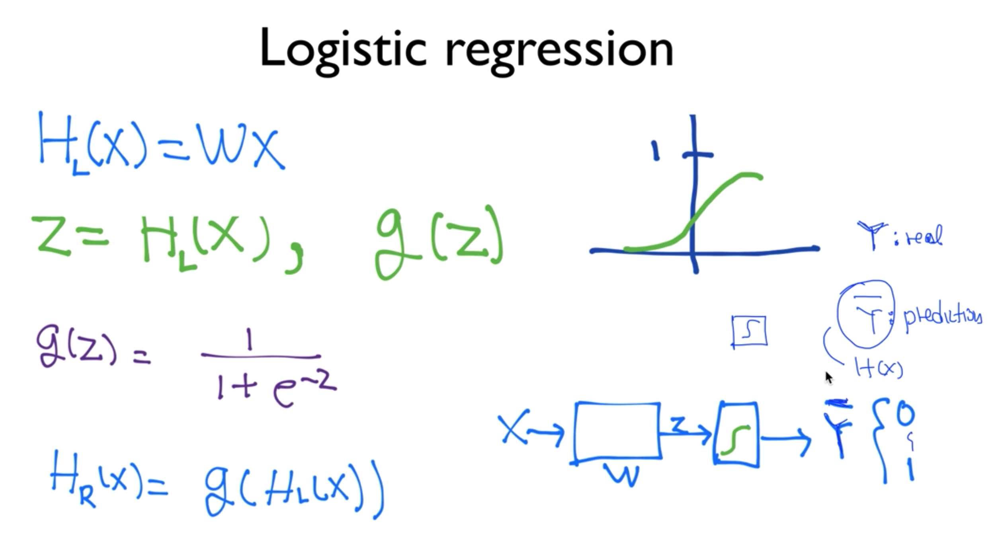

본격적으로 Softmax Classification에 대해 이야기를 시작하기 전에  
지난 시간까지의 이론적인 내용들을 짚고 넘어가도록 하자.

기본적으로 출발은 `H(X) = WX`라는 *Linear*한 Hypothesis와 함께하였다.  
이러한 `WX`와 같은 형태의 단점은 리턴하는 값이 어떠한 실수의 값 (100, -10 ... 등)
이 되기 때문에 둘 중 하나를 선택하는 **Binary Classification**을 수행하려 할 때  
적합하지 않았다. 그래서 이를 해결하기 위한 방안으로 `z = H(X)`라고 하고,  
어떠한 `g(z)`라는 함수를 통해 앞서 언급한 큰 실수 값들을 압축하여 0 또는 1  
혹은 그 사이의 값으로 표현할 수 있도록 하는 것이었다.  
이를 적합하게 표현한 `g(z)`를 **sigmoid function** 혹은 **logistic function**  
이라고 부른다고 하였다.

이를 우측 하단에 보이는 그림과 함께 다시 정리하여 설명하면,  
`X`라는 입력이 있고 연산 유닛에서 `W`를 가지고 *Linear*한 계산 과정을 거친 뒤에  
나오는 값이 `z`이며, *sigmoid*라는 함수에 입력하게 된다.  
이를 통과하고 난 뒤에는 어떠한 값이 나오게 되는데, 이는 0과 1 사이에 해당하는 값이고  
이를 통상적으로 **Y hat**이라고 부른다. 흔히 `Y`는 실제 데이터에 해당하고  
예측(predict)값에 해당하는 것을 구분하여 부르기 위해 Y hat이라고 한다.

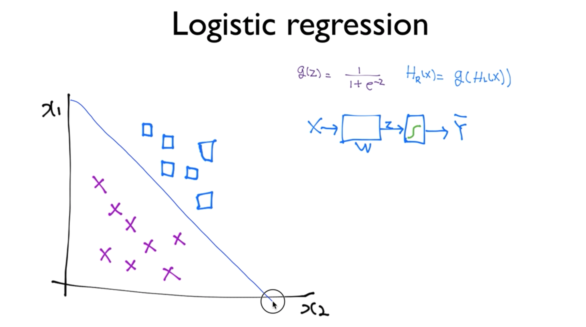

Logistic classification이 하는 일을 직관적으로 살펴보기 위해 예를 들면  
`x1`, `x2`라는 값을 가지고 있고, 우리가 분류해야 할 네모와 X 모양의 두 데이터가 있다고  
할 때, _Logistic classification을 한다_ 혹은 _`W`를 학습시킨다_ 는 말은  
이 두 모양의 데이터를 구분하는 어떠한 선을 찾아낸다는 이야기이다.

### Multinomial classification

자, 그러면 이 아이디어를 그대로 *multinomial classification*에 적용할 수 있다.  
multinomial이라는 것은 *여러 개의 클래스가 있다는 것*이다. 지금까지 자주 언급되고  
사용되던 예제의 맥락을 그대로 확장하여 살펴보도록 하자.

| <center>x1(hours)</center> | <center>x2(attendance)</center> | <center>y(grade)</center> |
| :------------------------: | ------------------------------: | ------------------------: |
|    <center>10</center>     |              <center>5</center> |        <center>A</center> |
|     <center>9</center>     |              <center>5</center> |        <center>A</center> |
|     <center>3</center>     |              <center>2</center> |        <center>B</center> |
|     <center>2</center>     |              <center>4</center> |        <center>B</center> |
|    <center>11</center>     |              <center>1</center> |        <center>C</center> |

Multinomial 이라는 것은 여러 개의 클래스가 있다는 의미이다.  
데이터가 위의 표와 같은 형태로 주어졌을 때 그래프에 나타내면 대략 아래와 같다.

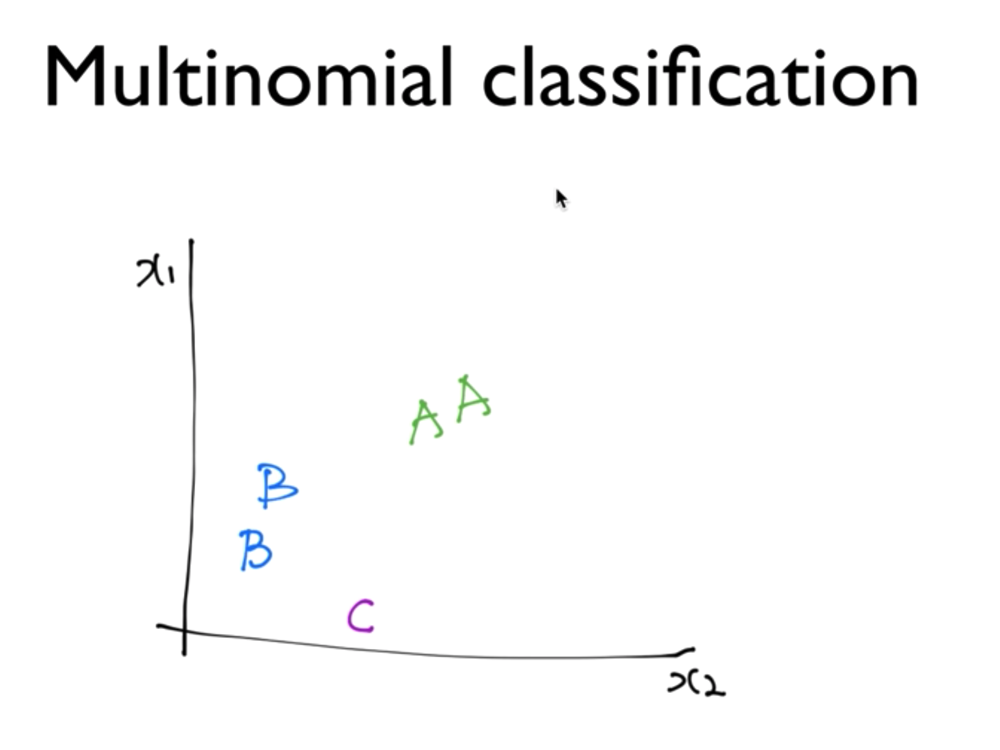

이처럼 A,B,C 세 개로 구분되는 Multinomial 형태를 갖더라도 이전까지 우리가 알고 있던  
Binary Classification만으로도 구현이 가능하다.

#### Hypothesis

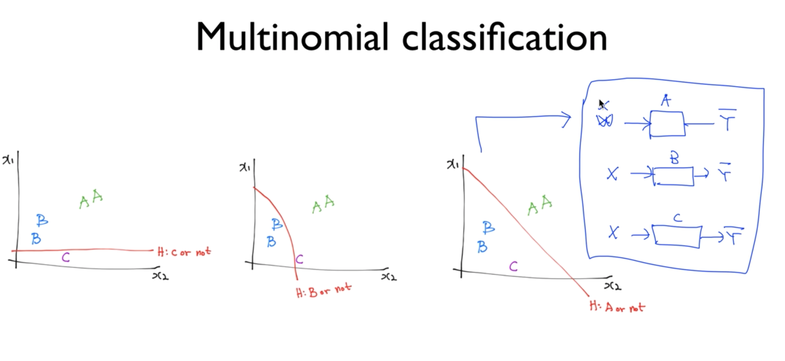

위의 그림에서와 같이 A인지 아닌지, B인지 아닌지, C인지 아닌지의 3개의 경우로 나누어  
구분할 수 있고, 앞서 본 도식을 각각 적용하여 3개의 독립된 *Classifier*들을 가지고  
구현이 가능하다고 할 수 있는 것이다.

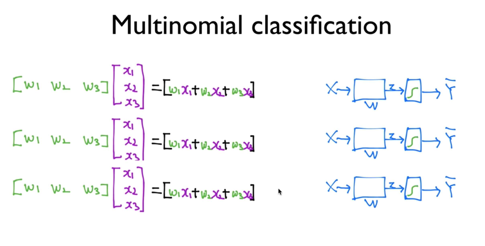

이 3개의 Classifier들을 실제로 구현할 때에는 그림에서와 같은 수식을 사용하게 되는데  
이는 우리가 알고 있던 `W * X = H(X)`와 같은 형태를 갖는 행렬 곱의 수식이다.
우리는 3개의 Classifier들을 구하려고 하기 때문에 각각 독립된 벡터를 가지고  
3번의 계산을 수행해내야 한다. 그런데 이렇게 독립적으로 계산하면 계산하는 데에도,  
구현하는 데에도 복잡하게 느껴지는데, 우리는 행렬 곱셈을 알고 있기 때문에  
하나로 표현할 수가 있다.

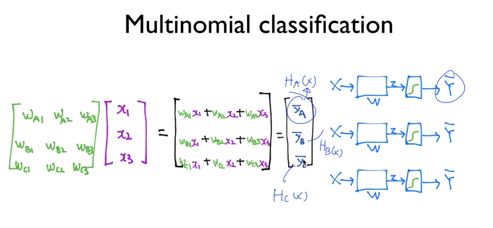

`W`에 해당하는 벡터들을 나란히 하나로 묶어 위와 같이 각 첨자를 A,B,C에 해당하게  
바꾸어주고 9 \* 9 행렬로 표현한 뒤, 동일한 곱셈 연산을 수행하게 되어 얻게 되는 결과가  
바로 우리가 원했던 `Ha(X)`, `Hb(X)`, `Hc(X)`에 해당하는 가설에 해당하게 된다.  
이렇게 3개의 독립된 Classifier를 각각 구현해야 하지만 하나의 벡터로 한 번에  
처리가 가능하고 이 것은 세 개의 독립된 Classification처럼 동작하게 된다.

다시 말해서, 사진의 오른쪽 도식과 같이 세 개의 Classifier들을 따로따로 나누어  
표현하고 연산하는 것은 불필요하고 복잡하므로 행렬 연산을 단일화하여 간단히 나타내고  
계산을 쉽게 할 수 있다는 것이다.

그런데 위처럼 가설 함수를 하나의 벡터로 한 데 묶어 구했다고 하더라도,  
이 값들은 결국 이전에 언급한 것처럼 실수 값에 해당한다. 그 값의 크기 따라  
정답을 도출해낼 수는 있겠지만, 이는 우리가 알던 Logistic의 방식이 아니기 때문에  
Sigmoid function을 적용하여 0에서 1사이의 값이 나오도록 해야 한다.

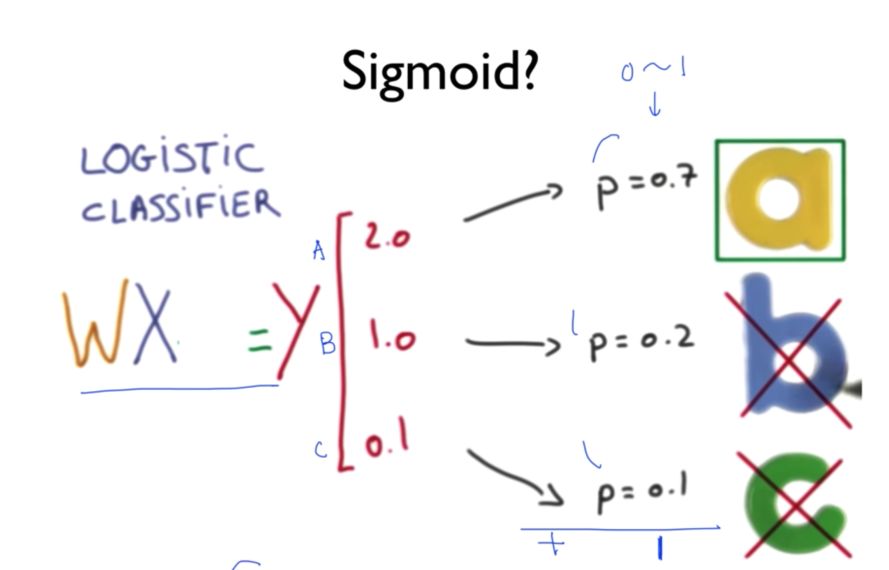

위 사진에서 A,B,C 각각에 해당하는 Classifier들은 어떠한 과정을 거쳐서  
0과 1사이의 값을 도출하게 되고, 결론적으로 한 벡터 안의 이 모든 클래스들의  
**결과 값의 합이 1이 되게 하는** 이 방식이 *Softmax classification*이다.

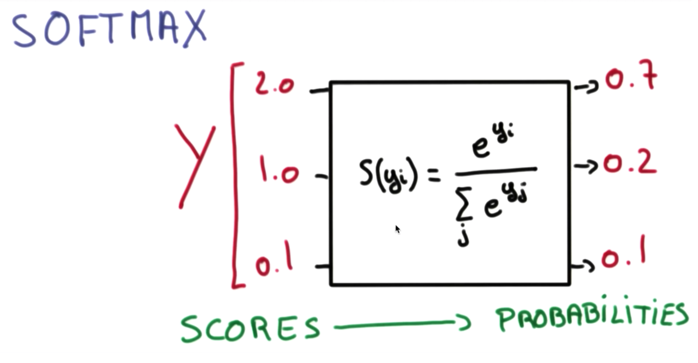

위 그림이 바로 Softmax function이다. 가설 함수 결과값의 행렬 벡터를  
(예시에서는 3개이지만 이 행렬의 행의 개수는 **n개**일 것이다.) 이 함수에 입력하면,  
앞서 말한 것과 같은 0과 1사이의 값이고 모든 값의 합이 1이 되는 *확률 값*이 될 것이다.

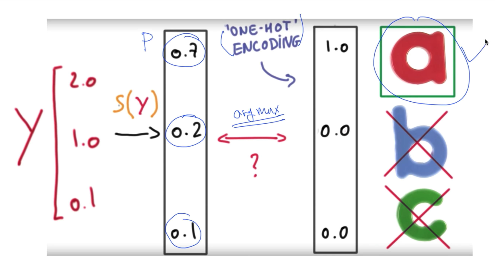

이렇게 Softmax function을 거쳐 변환된 확률 값들을 바탕으로  
**One-Hot Encoding**이라는 절차를 거쳐서 (실습 시간에 다룰 것이다.)  
가장 큰 값만 1로 바꾸고 나머지를 0으로 변경하여 하나의 클래스를 채택하는  
결과를 얻게 된다.

#### Cost function

지금까지의 과정을 통해 예측하는 모델 (Hypothesis)를 구해보았고  
이제 예측 값이 실제의 값과 얼마나 차이를 나타내는가에 대한 _Cost function_  
을 설계하는 방법에 대해 알아보도록 하겠다.

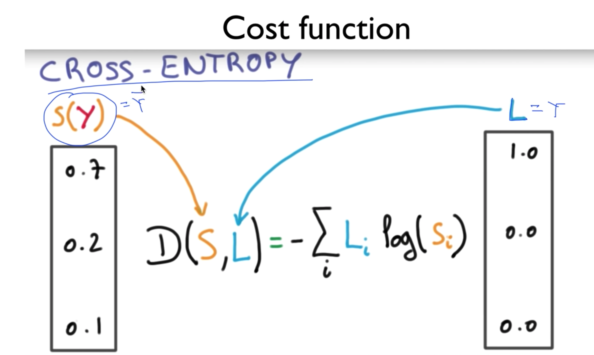

Softmax Classification 을 수행하는 과정에서 Cost function을 구할 때,  
**Cross-Entropy**라는 함수를 사용하여 도출하게 된다.  
위 그림에서의 `S`는 **S**oftmax function을 거쳐 도출된 확률 값이자, 달리 말하면  
가설 함수의 결과값에 해당하므로 예측 값에 해당하며 도입부에 언급된 *Y hat*이라 할 수 있다.
`L`은 **L**abel 값이라는 의미이며, 바로 이전 사진에서 본 것처럼 One-hot Encoding  
과정을 거쳐 변환된 실제 값, 즉 Y 값에 해당한다.

이제 이 수식이 어떻게 정상적으로 동작하고 적용이 가능한지에 대해서 알아보자.

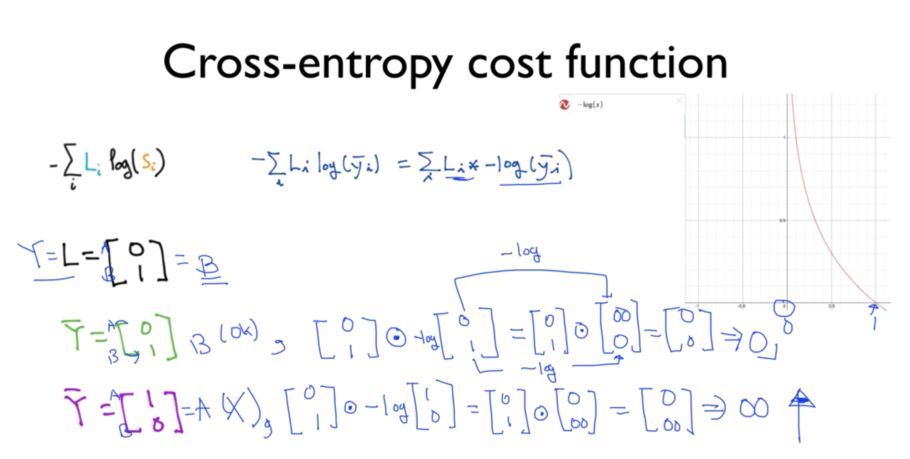

`-` 기호의 위치를 바꾸어 곱셈 기호를 명시적으로 표현하면 사진에서 제목 아래에 보이는  
공식처럼 표현할 수 있다. 이 곱셈 기호는 (필자도 이 강의를 들으며 처음 알게 되었는데)  
요소별 곱셈(**element-wise multiplication**) 이라고 불리는 곱셈 방식인데, 피연산자인  
행렬에서 각 요소별로 연산을 수행하는 방식이다. 사진에서 원 안에 점을 찍어 표현한 기호가  
바로 그 곱셈 기호이다. [아다마르 곱 (Hadamard product)](https://ko.wikipedia.org/wiki/%EC%95%84%EB%8B%A4%EB%A7%88%EB%A5%B4_%EA%B3%B1)이라고도 불린다고 한다.

여기서 `-log()` 형태의 표현은 _Logistic Classification_ 에서 도입한 것처럼  
우측의 그래프로 나타낼 수 있음을 알 수 있다. 간단한 예를 통해서 이 공식을 증명해보면  
사진의 하단부에 보이는 것과 같다. A, B 두 클래스를 갖는다고 가정하면`L`은 실제 값 벡터에  
해당하며 B를 채택한다는 것을 알 수 있다.

<span style="color:green;">초록색</span> 글씨로 표현된 예측 벡터는 B를 예측하고 있으며  
공식에 대입하게 되면 `L`에 해당하는 **[0, 1]**벡터와 Y hat에 해당하는 예측 벡터에  
`-log`를 취한 것에 곱을 수행하는 구조가 되는 것을 확인할 수 있는데,  
이 때 `-log`를 취하게 되면 우측 그래프를 통해 알 수 있듯이 0에 해당하는 값은 무한대가 되고,  
1에 해당하는 값은 0을 갖게 된다. 따라서 결과는 **[inf, 0]**이 되며, 이들을  
element-wise 곱셈을 수행하게 되면 **[0, 0]**이 되고, 공식의 가장 왼 쪽에 있는 _sigma_,  
즉 각 요소를 모두 합해주게 되면 0이라는 결과를 얻게 된다. 이 값이 구하려는 **Cost**가 된다.

<span style="color:purple;">보라색</span> 글씨로 표현된 예측 벡터는 A를 예측하고 있으며  
잘못된 예측을 하고 있다. 이를 공식에 대입하게 되면 `L`에 해당하는 벡터와 Y hat에 해당하는  
예측 벡터에 `-log`를 취한 것을 마찬가지로 element-wise 곱셈을 수행한다.  
마찬가지로 그래프를 통해 알 수 있듯, (간단한 예이므로 직관적으로 반대라고 생각하면 되겠다.)  
1에 해당하는 값은 0을 갖게 되고, 0에 해당하는 값은 무한대를 갖게 되어 **[0, inf]**라는 결과를  
얻게 됨을 알 수 있다. 이를 **L = [0, 1]**과 각 요소를 곱셈의 결과는 **[0, inf]**가 되고,  
최종 결과는 무한대가 됨을 알 수 있다. 따라서 잘못된 예측을 하는 가설은 무한대가 된다는 것이다.

반대의 경우도 마찬가지이다.

위의 예를 이어서 실제 Label `L`이 A를 채택하는 결과 **[1, 0]**를 가지고 있고 예측 벡터는  
동일하다고 할 때, 이제는 <span style="color:green;">초록색</span>이 잘못된 예측을 하고 있으므로 무한대의 값을 갖고,  
<span style="color:purple;">보라색</span>이 올바른 예측을 하고 있으므로 0의 cost 값을 갖게 되는 것을 알 수 있다.

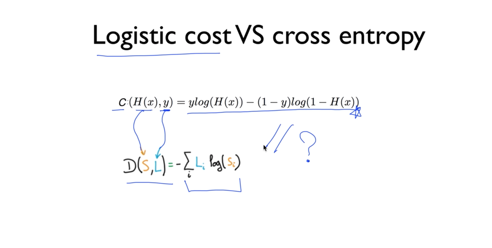

지금까지 우리가 살펴본 *Cross Entropy cost function*은 지난 강의에서 우리가 배웠던  
*Logistic Classification의 Cost function*과 완전히 동일하다.  
Logistic cost에서의 C는 **C**ost를 의미하고, Cross entropy의 D는 **D**istance를  
의미한다. 또한 Logistic cost의 `H(x)`와 `y` 값은 예측값(가설)과 실제 값을 의미하므로  
Cross entropy의 **S**oftmax 값과 **L**abel 값과 일맥상통한다.

> 교수님께서 우측에 나타나는 공식 또한 동일한 논리를 가지고 있다고 설명하시면서 그 이유는  
> 숙제로 남겨두겠다며 생각해보라고 말씀하셨는데, 지금까지 배운 것을 토대로 생각해봤을 때,  
> 사실상 Cross entropy의 공식은 Logistic cost 공식이 압축되어 있다고 생각할 수 있으며  
> (`H(x) = S`, `y = L`이라고 했으므로) 단지 차이점이라고 하자면 Cross entropy에서는  
> 각 클래스들에 해당하는 값이 한 벡터에 묶여있기 때문에 cost 값을 *sum*해주는 과정이  
> 포함되는 것 뿐이라고 생각된다.

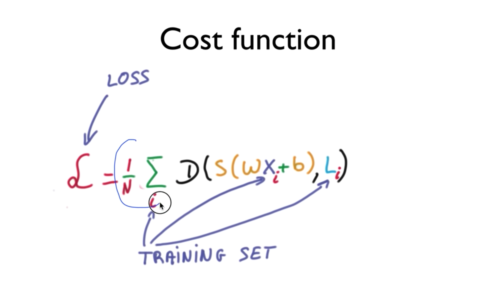

지금까지는 하나의 Training set에 대한 cost function을 설명한 내용이었고,  
여러 개의 Training Data Set이 있다면 각 Set의 Cost를 모두 더하여 평균을 내주면  
전체에 대한 Cost/Loss function을 정의할 수 있게 된다.

#### Gradient Descent

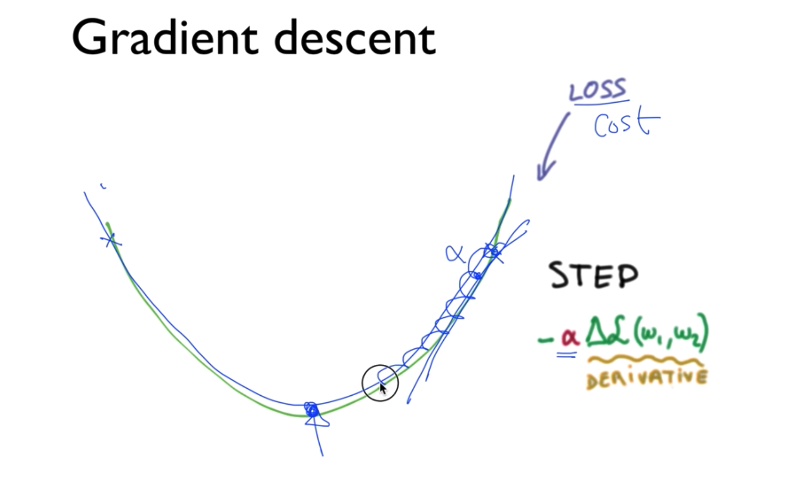

항상 그랬듯이 마지막 단계로 직전까지 논했던 **Cost**를 _최소화 시키는_ 값,  
(여기에서는 `W`에 해당하는 벡터)를 찾아내는 알고리즘을 적용해야 하는데 항상 등장하던  
Gradient Descent를 마찬가지로 적용하게 될 것이다.

어떤 점에서 시작하더라도 경사면을 따라 내려가서 반드시 최소값을 찾을 수 있음을  
보장하는 것이 이 알고리즘이며 경사면을 뜻하는 것이 그래프에서의 기울기이다.  
기울기를 구하기 위해서는 수식을 미분해야 하는데, 진도를 거듭하면서 수식이 복잡해졌기  
때문에 미분 과정은 다루지 않는다. 다만 기억해야 할 것은 사진에서 보이는 것처럼  
learning rate 값인 `alpha` 만큼씩 내려가면서 위치를 업데이트 시켜 기울기를 구하며  
최소값을 찾아가는 과정이라는 것이다.

<br/>

---

<br/>

### TensorFlow Practice

실습 강좌에서는 Softmax Classifier를 TensorFlow를 이용하여 직접 구현해본다.  
그 전에, 이론 시간에 학습했던 내용을 한번 더 요약하여 짚고 넘어간다.

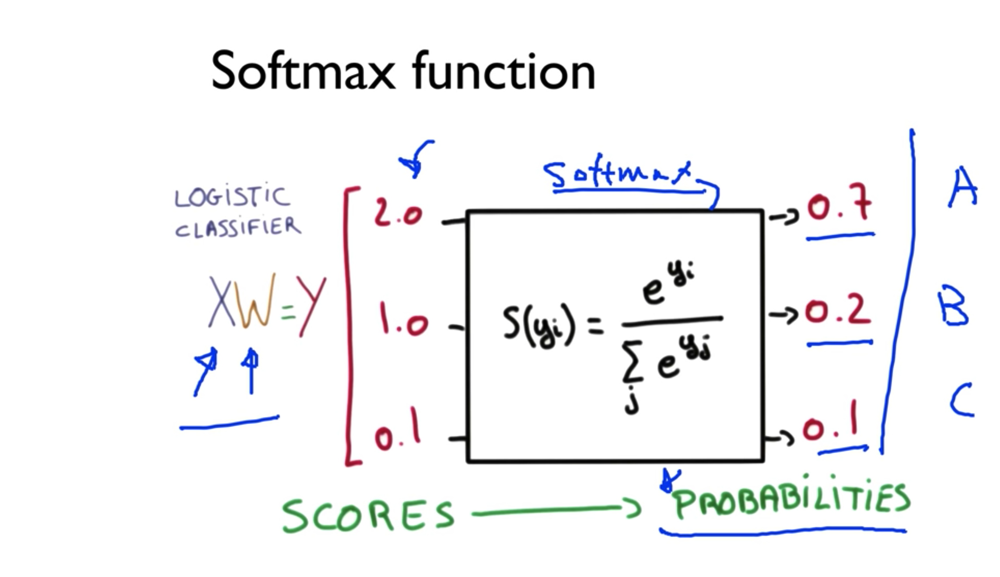

Softmax function이라는 것은 여러개의 클래스를 예측할 때 매우 유용하다.  
이 것을 다루기 이전까지의 Binary Classification은 0이냐 1이냐와 같은 예측만이  
가능했는데, 사실 실생활에서는 두 개보다는 여러개를 예측하는 경우가 더 많을 것이다.  
따라서 `N`개의 **예측할 거리**가 있을 때, 이 Softmadx Classification을 사용하는  
것이 좋다.

시작은 항상 동일하게 주어진 `X` 값에, 학습시킬 `W`를 곱해서 값을 만들어낸다.  
그런데 이렇게 만들어진 값은 Score에 해당하는 실수 값에 불과하므로 우리는 이것을  
*Softmax*라고 불리는 함수를 통과시키면 확률 값이 결과로 나오게 된다.  
만약 각 Label을 A, B, C라고 한다면 A가 0.7, B가 0.2, C가 0.1 과 같이  
확률로 표현할 수 있게 된다. 그리고 또 하나의 특징은 여기서 모든 클래스의 확률을 합치면  
이 값은 반드시 1이 될 것이다.

> 그러면 이것을 TensorFlow로 어떻게 구현할 것인가?

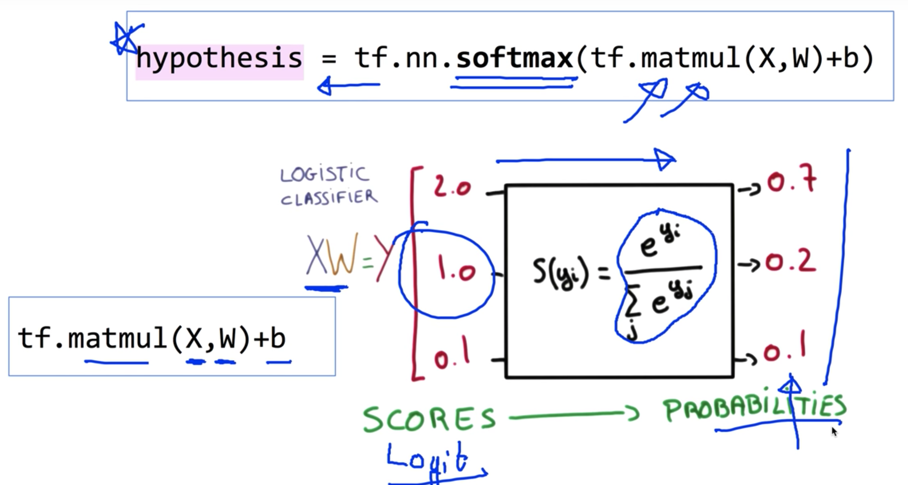

TensorFlow를 이용하여 **Softmax Classification**을 구현하는 것은 어렵지 않다.  
그림에 나와 있는 것처럼 실수 예측 값 수식을 그대로 옮겨 작성해주면 되는데,  
(이 *Scores*에 해당하는 값들을 다른 말로 **Logit**이라고 부르기도 한다.)  
주어진 `X-data`와 `W` 행렬을 TensorFlow의 Matrix Multiplication 내장 함수인  
`tf.matmul`을 이용하여 곱셈을 수행한 뒤 `b`(bias) 값을 더해주면 된다. 그리고  
이 가설을 통해 보기에 매우 복잡한 **Softmax function**을 통과시키는 방법은 마찬가지로  
TensorFlow의 내장 함수인 `tf.nn.softmax` 함수를 이용하여 **Logit**값을 전달해주면  
우리가 원하는 확률 값으로 구성된 벡터를 얻을 수 있고, 이 것이 우리의 Hypothesis이다.

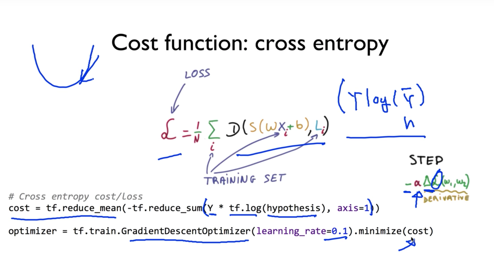

다음으로는 Cost(loss) function이다. Loss function은 수업 시간에 이야기 한 것처럼  
기본적으로 `Y` 와 `Y hat`(hypothesis)에 log를 취한 형태를 띠고 이를 **Cross entropy**  
라고 설명했었다. 그림에서 보이는 `L`이 `Y`에 해당하고, `S`(softmax function)이  
`Y hat`에 해당한다. 이를 `D`(distance, 즉 앞서 언급한 Cross entropy function을  
거친 결과) 라고 하고, 그 `D`의 결과들을 모두 더해 평균을 낸 것이 우리가 원하는 최종적인  
Cost function인 것이다. 그리고 어김없이 이 Cost를 minimize하기 위해 경사면 내려가기  
(Gradient Descent) 함수가 등장하는데, 여기서도 마찬가지로 Cost 함수를 미분한 기울기를  
alpha(learning rate)값을 곱하여 weight 값에서 빼주면서 최소 cost를 찾아가는 방식이다.  
따라서 결론적으로 optimizer의 선언은 지금까지와 항상 똑같은 한 문장으로 정의할 수 있다.

그럼 전체 코드를 한 번 살펴보도록 하자.

#### Practice 1 - Softmax Classifier

```python
# Lab 6 Softmax Classifier
import tensorflow as tf
tf.set_random_seed(777)  # for reproducibility

#x1, x2, x3, x4
x_data = [[1, 2, 1, 1],
          [2, 1, 3, 2],
          [3, 1, 3, 4],
          [4, 1, 5, 5],
          [1, 7, 5, 5],
          [1, 2, 5, 6],
          [1, 6, 6, 6],
          [1, 7, 7, 7]]

#One-Hot Encoding
y_data = [[0, 0, 1],
          [0, 0, 1],
          [0, 0, 1],
          [0, 1, 0],
          [0, 1, 0],
          [0, 1, 0],
          [1, 0, 0],
          [1, 0, 0]]
#의미에 따라 표현하자면 y_data는 [2, 2, 2, 1, 1, 1, 0, 0]이 될 것이다.

X = tf.placeholder("float", [None, 4])
Y = tf.placeholder("float", [None, 3])
nb_classes = 3 #number of class

W = tf.Variable(tf.random_normal([4, nb_classes]), name='weight')
b = tf.Variable(tf.random_normal([nb_classes]), name='bias')

# tf.nn.softmax computes softmax activations
# softmax = exp(logits) / reduce_sum(exp(logits), dim)
hypothesis = tf.nn.softmax(tf.matmul(X, W) + b)

# Cross entropy cost/loss
cost = tf.reduce_mean(-tf.reduce_sum(Y * tf.log(hypothesis), axis=1))

optimizer = tf.train.GradientDescentOptimizer(learning_rate=0.1).minimize(cost)

# Launch graph
with tf.Session() as sess:
    sess.run(tf.global_variables_initializer())

    for step in range(2001):
            _, cost_val = sess.run([optimizer, cost], feed_dict={X: x_data, Y: y_data})

            if step % 200 == 0:
                print(step, cost_val)
```

`x_data`를 먼저 살펴보면, x1 ~ x4에 해당하는 4개의 element로 구성된 데이터임을  
알 수 있고, `y_data`는 **One-Hot Encoding** 방식을 통해 표현되어 있는 것을  
확인할 수 있다. 여기서 One-Hot encoding이란, 이론 수업에서도 언급했지만 이름대로  
_하나만 뜨겁게 한다_ 라는 의미로 받아들이면 이해가 쉽다. 다시 말해서 우리는 여기서  
세 개의 클래스의 구분을 표현하고 싶은데, 첫 번째 클래스를 의미하도록 하기 위해서는  
**[1, 0, 0]** 두 번째 클래스를 의미하려면 **[0, 1, 0]**과 같은 방식으로 작성하면 된다는 것이다.

따라서 `placeholder`를 정의할 때에도 `shape`을 작성하는 데 있어서 `x_data`는  
직관적으로 None(instance의 개수 제한 없음)과 4(element의 개수)를 부여하면 되고  
`y_data`는 One-Hot-Encoding 방식으로 작성했기 때문에 element의 개수는 **3**으로  
전달해줘야 한다. 반대로 말해서, One-Hot으로 표현할 때`y_data`의 `shape`은 Label의  
개수(우리가 구하려는 class의 종류의 수 `nb_classes = 3`)가 되는 것을 알 수 있다.

`W`와 `b`를 TensorFlow Variable로 정의할 때에도 `shape`을 주의해야 하는데  
weight에서는 입력되는 `x_data`의 element 수가 4개이므로 4를 주고 bias에는  
출력되는 `Y`의 클래스 수와 같은 종류 만큼 출력되어야 하므로 `nb_classes` 값이 된다.

이후에 그래프를 명세하는 과정은 앞서 언급한 것처럼 변경된 수식에 대한 내용만 수정하면  
나머지 절차는 이전부터 행하던 방식과 동일하다. `Hypothesis`는 `X`와 `W`의 행렬 곱셈  
결과에 `b`값을 더해주고 `softmax` 함수를 통과시킨 것으로 정의할 수 있을 것이고,  
`cost` 또한 Cross entropy 함수의 수식대로 작성한 뒤 모두 더해서 평균을 구하는  
함수로 정의하고 나서 경사 하강법으로 `optimizer`를 선언해주면 되는 것이다.

학습이 이루어지는 과정 또한 마찬가지이다. 세션을 열고, 초기화를 시켜준 뒤에 Loop을  
돌면서 `optimizer`를 세션에서 실행시키면서 `feed_dict`를 통해  
`x_data`,`y_data`를 입력으로 던져주게 된다.

위 코드의 결과는 다음과 같이 출력된다.  
각 200회 마다 `step`의 값과 해당 시점의 `cost`값이 출력되며  
그 `cost`값이 처음에 무작위한 값으로 시작하여 학습 회수를 거듭하면서  
값이 점차 매우 작은 값으로 수렴하는 것을 확인 할 수 있다.

```
0 6.926112
200 0.6005015
400 0.47295815
600 0.37342924
800 0.28018373
1000 0.23280522
1200 0.21065344
1400 0.19229904
1600 0.17682323
1800 0.16359556
2000 0.15216158
```

다음은 우리가 작성한 모델이 학습한 결과가 올바른지에 대해 테스트하는 내용이다.

```python
    print('--------------')
    # Testing & One-hot encoding
    a = sess.run(hypothesis, feed_dict={X: [[1, 11, 7, 9]]})
    print(a, sess.run(tf.argmax(a, 1)))

    print('--------------')
    b = sess.run(hypothesis, feed_dict={X: [[1, 3, 4, 3]]})
    print(b, sess.run(tf.argmax(b, 1)))

    print('--------------')
    c = sess.run(hypothesis, feed_dict={X: [[1, 1, 0, 1]]})
    print(c, sess.run(tf.argmax(c, 1)))

    print('--------------')
    all = sess.run(hypothesis, feed_dict={X: [[1, 11, 7, 9], [1, 3, 4, 3], [1, 1, 0, 1]]})
    print(all, sess.run(tf.argmax(all, 1)))
```

<br/>

---

<br/>

##### tf.argmax

위 코드에서, 교수님께서 `tf.argmax`에 대해서 설명해주셨는데, 두 번째 인자로 전달되는  
`axis`에 대한 내용이 이해가 되지 않아서 구글에 검색을 통해 찾아보았다.

이 `axis`, 다시 말해 축에 대한 개념은 우리가 이 강의의 초반부에서 공부했던  
기본적인 내용 중의 하나인 **Rank**라는 개념과 동일하다. Rank란 달리 말해  
배열의 차원 수를 뜻하는데, 1차원 배열의 Rank는 1, 2차원 배열의 Rank는 2  
와 같은 느낌인 것이다.

첫 번째 인자로 전달된 배열이 일차원 배열일 경우에는  
`axis`값으로 0만을 사용할 수 있으며 이는 배열의 열(세로축)만을 기준으로 최대값을  
찾아내 반환한다. 2차원 배열, 즉 Rank가 2인 행렬일 경우에는 `axis`값으로  
0과 1을 사용할 수 있으며 0일 경우 앞에서의 설명과 마찬가지, 1일 경우에는 각 행에  
대하여 최대값이 위치한 인덱스를 묶어 하나의 배열로 반환하게 된다.

이를 일반화시키면, `axis`의 값으로는 **첫 번째 인자에 해당하는 배열의 Rank 값 - 1**  
부터 0까지에 해당하는 값이 전달 가능한 경우의 수가 될 것이다.

덧붙여 이 `argmax`함수를 사용하는 이유는 우리가 위에서 `y_data`를 정의할 때  
**One-Hot-Encoding** 방식을 통해 표현하였기 때문에 이 Label이 의미하는  
숫자를 찾기 위해서 사용된다고 한다.

따라서 간단한 예시를 들어 다음과 같은 `a`라는 Rank가 2인 행렬이 있다고 할 때

```python
a = tf.constant([[3, 10, 1],
                 [4, 5, 6],
                 [0, 8, 7]])
print(session.run(tf.argmax(a, 0))) #1
print(session.run(tf.argmax(a, 1))) #2
```

1번과 같은 경우에는 `a`행렬에서 세로 축만을 기준으로 최대값을 탐색하고,  
2번과 같은 경우에는 `a`행렬에서 각 행에 대한 최대값을 탐색하므로

```
[1, 0, 2]
[1, 2, 1]
```

와 같은 1차원 배열을 반환하게 될 것이다.
<a href="https://webnautes.tistory.com/1234" target="_blank">위 내용의 출처</a>

<br/>

---

<br/>

따라서 위 학습 결과 테스트에 대한 결과는 아래와 같다.  
우리는 데이터와 모델을 명세할 때 `y_data`를 One-Hot-Encoding 방식을  
사용하여 Rank가 2인 행렬로 작성하였으며 각 Label이 의미를 갖는 단위가 각 행에  
해당하므로 `axis = 1`을 전달해 아래와 같은 일차원 배열로 반횐되는 결과를 얻을 수 있다.

```
[[1.3890490e-03 9.9860185e-01 9.0613084e-06]] [1]
-------------
[[0.9311919  0.06290216 0.00590591]] [0]
-------------
[[1.2732815e-08 3.3411323e-04 9.9966586e-01]] [2]
-------------
[[1.3890490e-03 9.9860185e-01 9.0613084e-06]
 [9.3119192e-01 6.2902197e-02 5.9059085e-03]
 [1.2732815e-08 3.3411323e-04 9.9966586e-01]] [1 0 2]
```

<br/>

---

<br/>

#### Practice 2 - Fancy Softmax Classifier

두 번째 실습에 들어가기 앞서, Softmax function의 **Cost function**을  
정의하는 새로운 방식에 대해 도입해보도록 한다.

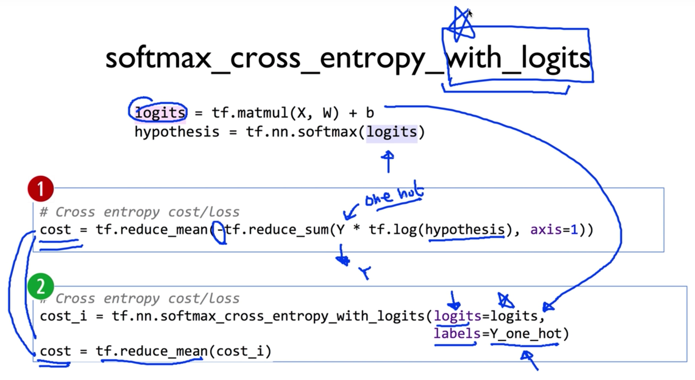

[본 실습을 도입하면서](#tensorflow-practice) **Logit**이라는 개념에 대해서 도입했는데,  
어떤 Label이 될지에 대한 확률값을 반환하는 Hypothesis를 정의할 때 Softmax 함수를  
통과시키기 전의, 기본적인 형태의 값을 의미한다. (다른 말로 _Scores_, 즉 예측 값.)

이전 실습에서 우리가 작성했던 Cost function은 사진에서 <span style="color:red;">1번</span>에 해당하는, 수식을 그대로  
풀어 옮긴 한 줄짜리 코드였지만, `softmax_cross_entropy_with_logits`라는  
TensorFlow 함수를 이용하여 <span style="color:green;">2번</span>과 같이 간단히 요약해 작성할 수 있다.  
여기서 `cost_i`는 `-tf.reduce_sum ~`에 해당하는 부분으로 대치됨을 알 수 있다.

이 과정을 통해 단순히 `tf.nn.softmax`함수를 통해 Hypothesis를 정의한 뒤 cost를  
수식으로 작성하지 않고 `tf.matmul(X, W) + b`를 `logits`이라는 변수로 둔 뒤  
동명의 Property로 전달해주면 된다. 여기서 `labels`로 전달되는 것은 우리가 <span style="color:red;">1번</span> 방식에서  
전달한 `Y` 벡터가 One-Hot-Encoding 방식으로 전달되었기 때문에 이를 명시적으로 이름을  
명시적으로 변경한 뒤에 전달해준 것이다.

따라서 결론적으로 이 두 방식 모두에 해당하는 `cost` 함수는 정확하게 일치한다.

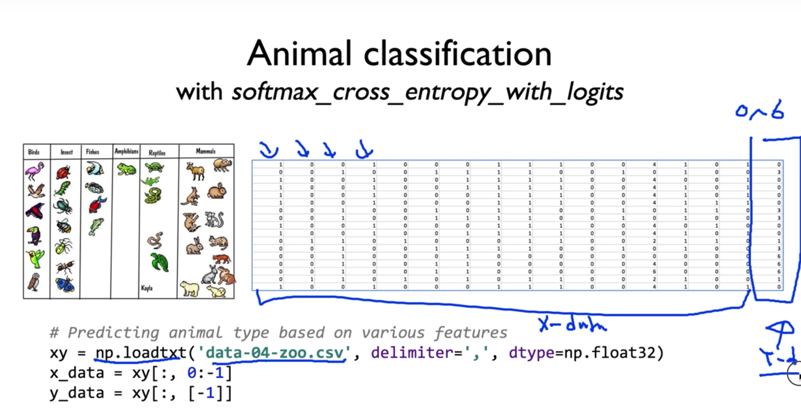

이번 실습의 예제는 위와 같은 데이터를 갖는다. 동물들이 갖는 여러 특징들을 통해서  
(다리가 몇개인지, 뿔이 달렸는지, 등등...) 어떤 동물인지를 예측하는 예제이다.  
표를 살펴보았을 때, 0번 째부터 마지막 직전까지에 해당하는 열은 각 동물들의 특징에 대해,  
즉 `x1` ~ `xn`에 해당할 것이고 마지막 열은 분류된 결과, 즉 Label 값에 대응하는  
`Y`값이 될 것이다. 또한 행은 instance의 수, 즉 주어진 동물의 수라고 생각하면 되겠다.

이 데이터에 대해서 조금 더 자세히 살펴보자.

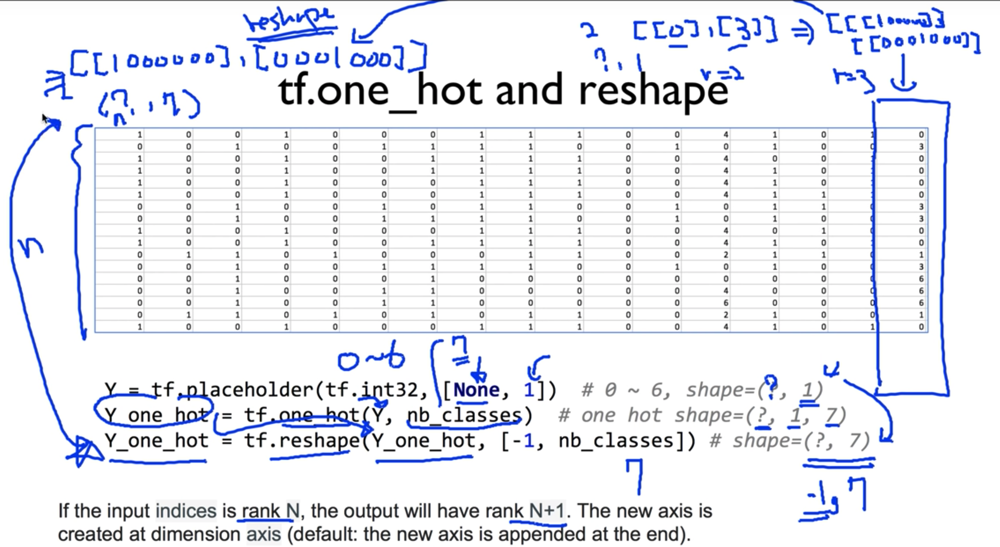

이 슬라이드에 대한 설명에서 조금은 복잡한 **Reshape**에 대한 개념이 등장한다.  
우선 우리가 사용할 마지막 열에 해당하는 `Y` 행렬의 `shape`은 `n`개의 행에 1열을 갖는다.  
나아가, 앞서 설명한 것처럼 우리가 사용할 `Y` 데이터는 결론적으로 One-Hot 방식으로  
인코딩 되어야 하므로 `tf.one_hot` 함수를 이용하여 7종류의 클래스 수를 인자로 함께  
전달해 구할 수 있다.

그러나 슬라이드의 하단에 적혀있는 것처럼, `tf.one_hot` 함수를  
사용하게 되면 `Y`의 각 Label들이 인코딩되면서 **Rank**가 한 차원 늘어나게 된다.  
무슨 말이냐 하면, 0은 **[1, 0, 0, 0, 0, 0, 0]**으로, 3은 **[0, 0, 0, 1, 0, 0, 0]**으로  
차원 축이 하나 늘어나게 되면서 우리가 원하는 `y_data`의 `shape`을 잃게 된다.

따라서 이를 해결하기 위해 `tf.reshape` 함수를 사용하여 이 늘어난 한 차원을  
줄이는 작업을 수행하도록 한다. (여기서 등장하는 -1에 대해서는 명확하게 이해하지는  
못했지만 <a href="https://tensorflowkorea.gitbooks.io/tensorflow-kr/content/g3doc/api_docs/python/array_ops.html" target="_blank">TensorFlow 공식 문서</a>
를 참조한 결과 구조를 암시(**infer**)하기 위해 사용된다고  
한다. `shape`을 적절히 조절하는 용도로 사용되는 것으로 추정.)

여기까지 이해했다면 실행하는 방법은 간단하며 그래프에 대한 코드는 다음과 같다.

```python
# Lab 6 Softmax Classifier
import tensorflow as tf
import numpy as np
tf.set_random_seed(777)  # for reproducibility

# Predicting animal type based on various features
xy = np.loadtxt('data-04-zoo.csv', delimiter=',', dtype=np.float32)
x_data = xy[:, 0:-1]
y_data = xy[:, [-1]]

print(x_data.shape, y_data.shape)

'''
(101, 16) (101, 1)
'''

nb_classes = 7  # 0 ~ 6

X = tf.placeholder(tf.float32, [None, 16]) # x_data의 개수 16개.
Y = tf.placeholder(tf.int32, [None, 1])  # 0 ~ 6

Y_one_hot = tf.one_hot(Y, nb_classes)  # one hot
print("one_hot:", Y_one_hot)
Y_one_hot = tf.reshape(Y_one_hot, [-1, nb_classes])
print("reshape one_hot:", Y_one_hot)

'''
one_hot: Tensor("one_hot:0", shape=(?, 1, 7), dtype=float32)
reshape one_hot: Tensor("Reshape:0", shape=(?, 7), dtype=float32)
'''

W = tf.Variable(tf.random_normal([16, nb_classes]), name='weight')
b = tf.Variable(tf.random_normal([nb_classes]), name='bias')

# tf.nn.softmax computes softmax activations
# softmax = exp(logits) / reduce_sum(exp(logits), dim)
logits = tf.matmul(X, W) + b
hypothesis = tf.nn.softmax(logits)

# Cross entropy cost/loss
# softmax_cross_entropy_with_logits
cost = tf.reduce_mean(tf.nn.softmax_cross_entropy_with_logits_v2(logits=logits,
                                                                 labels=tf.stop_gradient([Y_one_hot])))
optimizer = tf.train.GradientDescentOptimizer(learning_rate=0.1).minimize(cost)
```

위 코드는 앞서 설명한 내용과 기존에 진행하던 실습 내용들과 상당 부분 중복되므로  
자세한 설명은 생략하도록 하겠다.

조금 더 새로운 내용은 학습 과정 부분에서 등장한다.

```python
prediction = tf.argmax(hypothesis, 1)
correct_prediction = tf.equal(prediction, tf.argmax(Y_one_hot, 1))
accuracy = tf.reduce_mean(tf.cast(correct_prediction, tf.float32))

# Launch graph
with tf.Session() as sess:
    sess.run(tf.global_variables_initializer())

    for step in range(2001): # Optimizer, cost와 accuracy를 학습시켜 100회에  한 번씩 출력한다.
        _, cost_val, acc_val = sess.run([optimizer, cost, accuracy], feed_dict={X: x_data, Y: y_data})

        if step % 100 == 0:
            print("Step: {:5}\tCost: {:.3f}\tAcc: {:.2%}".format(step, cost_val, acc_val))

    # 학습이 완료된 후 X 데이터만 던져주고 예측이 정확한지 확인하는 과정
    pred = sess.run(prediction, feed_dict={X: x_data})
    # y_data: (N,1) = flatten => (N, ) matches pred.shape
    for p, y in zip(pred, y_data.flatten()):
        print("[{}] Prediction: {} True Y: {}".format(p == int(y), p, int(y)))

''' 출력 결과
Step:     0 Loss: 5.106 Acc: 37.62%
Step:   100 Loss: 0.800 Acc: 79.21%
Step:   200 Loss: 0.486 Acc: 88.12%
...
Step:  1800	Loss: 0.060	Acc: 100.00%
Step:  1900	Loss: 0.057	Acc: 100.00%
Step:  2000	Loss: 0.054	Acc: 100.00%
[True] Prediction: 0 True Y: 0
[True] Prediction: 0 True Y: 0
[True] Prediction: 3 True Y: 3
...
[True] Prediction: 0 True Y: 0
[True] Prediction: 6 True Y: 6
[True] Prediction: 1 True Y: 1
'''
```

코드의 흐름에 따른 부연 설명은 주석으로 작성하였고 축약된 출력 결과는 코드 블럭의 하단부와  
같다. 학습 과정과 확인 과정에서 볼 수 있듯이 예측 결과가 매우 정확한 것을 알 수 있다.

`prediction`은 가설 함수의 예측 값을 바탕으로 한 결과 Label에 해당한다.  
`correct` 값은 실제 결과 Label과 일치하는지에 대한 참, 거짓 결과를 뜻하며,  
`accuracy`는 위의 두 예측,실제 값의 일치 여부를 전체에 대해 평균을 매긴 정확도 값이다.

`zip`과 `flatten`은 파이썬 표준 라이브러리에 포함된 내장 함수로서  
`flatten`은 다차원 배열을 일차원 배열로 이름 그대로 평평하게 펴주는 역할을 하고  
`zip` 함수는 같은 개수로 이루어진 자료형을 하나로 묶어주는 역할을 한다고 한다.

---

여기까지 Softmax Classification에 대한 이론적인 내용을 공부하고 실습을 진행해 보았다.
