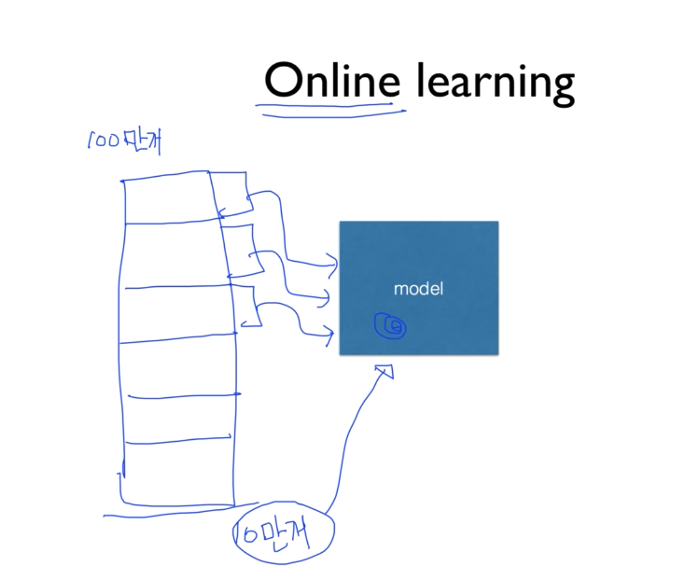

> 이 포스팅은 <a target="_blank" href="https://www.inflearn.com/course/%EA%B8%B0%EB%B3%B8%EC%A0%81%EC%9D%B8-%EB%A8%B8%EC%8B%A0%EB%9F%AC%EB%8B%9D-%EB%94%A5%EB%9F%AC%EB%8B%9D-%EA%B0%95%EC%A2%8C#">인프런 머신러닝 강좌</a> 를 수강하며 공부한 내용을 정리한 것입니다.  
> <a target="_blank" href="https://github.com/hunkim/DeepLearningZeroToAll">코드 출처</a>

## Lecture 7. Application & Tips

이번 강의는 Machine Learning Algorithm을 실제로 적용함에 있어서  
중요한 몇 가지 팁들에 대해서 알아 볼 것이다.

팁들에 대한 주제의 갈래는 크게 다음과 같다.

- **Learning rate**
- **Data preprocessing**
- **Overfitting**

### Learning rate


그림은 우리가 지금까지 Cost function을 정의하고, 그 Cost 값을 최소화(Minimize)  
하기 위해 사용한 알고리즘인 경사 하강법(Gradient descent)에 대해 보여주고 있다.

이 알고리즘을 적용할 때, 특정 `W`값에 대해 cost function을 미분한 기울기를 구하고  
거기에 우리가 임의로 정한 *learning rate*라는 것을 곱으로 적용함으로서 최소 비용을  
찾는 데에 활용해왔고 그 용법은 상단에 보이는 소스코드에서와 같았다.

#### Large learning rate


만약에 우리가 모델을 설계하면서 learning rate를 너무 크게 잡았다고 가정해보자.  
학습을 시작하게 되면 가장 처음에 무작위의 지점에서 시작을 하게 될 것인데,  
learning rate란 앞서 언급했듯이 기울기 앞에 곱해지는 상수 값이므로 기울기를  
타고 내려가는 한 발짝의 step이라고 생각하면 될 것이다. 이 step이 너무 크다고 하면  
cost가 최소가 되는 지점을 찾지 못하고 우리의 cost function 그래프의 양 옆을  
그저 왔다갔다만 하게 되어버린다는 것이다.

그리고 이 learning rate가 **매우** 크다고 한다면 학습이 제대로, 아니 아예  
이루어지지 않을 뿐만 아니라 이미 우리가 초기에 설정된 지점만큼의 값보다 더 크다고  
한다면 최소 지저이 존재하는 가운데로 수렴하지 못하고 그래프의 바깥 부분으로  
발산하게 되므로 학습 과정에서 cost 함수를 출력해보면 숫자가 아닌 값이 나올 수도 있다.

이렇듯 너무 큰 learning rate를 가지는 경우를 **Overshooting**이라고 부른다.

#### Small learning rate


반대의 경우도 마찬가지로 학습 과정에 있어 좋지 않은 영향을 미친다.  
이러한 경우, cost 함수를 학습 과정과 함께 iteration 과정에서 출력해보았을 때,  
cost 값이 매우 작은 폭으로 변화하는 것을 확인할 수 있다.

이러한 상황에서는 최소 지점을 찾는 데에 너무 많은 시간이 소요될 뿐만 아니라,  
학습 과정이 짧다면 최소 지점에 전혀 도달하지도 못하고 **local minimum**에서  
멈춰버리게 되는 것이다.

#### Try several learning rates

- Observe the cost function
- Check it goes down in a reasonable rate

이상적인 learning rate를 구하는 데에는 아쉽게도 정답은 없다.  
각자가 가진 데이터와 환경에 따라 다르기 때문에 어찌 보면 당연하다.  
때문에 대부분의 경우 `0.01`로 처음 learning rate를 설정하곤 하는데,  
이 값으로 인해 cost가 발산이 된다고 하면 조금 더 작게,  
너무 느리게 움직인다고 하면 조금 더 크게, 이러한 방식으로 조율해나가는 것이 좋다.

### Data preprocessing


우리가 가지고 있는 데이터, 특히 **feature data**라고 하는 `x_data`를 전처리해야 할  
필요성이 가끔씩 존재한다. 이 상황은 주로 **weight**가 여러 개일 때에 주로 나타나는데,  
여기서는 weight가 2개인 경우에 대해서 살펴보도록 한다. 그림의 그래프를 살펴보면 나이테와  
같은 모양을 한 것을 볼 수 있는데, cost 축을 z축으로 하는 3차원 그래프를 떠올리면 될 것 같다.  
따라서 `w1`과 `w2`에 대한 2차원 그래프에서는 이처럼 여러 개의 원으로 보일 수 있는 것이다.

간단하게 지금까지 살펴보았던 밥그릇 모양의 cost function을 위에서 바라봤다고 생각하자.  
그러면 이 그래프에서는 중심이 최소 cost를 갖는 지점이 될 것이며 마찬가지로 무작위의  
지점에서 학습을 시작하게 되어 경사면을 타고 중심을 향해 내려가게 될 것이다.


좌측의 표와 같이 `x1`,`x2` 두 개의 feature data를 갖는 데이터가 있다고 생각해보자.  
cost 함수는 이 `x1`과 `w1`, `x2`와 `w2`를 각각 곱해서 더한 값을 최소화하는 방향으로  
나아갈 것인데, 표를 살펴보면 이 `x1`과 `x2` 값이 서로 매우 큰 차이를 보이기 때문에  
이를 우측의 `w1`,`w2` 축으로 이루어진 그래프에 위에서 살펴본 것과 같은  
등고선 형태의 그래프를 그리게 되면 옆으로 넓고 납작한 모양으로 그려지게 될 것이다.  
그림은 2차원에서 살펴본 모습이지만, 다차원에서도 마찬가지로 한 쪽으로 치우친,  
매우 왜곡된 형태가 나타나게 될 것이다.

`x_data`간에 값의 매우 큰 차이가 발생하기 때문에 이 그래프 또한 한 쪽으로만 왜곡되어  
성장하는 형태를 가지게 된다. 이 때문에 그래프를 이루는 선분들 간의 폭이 매우 좁기 때문에  
`alpha`값, 즉 learning rate가 매우 좋은 값이더라도 그래프 위의 파란 선분과 같이  
조금이라도 잘못되면 중심으로 향하지 못하고 그래프 바깥으로 튀어 나간다는 것이다.

그래서 이렇게 데이터 값 사이에 큰 차이가 있을 경우 **Normalize**할 필요가 있다고 한다.

#### Normalize


우리가 가진 Original Data의 분포가 왼쪽 그래프와 같이 흩어져 있다고 했을 때,  
보통 사용되는 방법으로 _zero-centered data_ 라고 불리는 데이터 값의 중심이 0으로  
이동하도록 조정하는 작업을 일컫는다. 또, 가장 많이 사용되는 방법으로 어떠한 값의 범위가  
어떠한 형태의 범위 안에 항상 들어가도록 **normalize**하는 것이다.

learning rate도 잘 잡은 것 같은데 이상하게 학습이 이루어지지 않고 cost가 발산한다거나  
정상적이지 않은 동작을 보인다면 data set 중에 차이가 크게 나는 데이터들이 있는지,  
데이터 pre-processing 과정을 거쳤는지 한 번 점검해 볼 필요가 있다고 한다.

#### Standardization


normalize를 수행하는 방법은 간단하다.  
`x_data`를 `x_data`값에서 평균 값을 빼고, 계산한 분산 값으로 나누어 재설정해주면 된다.  
**python** 코드로 나타내면 그림의 하단과 같은데, 특히 이러한 형태의 normalize를  
**standardization**이라고 하며 여러가지 다른 형태의 normalization 또한 존재한다.  
이러한 normalization 과정을 통해 `x_data`를 이렇게 처리 해보는 것이 실제로  
좋은 성능을 발휘하기 위한 좋은 방법일 수 있다고 한다.

### Overfitting

- Our model is very good with training data set (with memorization)
- Not good at test data set or in real use

다음으로는 머신러닝에 있어 가장 큰 문제인 **Overfitting**이다.  
Overfitting이라는 것은 한 마디로 머신러닝이 학습을 통해서 모델을 만들어 나가는데,  
그러다보니 이 학습 데이터에**만** 딱 맞는 모델을 만들어낼 수 있다는 것이다.

이렇게 되면, 학습 데이터를 가지고 질문을 하면 제대로 된 대답을 하겠지만,  
시험용 데이터나 실제 데이터를 가지고 테스트를 해보면 제대로 된 답을 하지 못한다는 것이다.

#### Example of overfitting


위의 그림과 같이 `+`와 `-`를 구분하도록 하는 문제가 주어졌다고 하자.
일반적으로 생각할 때 좌측과 같이 구분할 수 있을 것이다. 그러나 우리의 학습 모델은  
우측과 같이 주어진 training data set에만 정확하게 일치하도록 학습을 하기 때문에  
다른 data set과 함께 같은 문제를 던져도 올바른 대답을 하지 못할 가능성이 높다.  
따라서 좌측과 같은 모델이 다른 데이터와도 잘 맞을수 있기 때문에 좋은 모델이라 할 수 있고  
우측과 같은 모델은 **Over fitting**되었다고 이야기 할 수 있다.

> 그렇다면 어떻게 Overfitting을 줄일 수 있을까 ?

#### Solutions for overfitting

- More training data!
- Reduce the number of features
- **Regularization**

이러한 문제를 극복하기 위해서는 여러 데이터의 상황을 학습할 수 있도록 매우 많은  
학습 데이터를 가지고 학습시키거나, 중복되는 feature data를 삭제하는 등의  
노력을 할 수 있을 것이다.

또 다른 기술적인 방법으로, **일반화** 시킨다는 의미로 **Regularization**이 있다.

#### Regularization

- Let's not have too big numbers in the weight


주로 Overfitting이라고 설명할 때, 데이터의 Decision boundary를 위의 그림과 같이  
특정한 데이터에 맞게 구부리게 되는 것 자체를 Overfitting이라고 하는데,  
Regularization은 이 구부러지는 것을 하지 말고 **펴자**라는 뉘앙스로 생각하면 되겠다.

여기서 *편다*는 작은 weight 값을 갖는다는 의미이고, *구부린다*는 의미는 어떤 weight
이 큰 값을 가질 때를 의미한다.

이 `W`의 값이 크면 클수록 구부러진다고 했으므로 쫙쫙 펴도록  
다음과 같은 방법을 사용할 수 있다.


`W`의 각 엘리먼트를 제곱하여 하나로 합한 값을 cost 값에 더해주어 함께 학습시킴으로서  
이 `W`값 또한 최소가 되도록 하는 방향으로 학습하게 될 것이다.  
그 앞에 *lambda*와 같은 모양의 상수가 있음을 볼 수 있는데, 이 것을  
*regularization strength*라고 부른다고 한다.  
이 값이 0이 되면 regularization을 사용하지 않겠다는 의미가 될 것이고,  
1이 되면 regularization을 매우 중요하게 생각한다는 의미가 될 것이다.  
따라서 이 값 또한 learning rate와 마찬가지로 사용자의 입장에서 정할 수 있다는 것이다.

이 것을 TensorFlow에서 구현하려고 한다면 매우 간단하다.

```python
l2reg = 0.001 * tf.reduce_sum(tf.square(W))
cost = cost + l2reg
```

위와 같이 작성하여 이 cost를 minimize하는 알고리즘을 적용시키게 되면,  
그 모델은 Overfitting되지 않은 모델이 될 가능성이 높아질 것이다.

<br/>

---

<br />

### Performance Evaluation

우리는 지금까지 머신 러닝 모델을 데이터를 가지고 학습을 시켰다. 그런데  
_이 모델이 얼마나 훌륭한지_, *얼마나 성공적으로 예측하는지*를 **평가**하려면 어떻게 해야 할까?


우리는 위와 같은 형태의 데이터 셋을 통해 모델을 학습시켜왔는데,  
만약 이렇게 학습한 모델에게 이 데이터 셋에 포함된 요소를 입력으로 주면 어떻게 될까 ?  
매우 정확한 예측 값을 출력할 것이다. 왜냐하면 앞에서 말했다시피, 모델은 이 데이터를 기반으로  
학습을 진행했기 때문이다. 모델은 당연하게도, 학습한 내용을 기억하고 있기 때문에  
이미 알고 있는 것을 질문하게 된다면 기억하고 있는 실제 값을 출력할 것이다. 따라서  
이와 같이 테스팅을 할 때, 이미 학습에 사용한 데이터 셋에 포함된 데이터를 가지고  
테스트를 하는 것은 매우 좋지 않으며 무의미한 행위라고 할 수 있다.

이 것을 실생활에 비유하여 예를 들자면, 마치 학교에서 시험을 보는데, 이미 한 번 시험을 본  
문제와 동일한 문제를, 그것도 답을 알려준 상태에서 중간고사를 보는 것과 유사한 뉘앙스라고  
볼 수 있으며 마찬가지로 좋지 않은 방법이라는 것이다.

그렇다면 학습시킨 모델을 테스트하는 **좋은 방법**은 무엇일까?

#### Training and Test set


일반적으로, 활용할 수 있는 전체 데이터의 7:3 으로 나누어 구분지어두고,  
70%를 모델 학습을 위한 **training data set**, 30%를 테스트를 위한 **test data set**  
으로 구분지어 활용한다고 한다. 이렇게 구분한 뒤에 test set은 **절대로** 학습 과정에  
포함시키지 않고 존재하지 않는 데이터라고 생각해야 한다.

이렇게 70%에 해당하는 데이터, training set을 통해 우리의 모델을 학습시키는 과정이  
완벽히 끝났다고 생각될 때, 나머지 30%에 해당하는 test set을 학습이 완료된 모델에  
입력을 주고, 모델이 test set의 `x_data`에 대해 예측하는 **Y hat** 값과 실제 test set  
의 `y_data` 값을 비교하여 정확도를 예측할 수 있으며 이것이 올바른 모델 평가 방법이다.

마찬가지로 여기에 비유하자면, training set은 교과서라고 볼 수 있고 test set은 실제로  
시험장에 들어가서 마주하는 시험지의 문제라고 볼 수 있겠다. 따라서 이렇듯 머신 러닝 모델도  
training set과 test set을 반드시 나누어 적용하고 평가해야 한다는 것이다.


조금 전까지 이야기했던 것처럼 **training set**과 **test set** 이렇게 두 가지로 데이터를  
구분하는 것이 일반적인데, 그림에서 보는 것과 같이 이 **training set**을 또 두 가지로  
나누어 둔 것을 볼 수 있을 것이다. 적혀있듯이 **Validation**이란, 위에서 살펴보았던  
**[learing rate](#learning-rate)** 혹은 **[lambda](#regularization)** 와 같은 학습에 필요한 상수 값을 *tuning*할 필요가 있을 때  
이를 주로 평가하기 위한 목적으로 사용된다. 학습 과정에서 이런 상수 값들 또한 학습의 성패에  
영항을 미치게 되므로 이들 또한 올바른 값을 가져야 하기 때문에 이를 조율하기 위한  
데이터를 별도로 분리하는 것이다.

여기서도 같은 비유를 적용하자면, *교과서*를 통해 우리가 열심히 공부를 하고(**training set**)  
실제로 시험장에 들어가서 *시험*을 보기 전에 (**test set**), *실전 모의고사*를 푸는 것을  
**validation set** 으로 빗대어 생각해볼 수 있을 것이다.

#### Online learning



그리고, 학습 시키려는 데이터가 너무 많아 한 번에 학습을 시키기가 힘든 경우가 있을 수 있다.  
이럴 때 **Online-learning**이라는 형태의 학습 방법을 적용시켜 볼 수도 있다.

예를 들어 training set이 100만 개가 있다고 할 때, 이를 한 번에 학습시키려면 메모리와  
저장 공간도 많이 필요하기도 하고 현실적으로 어려운 상황이기 때문에 이를 10만개 씩 나누어  
차례대로 학습시키는 것이다. 이 때, 이전 데이터로 학습한 결과가 모델에 남아있어야 한다.  
그래야만 다음 데이터를 학습시킬 때, 여기에 추가적으로 학습이 되어야 한다는 것이다.

이러한 방식을 Online learning이라고 하며, 좋은 방법인 이유는 위처럼 100만개의 데이터를  
바탕으로 학습을 시켰는데, 시간이 흐른 뒤 기존 것에 추가된 10만개의 데이터가 있다고 할 때,  
이를 처음부터 다시 새로 학습시키는 것이 아니라, 이미 100만개를 학습한 모델에 추가적으로  
새로운 10만개를 학습시키면 되는 것이기 때문에 Online이라고 부르며 매우 유용하다고 한다.


실제 데이터를 한 번 살펴보자. 이 것이 유명한 **MNIST Dataset**인데, 이 것은  
사람이 손으로 직접 적은 숫자를 컴퓨터가 이를 이해할 수 있도록 학습시키고 테스트하는  
데이터 셋이라고 한다. 이 것이 필요했던 이유는, 미국 우체국에서 사람이 손으로 적은  
알아보기 힘든 우편 번호(Zip code)를 분류하는 것을 기계 학습을 통해 자동화 하고자  
했기 때문이라고 한다.

빨간 글씨를 보게 되면, 우리가 조금 전에 배운 것과 같이 training set과 test set이  
나누어져 있는 것을 알 수 있을 것이다.

#### Accuracy

결론적으로 우리가 test set을 가지고 우리가 학습시킨 모델이 얼마나 정확한지를  
측정하기 위해서는 우리가 가진 test set의 실제 데이터 `Y`값(label 값)과 우리  
모델이 예측한 값 `Y hat`을 비교해서 예측을 시도한 개수와 일치한 개수를 백분율로  
환산하여 그 값을 비율로서 측정하면 되겠다. 최근 들어, 분야에 따라 다르지만  
이미지 처리 분야에서는 이 정확도 측면에서 **95%**를 넘어서고 있다고 한다.

<br />

---

<br />

### TensorFlow Practice

이번 실습에서 가장 중요한 포인트는 우리가 가지고 있는 data set을 training set과  
test set으로 구분하여 사용한다는 것이다. 이전까지의 실습에서는 이러한 구분이 없이  
우리가 가지고 있는 데이터를 통해 모델을 학습시키고, 테스트도 했었지만 엄밀히 말하면  
이 방법은 틀린 것이다. 지금까지는 예시를 간단히 하기 위해 그렇게 했었지만, 이제부터는  
반드시 데이터 셋을 구분하여 사용할 것이다.


그러면 나누어서 어떻게 하는가?  
training set은 이름 그대로 이 데이터는 모델을 **학습시키기 위해서만** 사용한다.  
이렇게 학습이 완료되었다면 그 시점에서 test set을 도입하는데, 이 데이터는 모델의  
입장에서 지금껏 한 번도 본 적이 없는 데이터이다. 이 데이터를 통해 모델이 예측한 값을  
평가함으로써 공정한 평가가 가능하다는 것이다. test set은 비밀 데이터처럼 숨겨두었다가  
학습이 끝난 다음에, 모델을 테스트하기 위해서만 사용한다.

#### Practice 1

데이터만 두 분류로 구분되었을 뿐, 파이썬 코드를 작성하는 방식은 변하지 않았다.  
`X`,`Y` 데이터에 대한 `placeholder`와 `W`,`b`를 선언한 뒤 `hypothesis`와  
`cost`, `optimizer`를 차례로 명세한 뒤에 이미 살펴본 적이 있는 바와 같이  
`prediction`과 `accuracy`를 정의한 뒤에 세션을 시작하고, 변수들을 초기화해준 뒤,  
학습을 시키는데, 이 과정에서 **training set**에 포함된 데이터만 `feed_dict`를  
통해 전달해준다. 여기서 placeholder의 장점이 나타나는 것이다. 이후에 이미 정의해둔  
예측 값과 정확도를 검증하기 위해 세션을 통해 해당 변수를 실행할 때, 이 때 **test set**  
이 사용되는 것이다.

아래는 이 예제에 대한 전체 코드와 출력 예시이다.

```python
# Lab 7 Learning rate and Evaluation
import tensorflow as tf
tf.set_random_seed(777)  # for reproducibility

# Model Training by this training dataset
x_data = [[1, 2, 1],
          [1, 3, 2],
          [1, 3, 4],
          [1, 5, 5],
          [1, 7, 5],
          [1, 2, 5],
          [1, 6, 6],
          [1, 7, 7]]
y_data = [[0, 0, 1],
          [0, 0, 1],
          [0, 0, 1],
          [0, 1, 0],
          [0, 1, 0],
          [0, 1, 0],
          [1, 0, 0],
          [1, 0, 0]]

# Evaluation our model using this test dataset
x_test = [[2, 1, 1],
          [3, 1, 2],
          [3, 3, 4]]
y_test = [[0, 0, 1],
          [0, 0, 1],
          [0, 0, 1]]

X = tf.placeholder("float", [None, 3])
Y = tf.placeholder("float", [None, 3])

W = tf.Variable(tf.random_normal([3, 3]))
b = tf.Variable(tf.random_normal([3]))

# tf.nn.softmax computes softmax activations
# softmax = exp(logits) / reduce_sum(exp(logits), dim)
hypothesis = tf.nn.softmax(tf.matmul(X, W) + b)

# Cross entropy cost/loss
cost = tf.reduce_mean(-tf.reduce_sum(Y * tf.log(hypothesis), axis=1))
# Try to change learning_rate to small numbers
optimizer = tf.train.GradientDescentOptimizer(learning_rate=0.1).minimize(cost)

# Correct prediction Test model
prediction = tf.argmax(hypothesis, 1)
is_correct = tf.equal(prediction, tf.argmax(Y, 1))
accuracy = tf.reduce_mean(tf.cast(is_correct, tf.float32))

# Launch graph
with tf.Session() as sess:
    # Initialize TensorFlow variables
    sess.run(tf.global_variables_initializer())

    # Training Step
    for step in range(201):
        #feeds training dataset
        cost_val, W_val, _ = sess.run([cost, W, optimizer], feed_dict={X: x_data, Y: y_data})
        print(step, cost_val, W_val)

    # Test step
    # predict
    print("Prediction:", sess.run(prediction, feed_dict={X: x_test})) # feeds test dataset
    # Calculate the accuracy
    print("Accuracy: ", sess.run(accuracy, feed_dict={X: x_test, Y: y_test}))
```

```python
'''
각 학습 과정에 따른 출력 - step, cost값, W벡터 순서
0 5.73203 [[ 0.72881663  0.71536207 -1.18015325]
 [-0.57753736 -0.12988332  1.60729778]
 [ 0.48373488 -0.51433605 -2.02127004]]
1 3.318 [[ 0.66219079  0.74796319 -1.14612854]
 [-0.81948912  0.03000021  1.68936598]
 [ 0.23214608 -0.33772916 -1.94628811]]
...
199 0.672261 [[-1.15377033  0.28146935  1.13632679]
 [ 0.37484586  0.18958236  0.33544877]
 [-0.35609841 -0.43973011 -1.25604188]]
200 0.670909 [[-1.15885413  0.28058422  1.14229572]
 [ 0.37609792  0.19073224  0.33304682]
 [-0.35536593 -0.44033223 -1.2561723 ]]

test dataset을 통한 학습 성공 평가에 대한 출력.
예측 값과 이 예측이 정확하게 일치하는 것을 볼 수 있다.

Prediction: [2 2 2]
Accuracy:  1.0 #
'''
```

##### Learning rate: NaN


이론 시간에 알아보았듯이 learning rate가 올바른, 좋은 값으로 결정되지 않았을 때 두 가지  
종류의 문제가 발생한다. Learning rate이란 한 지점에서 구한 기울기 값이 다음 step에서  
얼마만큼 움직일 것인가에 대한 가중치 값인데, 첫 번째 경우는 이 값이 너무 클 경우이다.

우리는 `W`값의 변화가 작게 움직이길 바라는데, learning rate가 너무 크다면 그래프 내에서  
이동이 매우 큰 폭으로 점프하게 될 것이다. 학습 중 이러한 과정이 반복된다면 `W`값은 점점 더  
큰 폭으로 변하면서 결국에는 계속해서 바깥으로 값이 튕겨나가 버리게, 발산하게 될 것이다.

반대로 이러한 경우를 조심하려는 차원에서 learning rate 값을 너무 작은 값으로 준다면  
학습이 굉장히 더디게 일어날 것이며, 나아가 cost function의 중간에 일정치 않은 폭의  
변화가 있다고 한다면 이 최소점을 찾지 못하고 **local minimum**에 갇혀버리게 될 것이다.

앞서 보았던 소스코드와 완전히 동일하지만 learning rate 값에만 변화를 주고 앞서 설명한  
내용을 직접 결과로 확인해보도록 하자.

```python
optimizer = tf.train.GradientDescentOptimizer(learning_rate=1.5).minimize(cost)
# 더 과감하게 10.0과 같은 값을 줘도 된다.
```

실행 결과는 아래와 같다.

```python
'''
when lr = 1.5
0 5.73203 [[-0.30548954  1.22985029 -0.66033536]
 [-4.39069986  2.29670858  2.99386835]
 [-3.34510708  2.09743214 -0.80419564]]
1 23.1494 [[ 0.06951046  0.29449689 -0.0999819 ]
 [-1.95319986 -1.63627958  4.48935604]
 [-0.90760708 -1.65020132  0.50593793]]
2 27.2798 [[ 0.44451016  0.85699677 -1.03748143]
 [ 0.48429942  0.98872018 -0.57314301]
 [ 1.52989244  1.16229868 -4.74406147]]
3 8.668 [[ 0.12396193  0.61504567 -0.47498202]
 [ 0.22003263 -0.2470119   0.9268558 ]
 [ 0.96035379  0.41933775 -3.43156195]]
4 5.77111 [[-0.9524312   1.13037777  0.08607888]
 [-3.78651619  2.26245379  2.42393875]
 [-3.07170963  3.14037919 -2.12054014]]
5 inf [[ nan  nan  nan]
 [ nan  nan  nan]
 [ nan  nan  nan]]
6 nan [[ nan  nan  nan]
 [ nan  nan  nan]
 [ nan  nan  nan]]
 ...
Prediction: [0 0 0]
Accuracy:  0.0
'''
```

학습이 진행되는 각 step마다 출력을 통해 값의 변화를 살펴볼 수 있었는데, 초기 cost 값이  
5에서 시작하여 23으로 점프하더니 학습 반복 6회차부터 무한대로 발산하여 `W`값이 NaN  
(Not a Number)이 되어버리고, cost값마저 NaN이 되어버림을 확인할 수 있었다.  
때문에 학습을 시키는 도중에 숫자가 나와야 하는 출력에서 `nan`이라는 값이 나오는 것을  
확인한다면 learning rate로 너무 큰 값을 준 것이 아닌지 의심해볼 필요가 있다는 것이다.

반대로 learning rate이 매우 작은 경우의 결과를 살펴보자.

```python
optimizer = tf.train.GradientDescentOptimizer(learning_rate=1e-10).minimize(cost)
```

```python
'''
When lr = 1e-10
0 5.73203 [[ 0.80269563  0.67861295 -1.21728313]
 [-0.3051686  -0.3032113   1.50825703]
 [ 0.75722361 -0.7008909  -2.10820389]]
1 5.73203 [[ 0.80269563  0.67861295 -1.21728313]
 [-0.3051686  -0.3032113   1.50825703]
 [ 0.75722361 -0.7008909  -2.10820389]]
...
199 5.73203 [[ 0.80269563  0.67861295 -1.21728313]
 [-0.3051686  -0.3032113   1.50825703]
 [ 0.75722361 -0.7008909  -2.10820389]]
200 5.73203 [[ 0.80269563  0.67861295 -1.21728313]
 [-0.3051686  -0.3032113   1.50825703]
 [ 0.75722361 -0.7008909  -2.10820389]]
Prediction: [0 0 0]
Accuracy:  0.0
'''
```

마찬가지로 여기서도 cost 값의 출력을 통해서 학습 상태를 유추해볼 수 있는데, 0에서 잡힌  
cost 값이 5.73203이었는데 200회 반복을 통해도 값이 변하지 않는 것을 확인할 수 있다.  
`W`벡터 내의 값들도 마찬가지이고, 학습이 전혀 진행되고 있지 않음을 알 수 있다.  
따라서 학습 과정에서 이처럼 cost 값의 변화가 현저하게 적은 것을 출력으로 확인하게 된다면  
learning rate가 너무 작은 것이 아닌지를 의심해봐야 한다는 것이다.

##### Non-normalized inputs

이렇게 learning rate를 잘 조절했음에도 불구하고 **무시무시한** `nan`을 만나게 될 수도 있다.
이 이유중에 하나가 **Data가 Normalize 되어있지 않을 경우**이다.

```python
xy = np.array([[828.659973, 833.450012, 908100, 828.349976, 831.659973],
               [823.02002, 828.070007, 1828100, 821.655029, 828.070007],
               [819.929993, 824.400024, 1438100, 818.97998, 824.159973],
               [816, 820.958984, 1008100, 815.48999, 819.23999],
               [819.359985, 823, 1188100, 818.469971, 818.97998],
               [819, 823, 1198100, 816, 820.450012],
               [811.700012, 815.25, 1098100, 809.780029, 813.669983],
               [809.51001, 816.659973, 1398100, 804.539978, 809.559998]])
```

이러한 데이터가 있다고 했을 때, 데이터들을 살펴보면 1,000에 가까운 큰 값들로 이루어져있는데  
중간중간에 100,000 내외의 큰 편차가 있는 매우 큰 숫자들이 존재하는 것을 살펴볼 수 있다.  
이런 값들을 그대로 사용하게 된다면, Cost function을 위에서 내려다봤을 때 이러한 형태의  
한쪽 방향으로 치우친 그래프가 형성된다.


이러한 그래프를 갖는 cost function의 문제점은 어떤 임의의 점에서 cost를 minimize하기  
위해서 경사를 타고 내려오게 될텐데, 그래프의 하향 변화 폭이 `W`의 클래스에 따라서 일정치가  
않기 때문에 중앙을 향해 내려오면 좋겠으나 바깥으로 **튕겨 나가버릴 가능성**이 존재하게 된다.

Linear regression에 대한 예제 전체 코드를 한 번 살펴보도록 하자.

```python
import tensorflow as tf
import numpy as np
tf.set_random_seed(777)  # for reproducibility


xy = np.array([[828.659973, 833.450012, 908100, 828.349976, 831.659973],
               [823.02002, 828.070007, 1828100, 821.655029, 828.070007],
               [819.929993, 824.400024, 1438100, 818.97998, 824.159973],
               [816, 820.958984, 1008100, 815.48999, 819.23999],
               [819.359985, 823, 1188100, 818.469971, 818.97998],
               [819, 823, 1198100, 816, 820.450012],
               [811.700012, 815.25, 1098100, 809.780029, 813.669983],
               [809.51001, 816.659973, 1398100, 804.539978, 809.559998]])
            #  |         여기까지 x_data에 해당한다.           |  y_data
x_data = xy[:, 0:-1] # 전체 data행렬을 열에 따라 분리한다.
y_data = xy[:, [-1]]

# placeholders for a tensor that will be always fed.
X = tf.placeholder(tf.float32, shape=[None, 4])
Y = tf.placeholder(tf.float32, shape=[None, 1])

W = tf.Variable(tf.random_normal([4, 1]), name='weight')
b = tf.Variable(tf.random_normal([1]), name='bias')

# Hypothesis
hypothesis = tf.matmul(X, W) + b

# Simplified cost/loss function
cost = tf.reduce_mean(tf.square(hypothesis - Y))

# Minimize
optimizer = tf.train.GradientDescentOptimizer(learning_rate=1e-5)
train = optimizer.minimize(cost)

# Launch the graph in a session.
sess = tf.Session()
# Initializes global variables in the graph.
sess.run(tf.global_variables_initializer())

for step in range(101):
    cost_val, hy_val, _ = sess.run(
        [cost, hypothesis, train], feed_dict={X: x_data, Y: y_data})
    print(step, "Cost: ", cost_val, "\nPrediction:\n", hy_val)

```

분명히 소스코드만을 살펴 보면 우리가 배운 바와 동일한, 아무런 문제가 없고,심플한 모델이다.  
그러나 실행을 시켜보면 학습 과정에서 아래와 같은 해괴망측한 결과를 얻게 된다.

```python
'''
0 Cost:  2.45533e+12
Prediction:
 [[-1104436.375]
 [-2224342.75 ]
 [-1749606.75 ]
 [-1226179.375]
 [-1445287.125]
 [-1457459.5  ]
 [-1335740.5  ]
 [-1700924.625]]
1 Cost:  2.69762e+27
Prediction:
 [[  3.66371490e+13]
 [  7.37543360e+13]
 [  5.80198785e+13]
 [  4.06716290e+13]
 [  4.79336847e+13]
 [  4.83371348e+13]
 [  4.43026590e+13]
 [  5.64060907e+13]]

 ...중략

 5 Cost:  inf
Prediction:
 [[ inf]
 [ inf]
 [ inf]
 [ inf]
 [ inf]
 [ inf]
 [ inf]
 [ inf]]
6 Cost:  nan
Prediction:
 [[ nan]
 [ nan]
 [ nan]
 [ nan]
 [ nan]
 [ nan]
 [ nan]
 [ nan]]
'''
```

이러한 결과가 도출되는 이유는, input data가 Normalize되어 있지 않기 때문이다.  
우리가 이론 시간에 배운 것처럼 직접 [Normalize](#normalize)한다거나, 최근에 많이 쓰이는 방법인

```python
xy = MinMaxScaler(xy)
print(xy)
```

와 같은 방법을 사용하면 간단하게 data를 normalize시킬 수 있고, 결과는 아래와 같이  
min을 0, max를 1로 하여 가중치가 매겨진 데이터들로 고르게 정리된 것을 볼 수 있다.

```python
'''
[[0.99999999 0.99999999 0.         1.         1.        ]
 [0.70548491 0.70439552 1.         0.71881782 0.83755791]
 [0.54412549 0.50274824 0.57608696 0.606468   0.6606331 ]
 [0.33890353 0.31368023 0.10869565 0.45989134 0.43800918]
 [0.51436    0.42582389 0.30434783 0.58504805 0.42624401]
 [0.49556179 0.42582389 0.31521739 0.48131134 0.49276137]
 [0.11436064 0.         0.20652174 0.22007776 0.18597238]
 [0.         0.07747099 0.5326087  0.         0.        ]]
'''

```

이렇게 데이터를 잘 정규화시키게 되면 앞서 본 것처럼 얇고 넓게 한 방향으로 치우친  
그래프가 아닌 아래와 같이 고르게 분포된 cost function의 그래프를 확인할 수 있다.
때문에 cost를 minimize하는 과정에서 어느 방향으로 가더라도 한 번만에 밖으로
튕겨나가지 않고 웬만하면 수렴하게 될 것이다.


기존과 동일한 소스코드에서 주어진 data에 `MinMaxScaler` 함수만을 적용하여  
얻어낸 결과를 살펴보면 아래와 같이 초반부터 안정적인 cost 값을 갖고 진행하므로  
정상적으로 학습이 이루어질 것을 예상해볼 수 있다.

이처럼 데이터가 너무 크거나 또는 데이터의 형태가 들쭉날쭉할 때에는 반드시  
Normalize 과정을 거치는 것이 좋은 선택이 될 것이다.

```python
'''
0 Cost: 0.15230925
Prediction:
 [[ 1.6346191 ]
 [ 0.06613699]
 [ 0.3500818 ]
 [ 0.6707252 ]
 [ 0.61130744]
 [ 0.61464405]
 [ 0.23171967]
 [-0.1372836 ]]
1 Cost: 0.15230872
Prediction:
 [[ 1.634618  ]
 [ 0.06613836]
 [ 0.35008252]
 [ 0.670725  ]
 [ 0.6113076 ]
 [ 0.6146443 ]
 [ 0.23172   ]
 [-0.13728246]]
 '''
```

<br/>

---

<br />

#### Practice 2


이번 실습에서는 실전 데이터를 이용하여 직접 학습모델을 만들어 볼 것이다.  
실습에 활용할 데이터는 **MNIST**라는 이름의 데이터로, 미 우체국에서 우편번호 처리를(?)  
컴퓨터를 통해 자동화하고자 손 글씨로 쓰여진 숫자 이미지를 컴퓨터에서 쓰이는 숫자로서  
식별하도록 하기 위한 데이터라고 한다. 데이터는 [이 링크](http://yann.lecun.com/exdb/mnist/)에서 다운받을 수 있다.


위 이미지는 우리가 분류하고자 하는 숫자 이미지의 모습이다. 28 x 28 픽셀로 이루어져 있으며
각 픽셀은 흑과 백, 그리고 그 채도에 따라서 다른 값을 갖고 가로 세로 28개씩, 총 784개의  
픽셀로 구성되어 있으며 이 픽셀 하나 하나가 모두 우리가 사용할 `x_data`에 해당한다.  
지금까지는 3개 내지 5개의 `x` feature들을 가지고 실습에 활용하였으나 이 데이터는  
무려 `x` feature가 784개에 달하는 것이다.

MNIST classification의 전체 소스코드는 아래와 같다.  
자세한 설명은 각 코드 사이에 주석으로서 덧붙이도록 하겠다.

```python
# Lab 7 Learning rate and Evaluation
import tensorflow as tf
tf.set_random_seed(777)  # for reproducibility

from tensorflow.examples.tutorials.mnist import input_data
# 이러한 내용을 직접적으로 구현하기에는 복잡하므로 TensorFlow 내에 포함된 이를 간단하게
# 구현할 수 있도록 도와주는 라이브러리를 사용해 실습하도록 한다.

# Check out https://www.tensorflow.org/get_started/mnist/beginners for
# more information about the mnist dataset
mnist = input_data.read_data_sets("MNIST_data/", one_hot=True)
# 데이터 파일을 읽어오기 위해 디렉토리를 지정해준다.
# 처음 데이터를 가져오기 위해 조금 느릴 수 있지만, 이후에는 보다 빠르게 실행된다.
# one_hot=True로 전달하게 되면 y 값을 우리가 원하는 one_hot으로 불러오기 때문에
# 따로 one_hot format으로 만들어줄 필요가 없고 읽어옴과 동시에 처리된다.

nb_classes = 10 # 숫자가 0부터 9까지 10개 종류를 예측해야 하고
# 보통 이러한 경우에 Softmax Classification에서 처럼 One-Hot encoding을 사용한다.

# MNIST data image of shape 28 * 28 = 784
X = tf.placeholder(tf.float32, [None, 784])
# 0 - 9 digits recognition = 10 classes
Y = tf.placeholder(tf.float32, [None, nb_classes])

W = tf.Variable(tf.random_normal([784, nb_classes])) # 입력이 784개, 출력이 10개
b = tf.Variable(tf.random_normal([nb_classes])) # bias도 마찬가지로 10개의 출력

# Hypothesis (using softmax)
hypothesis = tf.nn.softmax(tf.matmul(X, W) + b)
# 배운 것과 동일하게 X,W의 행렬곱과 bias를 더한 값을 softmax 함수를 활용하여 가설 정의

cost = tf.reduce_mean(-tf.reduce_sum(Y * tf.log(hypothesis), axis=1))
train = tf.train.GradientDescentOptimizer(learning_rate=0.1).minimize(cost)
# cost function은 softmax에 알맞게 cross-entropy 수식의 형태에 따라 정의한다.
# optimizer는 역시 동일하게 경사 하강법을 이용한다.

# Test model
is_correct = tf.equal(tf.argmax(hypothesis, 1), tf.argmax(Y, 1)) # True/ False
# Calculate accuracy
accuracy = tf.reduce_mean(tf.cast(is_correct, tf.float32))

# parameters
num_epochs = 15
batch_size = 100
num_iterations = int(mnist.train.num_examples / batch_size)
# 전체 데이터를 한 번 학습시키는 것을 1 epoch이라고 한다.
# 학습을 시키기 위한 전체 데이터가 굉장히 커서 다 읽어서 학습시킬수 없기 때문에
# 한 배치에 100개씩 잘라서 학습시키게 된다.
# 예를 들어 전체 데이터가 1000개이고 batch size가 500이라고 한다면
# 2회 반복을 통해 1 epoch을 완료할 수 있다고 한다는 것이다.

with tf.Session() as sess:  # 굉장히 일반적인 학습 방법
    # Initialize TensorFlow variables
    sess.run(tf.global_variables_initializer())
    # Training cycle
    for epoch in range(num_epochs): # epoch = 15
        avg_cost = 0

        for i in range(num_iterations): # 1 epoch 달성을 위한 total batch size
            batch_xs, batch_ys = mnist.train.next_batch(batch_size)
            # 모든 데이터를 한 번에 메모리에 올릴 필요가 없으므로 100개씩 불러오게 되고
            # 다음 반복에서는 새로운 그 다음 100개의 데이터를 불러오게 된다.
            _, cost_val = sess.run([train, cost], feed_dict={X: batch_xs, Y: batch_ys})
            avg_cost += cost_val / num_iterations

        print("Epoch: {:04d}, Cost: {:.9f}".format(epoch + 1, avg_cost))

    print("Learning finished")

    # Test the model using test sets
    print(
        "Accuracy: ",
        accuracy.eval( # 특정 tensor에 직접적으로 eval()이라는 함수를 호출함으로써 하나만 실행시킬때는 간단하게 사용하기도 한다.
            session=sess, feed_dict={X: mnist.test.images, Y: mnist.test.labels}
        ), # 학습에 한 번도 사용되지 않은 test dataset을 통해 학습한 모델을 평가하게 된다.
    )
```

이러한 소스코드를 실행하게 되면 아래와 같은 출력을 얻을 수 있다.  
출력은 전체 데이터를 한 번 학습하는 단위인 **epoch**의 반복으로 나타나는데,  
이 epoch을 거듭할수록 cost 값은 점점 작은 값으로 수렴하게 되며,
가장 아래에 test dataset을 통해 평가했을 때에 예측에 대한 정확도 값이 출력된다.  
위에서 살펴본 바와 같이 상당히 간단한 모델임에도 불구하고 89.5%의 정확도를  
보여주는 결과를 확인할 수 있다.

```python
'''
Epoch: 0001, Cost: 2.826302672
Epoch: 0002, Cost: 1.061668952
Epoch: 0003, Cost: 0.838061315
Epoch: 0004, Cost: 0.733232745
Epoch: 0005, Cost: 0.669279885
Epoch: 0006, Cost: 0.624611836
Epoch: 0007, Cost: 0.591160344
Epoch: 0008, Cost: 0.563868987
Epoch: 0009, Cost: 0.541745171
Epoch: 0010, Cost: 0.522673578
Epoch: 0011, Cost: 0.506782325
Epoch: 0012, Cost: 0.492447643
Epoch: 0013, Cost: 0.479955837
Epoch: 0014, Cost: 0.468893674
Epoch: 0015, Cost: 0.458703488
Learning finished
Accuracy:  0.8951
'''
```

더 나아가 실제로 모델이 예측한 숫자가 어떠한 모습으로 보이는지 알고 싶다면 위 코드에  
이를 시각화시켜주는 라이브러리를 활용하여 예측 이미지를 확인해볼 수 있다.

```python
import matplotlib.pyplot as plt
import random

# Get one and predict
r = random.randint(0, mnist.test.num_examples - 1) # 0~9 중 랜덤한 정수 1개 선택
print("Label: ", sess.run(tf.argmax(mnist.test.labels[r : r + 1], 1))) # 해당 정수에 해당하는 test label 선택
print(
    "Prediction: ",
    # 이 label에 해당하는 image의 x_data 값을 입력하여 argmax가 one-hot의 어떠한 값을 예측하는지 실행
    sess.run(tf.argmax(hypothesis, 1), feed_dict={X: mnist.test.images[r : r + 1]}),
)

plt.imshow( # imshow라는 함수를 통해 해당 image의 x_data값을 format에 맞춰 reshape하여 전달
    mnist.test.images[r : r + 1].reshape(28, 28),
    cmap="Greys",
    interpolation="nearest",
)
plt.show()
```

코드의 주석으로 간략한 설명을 포함하였고, 위의 코드를 추가하여 도출되는 결과는  
랜덤 값이므로 하나의 예를 들면 아래와 같다.


<br/>

---

<br/>

이렇게 모두를 위한 딥러닝 7섹션 강좌에 대한 내용 정리를 마치도록 하겠다.
