> 이 포스팅은 <a target="_blank" href="https://www.inflearn.com/course/%EA%B8%B0%EB%B3%B8%EC%A0%81%EC%9D%B8-%EB%A8%B8%EC%8B%A0%EB%9F%AC%EB%8B%9D-%EB%94%A5%EB%9F%AC%EB%8B%9D-%EA%B0%95%EC%A2%8C#">인프런 머신러닝 강좌</a> 를 수강하며 공부한 내용을 정리한 것입니다.  
> <a target="_blank" href="https://github.com/hunkim/DeepLearningZeroToAll">코드 출처</a>

## Lecture 8. Deep learning Basic : History

이번 강의부터 본격적으로 Deep neural network에 관한 이야기를 다룰 것이다.  
이번 장은 이 딥러닝이라는 아이디어가 어떻게 시작되었는지, 그리고 어떠한 문제가 있었고  
그 문제들을 인류가 어떻게 해결해왔는지에 대해서 수학적,컴퓨터적인 자세한 내용을 배제하고  
설명될 것이다.

우리 인류의 궁극적인 목표는 어떻게 보면 우리를 대신해 골치아픈 문제를 대신 생각해주는  
기계를 만드는 것일 것이다. 그것을 해결하기 위한 시작점은 어디였을까? 생각이라는 것은  
**우리**가 하는 것이므로 우리, 즉 사람의 뇌를 연구하기 시작했던 것이다.

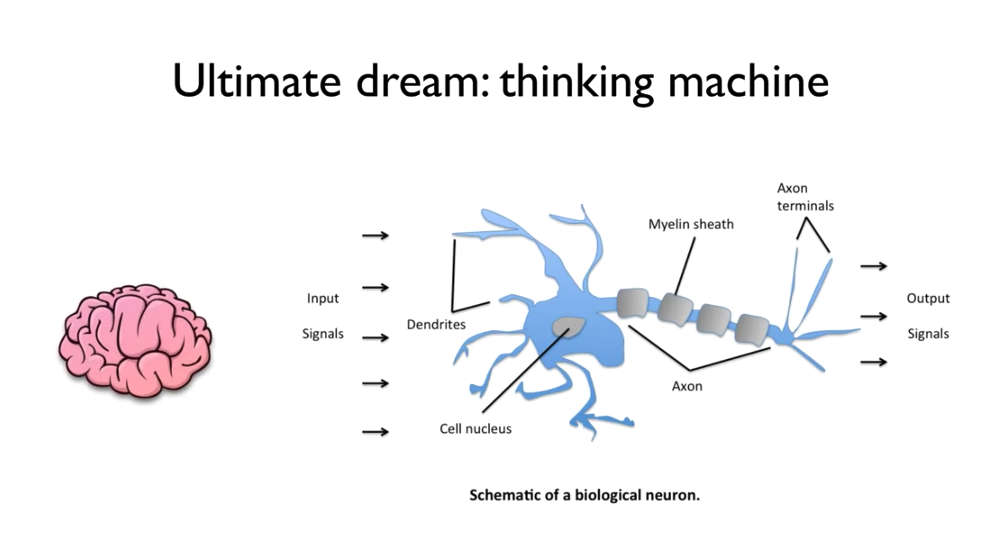

연구자들은 몇 가지 사실에 크게 놀랐는데, 하나는 우리의 뇌는 굉장히 복잡하게 연결  
되어있다는 것이었고, 또 그 연결된 부분들을 자세하게 살펴보았더니 뉴런이라고 불리는  
하나의 단위, 즉 **unit**들이 너무나 단순하게 동작하고 있다는 사실이었다고 한다.  
이렇게 단순하게 동작하는데 이 것을 통해 어떻게 우리가 생각이라는 것을 한다는 것일까?  
정도가 되지 않을까 싶다.

그림에서 보는 것처럼 이 뉴런(neuron)이라는 것이 동작하는 방식은 다음과 같다고 한다.  
어떠한 input signal이 있고, 이를 전달해주는 것의 길이에 따라 전달되는 신호의 양이  
달라지게 된다. (`X * W`) 이후 세포 핵에 모여서 이 신호 물질들이 하나로 합쳐지는 과정을  
거친다. (sum, 즉 **sigma**) 그런 다음, 내부에서 말단으로 통과하는 과정에서 어떠한 항목  
(**bias**)가 더해지면서 전달되더라는 것이다. 이 때, 이 과정에서 조금 전에 언급한 합쳐진  
물질들이 어떠한 정해진 일정 값을 넘어야 활성화(**activation**)이 되고, 그 이하일 때에는  
활성화되지 않는다고 한다. (생물학에서는 이를 *역치*라고 한다.)

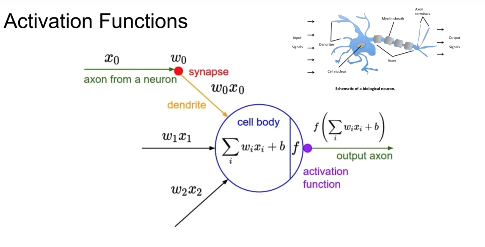

그래서 이 사실들을 발견한 이들은 사람의 뇌에 있는 뉴런을 수학적으로 표현할 수 있지 않을까  
하는 생각에서 출발하여 위와 같은 **Activation Functions**이라는 것을 고안해냈다고 한다.
원리는 뉴런으 동작과 같다. `x`라는 입력이 다른 뉴런으로부터 들어오면, synapse의 길이에  
따라 다른 가중치 `w`와 곱해지게 되고, 여러 synapse에서 들어오는 이 값들을 모두 본체에서  
더한 뒤, `bias` 값을 더한 이 값이 **Activation Function**을 통해  
일정 수준을 넘으면 출력으로 예를 들어 1, 넘지 않으면 0을 내보내도록 동작하는
이러한 단순한 형태로 만들어볼 수 있겠다고 생각했었다고 한다.

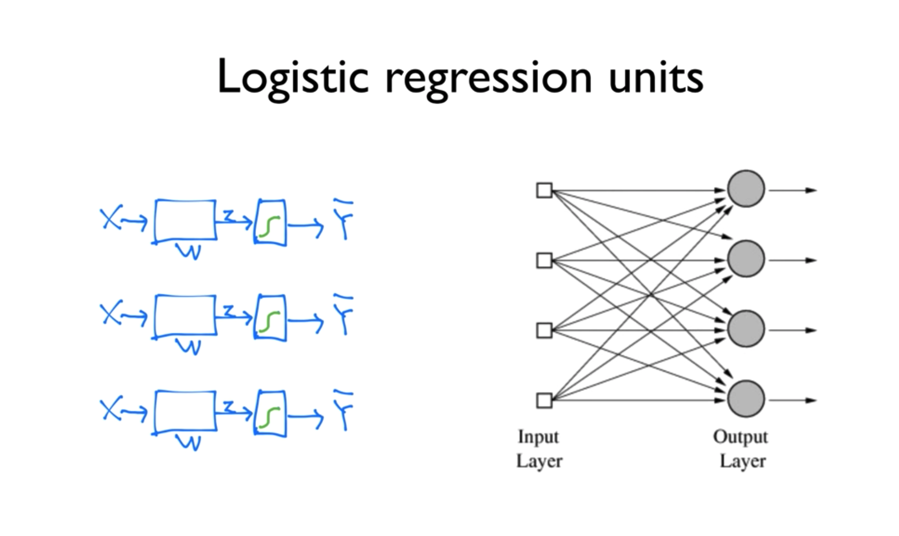

위 사진의 왼 쪽에 있는 그림은 지난 강의에서 본 적이 있는 그림일 것이다.  
Logistic regression을 설명하기 위한 그림이었는데, 앞서 설명한 Activation function의  
개념과 닮아 보인다. 이렇게 여러 입력들을 어떠한 다음 단계의 여러 unit으로 보내주어서  
학습하게 된다면 우측의 그림처럼 나타날 것이다.

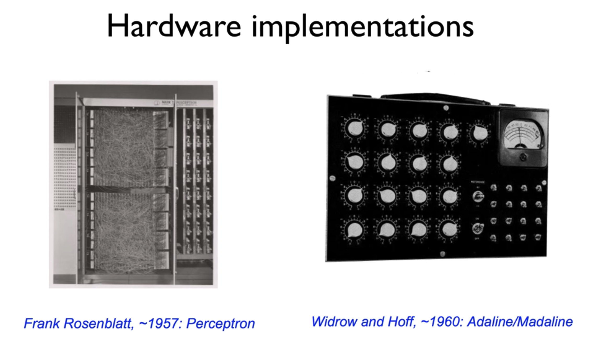

동일한 형태의 갖는 기계를 직접 하드웨어만 가지고도 만들 수가 있다고 한다. 아니, 실제로  
과거에 만들었다고 한다. 왼쪽 기계의 사진에서 보이는 수많은 선들은 예상컨대 이전 슬라이드의  
오른쪽 그림에서처럼 각 unit들을 이전 계층과 서로 연결해주는 간선의 역할일 것으로 보인다.  
이 기계를 제작한지 3년이 지나, 더 발전하여 각 unit에 입력되는 가중치, 즉 `w`의 값을  
조절하기 위한 다이얼이 추가된 형태를 볼 수 있다. 당시에는 이러한 기계들을 보면서  
이러한 것들이 **인공지능**이라고 생각했다고 한다.

이러한 시기에 위와 같은 연구 결과와 기계들이 사람들의 많은 관심을 끌자, 연구자들은 점점  
허황된 예언과 약속을 하기 시작한다. 이전 슬라이드의 왼쪽 사진에 있던 Perceptron을 만든  
Frank 박사는 이 기계들을 두고 이것이 곳 걷기도 하고, 말도 하고, 볼 수도 있고, 글도 쓰며  
스스로를 재생산하고, 자신의 존재를 자각하게 될 것이라고 예측했다고 한다. (지금도 못하고  
있는 것들인데...) 허황된 얘기였지만, 당시로서는 어느정도 성공했다고 볼 수 있는 점이 있다.

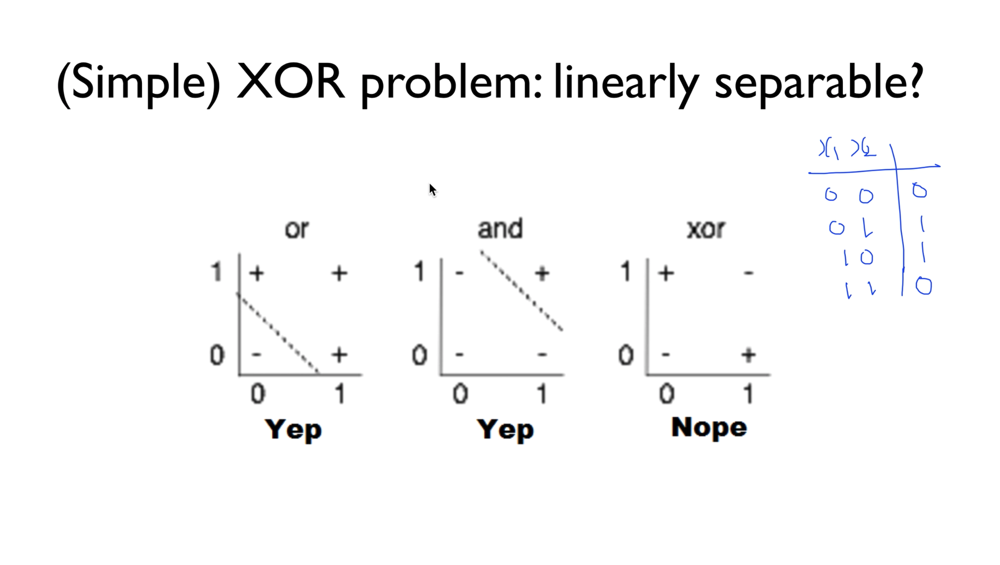

그 당시에는 위와 같은 AND/OR 로직을 풀 수가 있다면 이것들을 조합해서 생각할 수 있는  
기계를 만들 수 있을 것이라고 생각했다고 한다. 그래서 이 것을 기계가 예측할 수 있도록 하는  
것이 그 당시에 굉장히 중요한 문제중의 하나였다. **OR**란 둘 중 하나만 참값을 가지는 것을  
말한다. 두 값이 모두 0이면 거짓이 되고, 둘 중 하나, 혹은 둘 모두 1의 값을 갖는다면  
참을 뜻하게 되는 것이다. **AND**란 이와 반대(?)로 둘 모두 참의 값을 가져야만 참을  
의미하게 되고 둘 중 하나, 혹은 둘 모두 0의 값을 갖는다면 0, 즉 거짓을 의미하게 된다.

그림에서 보는 것처럼, 이 논리는 Linear한 개념이기 때문에 적당하게 선을 그어서 구분할 수  
있게 된다. Binary Classification이 된다는 것이다. 그림의 `+`와 `-`가 그것이다.  
때문에 당시 사람들은 박수를 치며 만들 수 있겠다는 희망에 부풀어 있었는데 여기에 찬물을 확  
끼얹은 것이 마찬가지로 단순하지만, 조금 다른 **XOR**이라는 로직이었다. XOR이란  
Exclusive OR의 줄임말로, 이 Exclusive하다는 것은 서로 같은 값일 때 거짓을 의미하게  
된다는 것이다. 즉, 0과 1에 대해서는 참이지만 0과 0, 1과 1에 대해서는 거짓을 뜻한다.

이 또한 매우 단순한 로직인데, 문제는 같은 기계를 가지고 이 로직을 학습시키려고 했지만
동작하지 않는다는 것이었다. 이 로직은 Linear한 방식으로 분리되지 않기 때문에 100%로  
해결되지 않고 어떻게 해도 50%만 맞을 수밖에 없어 정확도가 매우 떨어진다는 것이다.

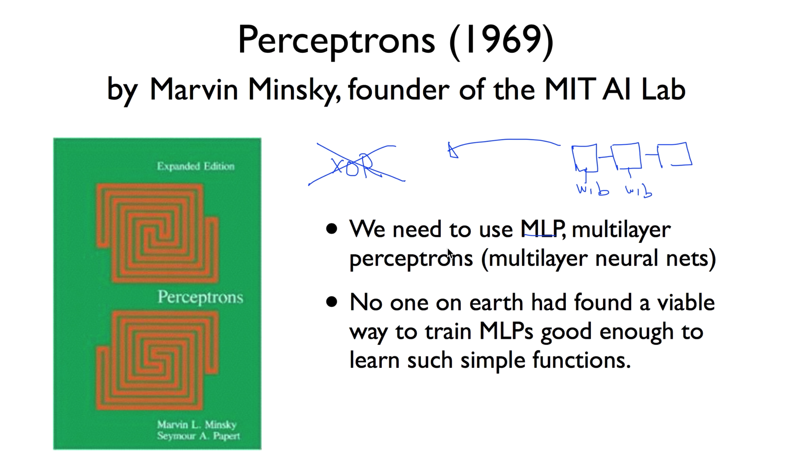

당시 MIT AI 연구소의 수장이었던 Minsky 교수는 저서 Perceptrons에서 XOR은 현재  
기술로는 해결할 수 없다는 사실을 수학적으로 증명했다. 그러면서 하나의 unit으로는 할 수  
없고, 여러 개의 unit, 즉 MultiLayer Perceptrons에서는 가능할수도 있다고 했다.  
하지만 동시에, 이 각각의 unit에 들어가는 `W`(weight)과 `b`(bias)를 지구상 그  
누구도 학습시킬 수가 없다고 주장하며 많은 이들에게 실망감을 안겼다고 한다.  
이 책에 큰 많은 사람들이 영향을 받아, neural network분야에 있어 10년 내지 20년 가량  
후퇴하고 이 기간동안 침체기에 빠졌다고 한다.

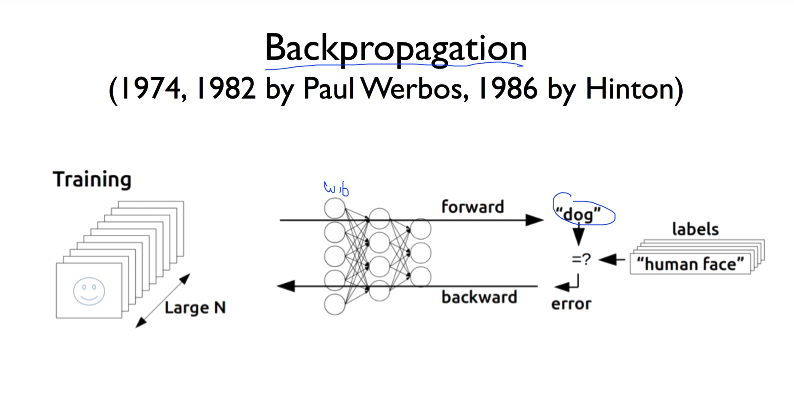

이러한 침체기에 이 문제를 해결한 사람이 있었는데, Paul이라는 사람이 박사 과정 논문에  
새로운 해결 방식을 소개했다. 어떠한 network이 있고, 각 unit마다 존재하는 `W`와 `b`  
를 통해 학습을 진행해 출력을 만들어나가는데, 이 결과물에 해당하는 출력이 잘못되었을 때  
`W`와 `b`를 조절하도록 하는 부분이 이전까지 불가능하고 문제가 되었던 부분이다.  
Paul이 도입한 방식은 **Backpropagation**(역전파)라고 불리며, network의  
전반부에서 `W`와 `b`를 조절하기 어려우므로 가장 마지막 결과를 보고 발생한 에러를 다시  
이름 그대로 뒤로 전달하여 값을 조정하는 알고리즘인 것이다.

그러나 앞서 말했다시피 그 당시에는 이러한 연구가 아예 불가능한 것이라고 낙인이 찍혀버린  
상태였기 때문에 아무도 관심을 갖지 않았고 70년대 후반에 이르러 심지어는 이 침체기의  
근원이었던 Minsky교수를 만나 이 문제를 해결했음을 알려보았지만 그 교수 또한 전혀  
관심을 주지 않았다고 한다. 그럼에도 불구하고 82년도에 다시 논문을 발표해보지만 마찬가지로  
아무도 읽지 않고 묻혀버렸다. 약간 어이없게도, 이와는 독립적으로 같은 연구를 진행하고 있던  
Hinton이라는 사람이 86년도에 이 연구를 발표하면서, 많은 주목을 받았고, XOR과 그 이상의  
더 복잡한 문제들을 예측할 수 있는 해결책이 되었다.

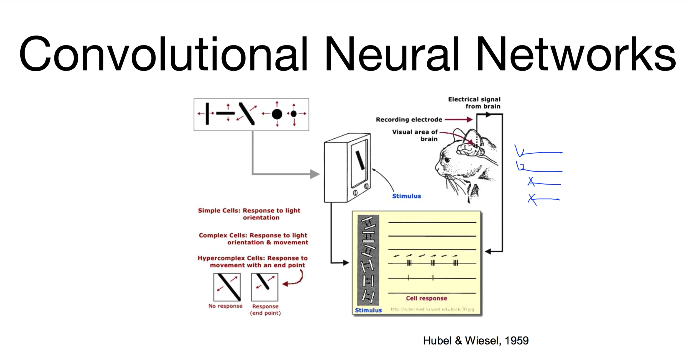

다른 한 편으로는 LeCun이라는 교수는 다른 방법으로 이 문제에 대해서 접근했는데,  
고양이에게 여러 도형을 보여준 후에 고양이의 시신경에 있는 뉴런들이 어떻게 동작하는지를  
관찰해보니 수많은 시신경들 중에서 특정 도형마다 일부의 다른 뉴런들만 활성화된다는 사실을  
알아냈다고 한다. 이 실험 결과에 대한 생각에서 출발한 것이, 바로 현재에도 널리 알려져 있는  
**CNN**(Convolutional Neural Networks)이다. 어떠한 이미지가 있을 때, 이 이미지를  
Network에 한 번에 입력시키게 되면 동작이 복잡해지고 학습이 많이 일어나야 하기 때문에,  
이 이미지의 부분들을 잘라서 다음 레이어로 보내는 과정을 반복하여 나중에 합치는 방법으로  
Network을 개발했다고 하며 우리가 익히 아는 AlphaGo도 이 CNN이 적용되었다고 한다.  
현재에도 문자와 숫자 이미지에 대한 정확도가 90%를 넘을 정도로 잘 동작하기 때문에  
수표가 널리 사용되는 미국에서는 90년도에 수표를 읽어내는 시스템을 만들기도 했다고 한다.

84년부터 94년까지 카네기 멜론 대학교에서 자율주행 자동차 프로젝트를 진행하기도 했고,  
91년에 개봉한 영화 터미네이터의 대사에서도 사람처럼 학습할 수 있냐는 질문에 터미네이터는  
자신의 CPU가 neural-net으로 되어 있어 학습하는 컴퓨터라고 대답하기도 한다.  
이처럼 Hinton의 논문을 통해 다시 부흥을 맞는 줄 알았던 Neural network 분야는  
95년도에 다시 한번 큰 문제에 봉착하게 된다.

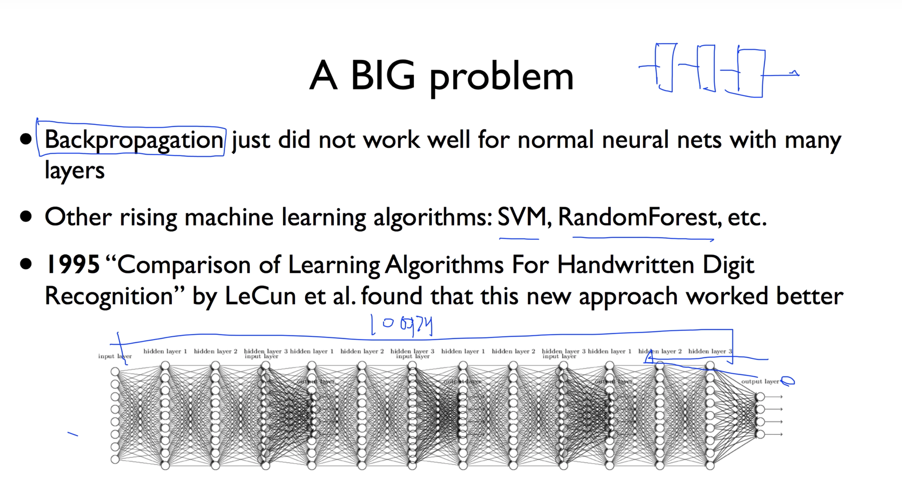

긴 침체기를 깨고 다시 많은 사람의 주목을 받게 되었던 계기인 역전파 알고리즘은 Layer를  
몇 개만 가지고 있는 Network에서는 잘 동작을 하는데 실제로 복잡한 문제를 풀기 위해 필요한  
Network에서는 10여 개 정도의 Layer를 필요로 하기 때문에 제대로 동작하지 않는다.  
Backpropagation은 가장 마지막으로 출력되는 결과값을 비교하여 그 Error를 다시  
끝에서부터 입력 부분까지 전달하면서 값을 바꾸는 것인데, 층을 거듭할수록 그 에러의 의미가  
퇴색된다. 또한 가장 중요하게 `W`와 `b`값이 변경되어야 하는 부분은 입력 부분인데  
이와 같은 이유 때문에 역전파로는 입력 부분까지 값을 조절하면서 학습이 이루어지기 힘들다는  
것이다. 때문에 한편으로는 다른 형태의 알고리즘들이 다수 등장하기 시작했는데, 어떻게 보면  
Neural Network보다 훨씬 간단한 알고리즘인데 더 잘 동작하는 것이었다. 급기야 앞서  
등장한 바 있는 LeCun 교수조차 자신도 이 인공신경망 분야의 전문가이지만, SVM이나  
RandomForest와 같은 대체 알고리즘들이 훨씬 쉽고, 잘 동작하는 사실을 인정했다고 한다.

이렇게 다계층 학습 문제 해결이라는 벽을 만나면서 Backpropagation이 유일한 해결책이던  
인공신경망 분야는 이렇게 두 번째 침체기를 맞게 되고, 대중들의 신뢰도 많이 잃었다고 한다.

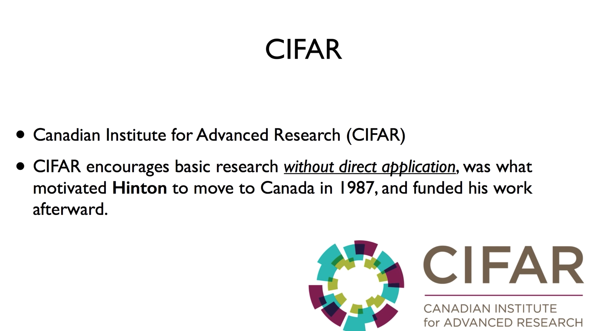

이야기를 계속하기 전에, 한 단체를 언급하고 넘어가야 하는데, CIFAR라는 이름의 단체이다.  
이 연구 기관은 당장 가까운 미래에 직접적으로 사용되지 않는 주제일지라도 계속해서 연구할  
것을 장려했고, 지금까지 이야기한 것처럼 neural network이라는 제목만 들어가도 논문이  
reject되고, 더이상의 연구비를 지원받기도 어려웠던 당시의 냉랭했던 이 분야의 전문가였던  
Hinton 교수는 여기에 매력을 느껴 캐나다로 이주하게 되어 이후의 연구에 대해서 지원을  
받을 수 있었다고 한다. 이 때문인지 최근 딥러닝 분야의 발전을 주도하고 있는 많은 학교와  
연구자들이 캐나다 출신이라고 한다. 당시를 회고했을 때, 가장 힘든 시기라고 이야기할 만큼  
이 분야에 대해 어려웠던 시기에 도박을 걸었던 이 단체에 크게 칭찬하지 않을 수 없다고 한다.

이러한 지원에 힘입어 Hinton과 Bengio 교수는 이 시기에 큰 돌파구가 될 논문을 2006년,  
2007년에 각각 발표했다. 이 논문의 주요한 내용을 살펴보면, 지금까지의 큰 장벽이었던  
여러 계층에 있어서의 학습 문제는, 각 Layer마다 `W` 값들은 처음에 초기값을 줘서 학습을  
진행하게 되는데 이 처음에 주어진 **초기값**을 제대로 주지 못한 것이 원인이었다는 것이다.  
이 초기값만 잘 주면 학습을 시킬 수 있다는 것이 2006년 발표된 논문의 주 내용이다.  
2007년도 논문에도 같은 내용을 담고 있었으나 더 나아가 이를 통해 기존의 신경망을 더 깊게  
구축하면 더 복잡한 문제를 해결할 수 있다는 사실을 증명한 것이다. 이 논문들을 통해 다시  
사람들에게 한 번 더 주목받는 계기가 되었는데, 이 과정에서 neural network이라는  
이름 때문에 사람들이 거부감을 갖지 않도록 하기 위해 Deep learning으로 이름을 바꿔  
마치 다른 학문 분야인 것처럼 다가가게 되었고 이때부터 다시 많은 연구가 활성화되었다.

이렇게 점점 분야가 활발해지면서, 대중적으로 주목을 받게 된 계기가 또 하나 있는데, 이  
IMAGENET이라는 이름의 컴퓨터에게 어떤 사진을 주고 이 사진을 묘사하는 내용을 맞춰보도록  
하는 챌린지이다. 이를 정확하게 묘사하고 맞추는 것은 사실 쉽지만은 않은 일이다. 따라서  
컴퓨터비전 분야에서는 이 문제를 굉장히 중요하게 다루고 있었는데, 2010년에는 30% 정도의  
에러율을 가지고 있었고 해를 거듭하면서 1~2%정도의 개선을 보이고 있었다. 사실 이 기술은  
정확도가 90%정도에 육박해야지만 실제로 적용할 수 있는 성능을 보인다고 판단하여 해당  
범위에 들어가려면 못해도 10년정도는 걸릴 것이라고 모두가 예측하고 있는 상황이었다.  
그런데 2012년에 ALEX 박사의 논문에서, ALEXNET이라는 이름의 시스템이 이 에러율을  
15%정도로 확 줄여내어 많은 이들을 깜짝 놀라게 하였다. 이 시기부터 CNN이 접목되었던  
시기였으며 해를 거듭하면서 에러율이 큰 폭으로 감소하다가 결국에 2015년에 만들어진  
CNN기반의 시스템에서 3%대의 에러율까지 도달하게 되었다.

이렇게 매우 빠른속도로 Deep Learning 분야가 발젼하게 되면서 하나하나 다 읊어낼 수  
없을 정도로 많은 기술의 발전이 일어나고 있었다. 몇 가지 예를 들면

- 이미지에 대한 단순 묘사가 아닌 문장 수준의 설명
- 딥 API Learning (API의 동작과 절차를 단순한 명령어를 통해 처리) - 홍콩과기대
- Noise가 많은 환경에서 90%까지 사람의 말을 알아든는 시스템 - 바이두
- 딥러닝 기반의 벽돌깨기 자동화
- 우리가 너무나도 잘 아는 AlphaGo

그리고 현대에 이르러, 우리 실생활에서도 밀접하게 녹아있는 기술들도 있다.

- 유튜브 자동 생성 자막 - 영어는 꽤 정확함
- 페이스북 뉴스피드 - 사용자 개인화 추천 알고리즘
- 구글 검색 엔진 - 검색어 기반 및 개인 관련성 추천 알고리즘
- 넷플릭스 비디오 추천 시스템
- 아마존 상품 추천 시스템

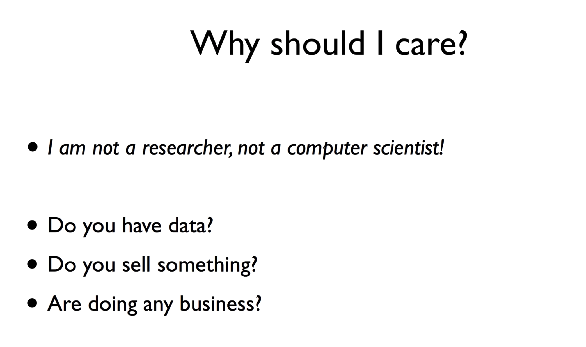

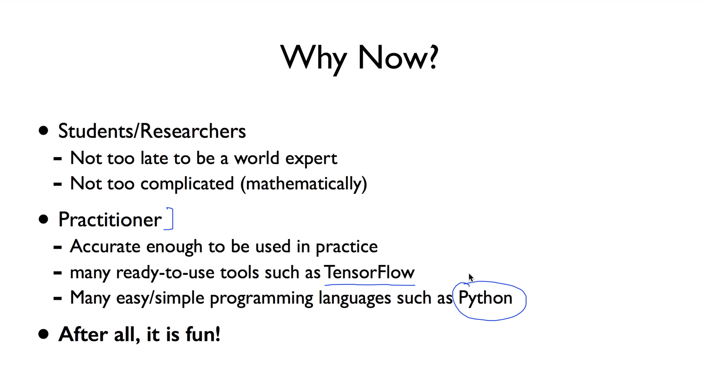

위 두 슬라이드들은 교수님이 이번 강의를 진행하시면서 수강생들에게 이 분야에 대해서  
약간의 홍보(?)를 하시는 듯한 느낌을 받았다. 요약하자면, 지금 당장 이 분야의 연구자라거나  
컴퓨터 과학자가 아니더라도 데이터를 가지고 있거나 사업을 하고 있는 사람이라면 충분히  
관심을 가져볼만한 분야라는 것이고, 시기적으로도 학생이나 연구자들에게 있어서는 지금까지  
설명한 것처럼 크게 성장한 기간이 그리 길지 않은 분야이기 때문에 지금 뛰어들어도 여러분도  
전문가가 될수 있다는 이야기, 실용주의자들에게는 현재 나와있는 많은 이론들이 꽤 실질적이고  
정확하며, TensorFlow와 같이 잘 만들어진 툴도 많이 있는데다가 Python처럼 시작하기에  
매우 쉽고 간단한 언어들도 있다는 이야기를 전달하는 내용이었다.

 

---

 

## 맺음말

학교에서 진행하는 프로그램 때문에 자습 목적으로 진행한 연재 방식의 글을 제대로는 처음으로  
진행해보았습니다. 앞으로 학기가 시작하면서 졸업 프로젝트 마무리에 박차를 가해야 하기  
때문에 머신러닝을 실질적으로 많이 다루게 될 것 같지만, 이렇게 온라인 강의를  
들으면서 직접 글로써 정리하는 일 자체가 아시다시피 매우 귀찮고 번거로운 일이기 때문에,  
실제 프로젝트 진행에 필요한 개념들과 이론적인 내용을 부분적으로 학습할 듯 보이고, 또  
기본적이고 기초가 되는 내용들은 지금까지의 강의들을 통해서 충분히 정리했다고도 생각하고  
있기 때문에 잠정적으로 아니, 거의 확정적으로 중단하도록 하겠습니다.

아마도 같은 제목으로 새로운 글이 연재될 일은 없을 것으로 보이고,  
만약 그렇다고 한다면 제가 모든걸 다 제치고 인공지능과 데이터 과학 분야로 진로를 정하고  
여기에 올인해서 다시 공부를 시작한다는 시나리오 밖에는 없을 것 같습니다. 시작한지도  
얼마 되지 않았고 인강 내용을 정리한 글밖에 없는 블로그라 누가 읽었을 것이라고 생각도  
하지 않지만, 지금까지 읽어주신 분들이 계시다면 감사드리면서  
이번 연재는 여기서 마치도록 하겠습니다.

앞으로 이 블로그에 게시되는 글과 함께 더욱 더 성장하는 개발자가 되도록 하겠습니다.  
감사합니다.
