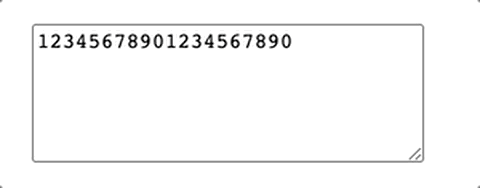
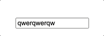
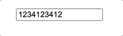
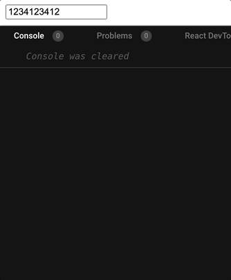
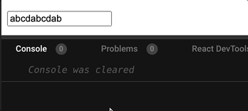
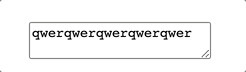
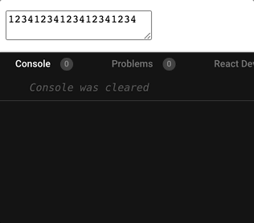
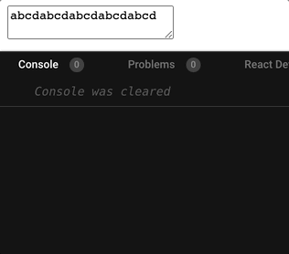

# 사건의 발단

얼마 전, 현재 소속된 조직에서 준비중인 신규 프로젝트에서 베타 오픈을 위해 사내에서 도그푸딩을 진행했는데, 그 때 올라온 이슈 중에서 100자까지만 입력이 가능한 `<textarea>`에 이미 입력된 텍스트의 중간에서 입력을 시작해 최대 길이에 도달하면 입력 커서가 텍스트의 맨 뒤로 밀려나는 현상을 발견했는데 이것이 의도된 스펙인지에 대한 질문을 발견하게 되었다.

당시 해당 현상이 입력 요소의 동작으로써 적절하지 않다고 판단했던 나는 해당 이슈를 담당하기로 결정하고 원인 파악을 위해 해당 `<textarea>`를 제어하는 코드를 살펴보기로 했고, 대략 아래와 같이 작성되어 있었다.

```tsx
// 이벤트 핸들러
const handleChange: ChangeEventHandler<HTMLTextAreaElement> = e => {
  if (e.target.value > MAX_LENGTH) {
    return
  }
  setValue(e.target.value)
}

// JSX
return (
  <textarea
    // ...
    onChange={handleChange}
  />
)
```

위 코드를 확인하고 나서 이런 생각을 하게 되었다.
_"어? `<textarea>`에는 글자수를 제한하는 내장 prop이 있는데도 왜 핸들러에서 조건 처리를 하고 있지?"_
의식의 흐름에 따라 그대로 코드를 바꿔보기로 했다.

```tsx
const handleChange: ChangeEventHandler<HTMLTextAreaElement> = e => {
  setValue(e.target.value)
}

return (
  <textarea
    // ...
    maxLength={MAX_LENGTH}
    onChange={handleChange}
  />
)
```

변경한 코드는 기존에 발견한 문제점을 깔끔하게 해결해주었다.
입력된 텍스트의 중간에서 타이핑을 시작해 텍스트의 최대 길이에 도달하더라도 커서가 뒤로 밀려나는, 당초 검증의 대상이었던 현상이 더 이상 재현하지 않았고, 수차례 여러 방식의 문자열을 입력해 테스트해보아도 특별히 문제가 없는 **것처럼** 보였기 때문에 변경한 코드를 저장소에 그대로 반영했고, 이슈를 잘 처리했다고 생각했다.

> 결과적으로 처음 문제삼았던 현상은 해결되었지만 그 문제를 처리하는 데에만 집중한 나머지 그 결과로 인해 영향을 받을 수 있는 부분을 살피지 못하고 지나쳐 개발서버에 배포된 이후에야 수정된 코드로 인한 새로운 문제를 발견하게 되었다. 사실은 아무 문제가 없는 것이 아니라 그만큼 애초에 꼼꼼히 살펴보지 않았던 탓이다.  
> 간단한 문제라고 해서 간단히 해결되리란 법도 없고, 현재 조명한 문제가 해결된다고 해서 다른 문제도 없다는 뜻이 되진 않는다.  
> 이런 식의 일처리는 반성할 필요가 있다고 느꼈고, 앞으로는 간단해 보이는 이슈를 다루더라도 이런 부분에 주의하며 업무에 임해야겠다는 생각을 하게 되었다.

# 새로운 국면

해당 코드가 개발서버에 배포된 이후 해당 이슈의 기대결과가 정상적으로 동작하는지 확인하기 위해 배포 환경에서 몇 가지 테스트를 하던 도중, 작업하면서 테스트할 당시에는 발견하지 못했던 현상이 발생하는 것을 알게 되었다.

;

예시로 만든 위 gif에서 보이는 것처럼 10글자 제한이 있는 `<textarea>`에서 숫자, 알파벳을 입력할 때에는 아예 입력이 되지 않다가, 한글을 입력하니 최대 길이 제한을 무시한 채 입력이 가능했다. 물론 한글자 이상을 작성하려고 하면 매 글자마다 초기화가 되긴 하지만, 커서를 마우스 클릭으로 강제로 이동시켜가며 자음만 입력할 경우에는 위 예시에서처럼 몇글자가 되었든 최대 글자수 이상을 입력할 수 있었다.

우선은 발견 직후 이 동작 자체도 정상적이지 않다고 판단해 추가로 수정작업이 필요하다는 생각이 들었다.
하지만 어떻게 해결하는 것이 좋을까? 그것에 대해서는 여전히 의문이었다. textarea의 최대 길이 제한과 관련하여 여러 자료를 찾아보았지만 대부분 숫자, 알파벳과 한글의 byte 수 차이에 의한 글자 수 카운트 방식에 대한 이야기이거나, 핸들러에서 글자수를 넘어가면 `slice` 혹은 `substring`으로 처리하는 방식(하지만 이렇게 처리하게 되면 중간에서 입력 시 뒷부분이 삭제됨)이 대부분이었다.

그래서 결국은 입력 엘리먼트의 글자수 제한에 대해서 생각할 수 있는 모든 경우의 수를 실험해보자는 결론에 도달하게 되었다.

# 입력 엘리먼트 최대 길이 제한 실험

현재까지 주어진 현상들을 바탕으로 봤을 때, 최대 길이가 입력된 상태에서 어떤 조건 하에서 한글 입력이 가능하거나 불가능한지, 또 어떤 조건 하에서 커서가 밀리거나 밀리지 않는지를 비교하기 위한 대상이 되는 케이스들을 정리해보니 아래와 같았다.

1. 비제어 `<input>` 컴포넌트
2. 제어 `<input>` 컴포넌트 - maxLength
3. 제어 `<input>` 컴포넌트 - onChange
4. 비제어 `<textarea>` 컴포넌트
5. 제어 `<textarea>` 컴포넌트 - maxLength
6. 제어 `<textarea>` 컴포넌트 - onChange

그러면 각각을 실험해보고 결과를 한 번 살펴보도록 하자.

## 1. 비제어 `<input>` 컴포넌트

비제어 컴포넌트, 즉 React 단에서 변경되는 사용자 입력을 직접 관리하지 않는 컴포넌트는 다시말해 곧 HTML 엘리먼트 그 자체를 의미한다고 볼 수 있다. 앞서 살펴본 현상들이 React 환경에서 상태 관리와 이벤트 핸들링을 담당해서 발생했다고 의심해볼 수 있기 때문에 상태 관리 없이 순수한 상태의 엘리먼트는 어떤 현상을 보여주는지 궁금해서 실험 대상에 포함하게 되었다.

```tsx
<input
  type="text"
  id="UnControlledInput"
  maxLength={10}
  defaultValue="qwerqwerqw"
/>
```

그래서 HTML `<input>` 엘리먼트의 기본 동작을 살펴보기위해 최대 길이를 지정하고 기본값으로 10글자의 무작위의 문자열을 설정한 뒤 테스트를 진행했다.



결과는 gif에서 확인할 수 있듯이 한글을 입력하면 똑같이 입력창에서 보이는 값이 변하지만, 위에서 경험했던 케이스와는 다르게 blur 이벤트를 비롯한 다른 이벤트가 발생하면 다시 원래 값으로 돌아가는 모습을 보여준다.

## 2. 제어 `<input>` 컴포넌트 - maxLength

다음으로는 같은 `<input>` 엘리먼트이지만 React에서 값 상태를 관리하는 구조를 가진 제어 컴포넌트를 살펴볼텐데, 위에서 살펴본 것과 동일하게 단순히 `maxLength` 속성에 의한 10글자 제한과 10글자의 기본 상태만을 설정한 뒤 테스트를 진행했다.

```tsx
const [inputTxt, setInputTxt] = useState('1234123412')
// ...
return (
  <input
    type="text"
    id="ControlledInput"
    maxLength={10}
    value={inputTxt}
    onChange={e => {
      console.log(e.target.value)
      setInputTxt(e.target.value)
      console.log('onChange triggered!')
    }}
  />
)
```

;

결과를 보면, 제어 컴포넌트도 비제어 컴포넌트의 케이스와 동일하게 처음 입력창에 보이는 값이 변했다가, blur 이벤트가 발생하자 다시 원래 값으로 돌아가는 모습을 보여줬다.



그래서 이번 케이스에서는 이 동작이 어떻게 돌아가는지 조금 더 자세히 확인해보고자 핸들러에 로그를 찍어봤는데, 이미 입력값이 최대 길이인 상태에서 한글을 입력하자 `onChange` 이벤트 핸들러가 실제로 실행이 되고, 그 이벤트의 실행 값인 `e.target.value`에 한글을 포함한 문자열도 실제로 들어오는 것을 확인할 수 있었다.
나아가, 대상 `<input>`에 focus를 해제할 경우 다시 한번 더 `onChange`가 실행되면서 그 실행값으로 직전 실행으로 한글이 포함되기 전 초기 상태값이 다시 입력되는 것을 확인해볼 수 있었다.
그리고 `e.target.value`가 위처럼 변화함에 따라 이벤트 핸들러 동작에 의해 `setInputTxt` 함수도 각각 실행되어 `inputTxt`의 상태값도 두 차례 변경되는 모습 또한 확인할 수 있었다.

이를 짧게 정리해보면, `<input>` 엘리먼트는 `maxLength` 속성을 통해 입력 길이를 제한할 수 있지만 한글 입력 시 `onChange`이벤트가 실행되고, 이를 교정하기 위해 `blur` 등 다른 이벤트가 발생했을 때 다시 직전 `onChange` 발생 이전의 값으로 `onChange`가 한번 더 실행되어 최대 길이를 초과하지 않도록 제어한다고 볼 수 있겠다.

## 3. 제어 `<input>` 컴포넌트 - onChange

이번 케이스는 본 글의 [발단](#사건의-발단)에서 설명한 기존 코드에서처럼 제어 컴포넌트로 구성을 하되, `onChange` 이벤트 핸들러에서 직접 현재 입력된 길이를 최대 길이와 비교해 작을 때에만 상태 업데이트가 이뤄지도록 하는 방식으로 구성해 테스트를 진행했다.

```tsx
const [inputTxt2, setInputTxt2] = useState('abcdabcdab')
// ...
return (
  <input
    type="text"
    id="ControlledInput2"
    maxLength={10}
    value={inputTxt2}
    onChange={e => {
      console.log('onChange triggered!')
      if (e.target.value.length > 10) {
        return
      }
      setInputTxt2(e.target.value)
    }}
  />
)
```



조건문 이후의 라인이 실행되기 이전까지는 2번 케이스와 다를 것이 없기 때문에 동일하게 `onChange` 이벤트 자체는 실행은 되지만 가장 처음 이슈라고 판단했던 입력 커서가 맨 뒤로 밀리는 현상이 똑같이 나타났는데, 사실 이 커서 밀림 현상에 대해서 설명할만큼 명확한 근거는 아직까지 잘 모르겠다.
다만 그래도 추리를 해보자면 2번 케이스에서 정리한 것처럼 `onChange` 이벤트가 두 번 실행되는데, 초과된 길이의 문자열을 `value`로 갖는 첫 번째 이벤트가 실행될 때에는 조건문에 의해 중간에 종료되지만, 초기값 문자열을 `value`로 갖는 두 번째 이벤트는 `setInputTxt2`까지 정상적으로 실행되므로 입력 커서가 문자열의 끝으로 밀려나게 되는 것이라고 생각해볼 수 있을 것 같다.

## 4. 비제어 `<textarea>` 컴포넌트

이번에는 1번 케이스와 마찬가지로 React에 의한 상태 제어를 받지 않는 기본 HTML `<textarea>` 엘리먼트와 동일한 형태이다. 사실 본 글이 시작한 출발점이 `<textarea>` 엘리먼트의 동작 관련된 부분이었기 때문에 이 이후의 결과가 가장 중요하다고 볼 수 있겠다.

```tsx
<textarea
  id="UncontrolledTextArea"
  maxLength={20}
  defaultValue="qwerqwerqwerqwerqwer"
/>
```



결과는 기대했던대로 1번 케이스의 결과와 동일하다. React에 의한 제어가 포함되지 않은 경우에는 `<input>`이든 `<textarea>`든 무관하게 최대 길이를 초과하는 입력 이벤트를 교정하도록 설정되어있는 것으로 추측된다.

## 5. 제어 `<textarea>` 컴포넌트 - maxLength

사실상 이번 실험의 주인공이면서, [새로운 국면](#새로운-국면)에서 확인했듯 의아한 동작을 보여주는 케이스이다.
앞서 문제를 발견하면서 어떻게 동작하는지 확인했지만 다시 한번 더 동작을 살펴보자.

```tsx
const [areaTxt, setAreaTxt] = useState('12341234123412341234')
// ...
return (
  <textarea
    id="ControlledTextArea"
    maxLength={20}
    value={areaTxt}
    onChange={e => {
      console.log(e.target.value)
      setAreaTxt(e.target.value)
      console.log('onChange triggered!')
    }}
  />
)
```



결과는 역시 겪었던 대로, 예상했던 대로 동일한 모습을 볼 수 있다.
그런데 원래대로라면 대응되는 2번 케이스, 즉 제어 `<input>`과 동일하게 동작하는것을 기대해볼 수 있었는데, 로그와 함께 살펴보면 2번 케이스와 다르게 길이를 초과한 입력이 반영된 직후에 초기값으로 교정되는 두 번쨰 `onChange` 이벤트가 실행되지 않고 처음 길이를 초과되도록 입력한 동작 1회에만 실행되는 것을 확인할 수 있었다.

다만 아쉬운 점은 이 역시 동일한 제어 컴포넌트이더라도 `<input>`과 `<textarea>` 각각 최대 길이를 초과하는 한글 입력에 대해서 처리 방식이 다르다는 사실 자체를 육안으로 확인해볼 수는 있었으나 이 둘이 구체적으로 어떤 이유에 의해서 이런 차이를 나타내고 있는지에 대한 근거는 관련된 자료를 찾아보거나 추측해보기가 조금 어렵다는 것이다.

> 이와 관련된 구체적인 근거 자료를 찾게 된다면 추후에 후속 포스팅을 작성할 예정이다.

## 6. 제어 `<textarea>` 컴포넌트 - onChange

마지막으로 3번 케이스에 대응되는 케이스이다.

```tsx
const [areaTxt2, setAreaTxt2] = useState('abcdabcdabcdabcdabcd')
// ...
return (
  <textarea
    id="ControlledTextArea2"
    maxLength={20}
    value={areaTxt2}
    onChange={e => {
      console.log('onChange triggered!')
      if (e.target.value.length > 20) {
        return
      }
      setAreaTxt2(e.target.value)
    }}
  />
)
```



이 케이스에서도 역시 결과는 겪었던 대로, 예상했던 대로 동일한 모습을 볼 수 있었다.
여기에서의 커서 밀림 동작에 대한 근거도 3번에서 추측했던 것과 동일하게 적용해도 무방할 것으로 보인다.

# 결론

결과적으로 실험을 통해 얻어낼 수 있었던 것은, 구체적인 이유는 밝혀내지 못했지만 `<textarea>`를 React적으로 다룰 때 발생하는 HTML에서와의 기본 동작 차이에서 비롯한 현상이라는 점이다.
그런데 글자수가 제한된 `<textarea>` 를 어찌됐든 사용해야 하는 입장에서 이에 대한 완벽한 해결책이 아직까지 없다는 사실은 결국 한글이 입력이 가능하도록 하든지 문장 중간에서 타이핑을 하더라도 최대 길이 도달 시 입력 커서가 맨 뒤로 가도록 하든지 둘 중에 한 가지를 선택해야 한다는 것을 의미한다.

따라서 둘 중에 하나를 굳이 골라야 한다면, 지금까지 살펴본 것처럼 `maxLength` 속성이 적용되었음에도 길이를 초과해 한글이 입력되고 다시 원상복구 되지 않는 현상이 단순히 커서가 입력값의 맨 끝으로 이동하는 현상보다는 실 서비스에서 더 큰 문제를 발생시킬 여지가 크다고 판단해서 결국은 다시 6번 케이스처럼 이벤트 핸들러 내부에서 길이를 비교하는 조건을 활용하는 초기 코드로 롤백하게 되었다.

## 여담

지금까지 살펴본 엘리먼트들이 결국 form 관련 엘리먼트들이다보니 간단한 비교를 위해 프로젝트에서 사용하던 react-hook-form 라이브러리의 로직이 적용된 컴포넌트를 살펴봤더니 같은 제어 `<textarea>` 컴포넌트이더라도 비제어의 케이스에서와 같이 최대 길이를 초과한 한글 입력이 다시 교정되는 것을 볼 수 있었다.

이 라이브러리에 대해서 자세히 다루기에는 분량이 난감하지만, 간단하게 설명하자면 이 라이브러리에서 제공하는 Form 내에 각 항목별 입력 요소들, 즉 여러 타입의 `<input>` 및 `<textarea>`를 제어하는 props를 생성하는 `register`라는 함수의 반환값을 살펴보면, 내부에 직접 별도의 로직으로 구현된 `onChange` 가 존재하고, `onBlur`함수에 `onChange`함수가 할당되어있는 것을 볼 수 있다. ([코드 링크](https://github.com/react-hook-form/react-hook-form/blob/5f3df1227c381a9127ab27f7d1d98a9cefee33d5/src/logic/createFormControl.ts#L995-L996))

```tsx
<input id="title" {...register('title')} />
```

간단한 예시로, `register` 함수는 위와 같이 사용되기 때문에 자연스럽게 본문에서 추리했던 것과 같은 2번의 `onChange` 이벤트 핸들러가 첫 차례에는 실제 `change` 이벤트, 두 번째는 `blur` 이벤트에 의해서 실행되는 것은 아닐지 또 추측해볼 수 있을 것 같다.
따라서 React에서 form을 다룰 때, 이 라이브러리를 사용한다면 웬만한 경우 본문과 같은 이슈를 겪을 일이 없을 것으로 생각되지만, 이 이슈를 작업한 컴포넌트는 단순히 단 하나의 `<textarea>`만 존재하는 스펙의 사용자 입력이었기 때문에 해당 라이브러리를 사용하는 것 자체가 불필요하게 컴포넌트 사이즈와 관리 포인트를 늘리는 것 같다고 판단해 단순한 방식으로 처리하는 것으로 결론을 지었다. _(이 라이브러리에서 제공하는 로직을 사용하기 위해서 Form을 다루는 대상 컴포넌트 내부에 작업해줘야 할 보일러플레이트 코드가 생각보다 적지 않은 편이다.)_
