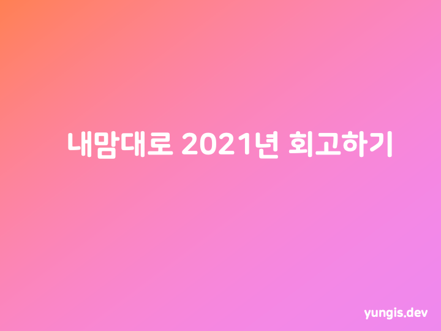

 

나는 한 해의 끝을 앞둔 지금 이제야 막 4개월차가 된 햇병아리 웹 개발자다.  
사실 개발자로서 회고를 어떻게 작성해야 하는지도 모르고 글재주도 딱히 없는 편이라 어떤 식으로 써나가야 할지 잘 모르겠다.  
지금은 별 볼일 없는 사람이지만 단순히 **성장**처럼 추상적인 목적을 떠나 오늘보다 내일, 올해보다 내년에는 조금이라도 그나마 더 나은 인간이 되기 위해서 한 해를 돌아보고 기록해보고자 한다.  
개발자가 되고 나서 처음으로 작성하는 회고이지만 개발과 관련된 내용보다는 전체적인 한 해의 일상들을 돌아보게 될 것 같다.  
지속된 팬데믹으로 어찌 보면 썩 유쾌하지만은 않은 1년이었지만 그래도 나에게 일어났던 이런저런 사건들로 구성해보려고 한다.  
내년에는 반기 단위로도 회고를 작성하고,조금 더 알찬 스스로의 진짜 성장을 꾸준히 기록할 수 있는 한 해를 보내기를 희망해본다.

 

## 취업

가장 먼저 올해 나는 취업을 했다.  
짧다면 짧고 길다면 긴 여정이었지만 어찌됐든 **취준**이라는 길고 깜깜한 터널같은, 혹은 높은 벽 같았던 시간의 끝을 냈다.  
작년 하반기부터 취업 시장에 뛰어들고부터 참 수없이도 많은 포지션에 이력서와 자기소개를 썼고 수십번의 탈락의 고배를 마셨다.  
어떤 기업으로부터는 서류를 내고 단 몇시간 만에 탈락 통보를 받아보기도 하고, 지금의 회사 이외에 한 기업에서는 최종 면접까지 가서 탈락해보기도 하는 등 참 다양한 경험을 했고, 계속해서 스스로를 갈고 닦는 과정이었던 것 같다.  
작년에도 취준을 하면서 참 다양한 경험이 있었지만, 올해에는 굵직하게 기억이 남는 다음과 같은 경험들이 있었던 것 같다.

### 삼성전자 공채 코딩테스트 응시

사실 왠지 모르겠지만 당연하게 서류에서 떨어질 것이라고 생각했었다.  
하지만 정말 생각지 못하게 몇 주만의 서류 심사 결과, 합격 통보와 코딩테스트 전형 안내를 받게 되었다.  
사실 코딩테스트는 이전까지 계속해서 프로그래머스와 BOJ, 그리고 leetcode의 문제들을 통해 나름대로 꾸준히 준비를 해왔지만 삼성에서 치르는 테스트는 처음 치뤄보기에 BOJ의 삼성 SW역량테스트 문제집, 그리고 삼성 SW Experts 사이트를 통해 유형에 익숙해지는 연습을 더 하면서 준비했다.  
그리고 항상 온라인으로만 테스트를 보다가 처음으로 오프라인으로 시험장에 가서 테스트를 봤다.  
고사장이 수원이었기에 시험 전날 숙소까지 잡고 응시를 했으나 좋은 결과를 얻진 못했다.  
이 이상 길어지면 회고보다는 코딩테스트 후기가 되어버릴 것 같아 이만 줄여야겠다.  
(그 당시, 직후에 후기를 작성할 걸 하는 후회가 밀려온다.)

### 카카오 신입공채 2차 코딩테스트 응시

카카오는 개발자라면, 특히 미취업 개발자라면 누구나 한번쯤 꿈꿔봤을 만한 선망의 기업이다.  
하지만 나의 평범한 알고리즘, PS 실력으로는 "아, 꿈만 꿔야겠구나"라는 생각이 들게 만드는 극악의 신입공채 코딩테스트 난이도로 인해 인턴십 전형을 포함해서 2019년부터 참 여러번도 그 1차의 문턱조차 넘지 못했던 것 같다.  
그런데 올 해 무슨 바람이 들었는지, 여러 기업의 프론트엔드 포지션의 전형들을 겪은 뒤 코딩테스트 주력 언어를 Javascript로 바꿔서인지, 1차 테스트에서 총 7문제 중 4개의 문제를 풀어낼 수 있었고 처음으로 2차에 응시해보게 되었다.  
2차는 일반적인 알고리즘 테스트와 달리, 아니 사실 결국은 알고리즘 테스트이지만 온라인 에디터를 통해 직접 제출 방식이 아닌 응시자의 PC에서 시험에서 제공하는 API를 활용해 HTTP 요청을 통해서 스코어보드를 업데이트하는 재미있는 방식이었다.  
이 테스트는 재미있었지만 처리해야할 요구사항들이 뒤로 갈수록 참 어려웠던 기억이 난다.  
무엇보다 카카오는 시험을 길게 보는 것으로 유명한데, 오랜 시간을 들여서 2차까지 응시했지만, 스스로 만든 결과가 조금 아쉽게 느껴진다.

### 현재 재직중인 회사

지금의 회사는 정말 우연한 계기로 만나게 되었다.  
사실은 입사 전까지 이 회사가 무슨 회사인지 전혀 몰랐고, 지원하기 전까지 회사 이름을 들어본 적도 없었다.  
그러나 그 당시 나는 졸업을 코앞에 두고 마지막 학기가 끝난 뒤 지푸라기라도 잡고 싶은 처지였고, 이 회사는 나에게 훌륭한 지푸라기가 되어 주었다.  
보통 코딩테스트 포함 총 전형이 거의 4단계로 이뤄진 다른 많은 기업들과 달리 1차 코딩테스트와 2차 면접+라이브코딩으로 단순하게 구성된 전형이었기에 전형 기간은 짧았고 운이 좋게도 합격할 수 있었다.  
입사 후에는 채용 연계형으로 8주간의 인턴십을 거친 뒤 평가가 진행되어 정규직으로 전환되는 방식이었는데, 시작부터 마냥 좋은 분위기는 아니었다.  
처음 인턴십 합격과 함께 받은 인턴십 과정에 대한 안내를 통해 Java와 JSP를 주력으로 다루는 과정인 것을 보고 정말 수십번의 고민 끝에 입사 포기를 결정했었다. 나는 학부 과정 내내 프론트엔드 개발자를 지망하고 준비해왔기 때문이다.  
당시 인턴십을 총괄하셨던 지금의 리더님께서 사용 언어가 맞는 팀으로 배정해주시겠다는 배려와 설득 덕분에 결정을 재고하게 되었고 약 20명의 인턴들 중 유일하게 다른 코스로 인턴십을 시작하게 되었다. (리더님 죄송합니다..)  
그래서 결국에는, 그렇게 8주간의 인턴 과정을 마치고 같은 팀에서 Node.js를 메인으로 다루는 풀스택 개발자로(...) 지금까지 일할 수 있게 되었다.  
이제 전환된지 만으로 4개월이 다 되어가지만, 아직도 일이 어렵고 적응해가는 중이다. 사실 업무 자체가 어려운것도 아니고 네 달동안 적응하는 중이란게 정말 부끄럽지만, 소속된 팀의 매우 큰 코드베이스에서 아주 일부분을 담당하고 있는데도 결국 기저의 코드 동작들을 다 알아야 문제 해결이 수월하고, 지식과 경험이 부족한 백엔드와 인프라쪽까지 고려하고 다뤄야 한다는 것 등의 것들이 여간 어려운 게 아니라는 것을 체감하고 있는 중이다.  
투정해봤자 달라지는 것은 없으니, 아직 제대로 1인분도 못하고 있는 나에게 돈을 주고 고용해준 회사에 무한히 감사하며 얼른 제 값 하는 개발자가 되어야겠다고 다짐해본다.

 

## 졸업

나는 올해에 대학교를 5학년을 꽉 채워서 졸업했다. 다행히 초등학생과 동급이 되는 상황은 면했다.  
전과생으로서 부족한 실력을 메우기 위해 2019년을 보냈고, 졸업 동시에 취업을 하기 위해 학점을 욱여 넣어 2020년을 보냈다.  
코로나 때문(덕분)에 비대면 수업도 경험해볼 수 있어 좋았지만, 말그대로 정신이 없게 스케줄을 구성한 탓인지 하루 하루를 보내면서 놓치는 것들이 생겼고, 그렇게 2020년 하반기에 2개의 과목에서 출석시수 미달로 F를 받고 졸업이 한학기 늦어지게 되었다.  
학기를 마친 직후에는 걷잡을 수 없는 자괴감에 빠져 폐인처럼 지냈다. 자고 일어나서 게임하고, 배달음식 시켜먹고, 다시 자고... 그런 지난하고 무의미한 시간들의 반복이었다.  
번아웃인 것 같다고, 이만큼 달려왔으면 이정도는 쉬어도 된다고 말도 안되는 핑계를 위안 삼았다.  
난 그렇게 가장 중요한 터닝 포인트가 될 수 있었던 두달이라는 시간을 그대로 쓰레기통에 처박아버린 셈이었다. 이 시간을 이렇게 보냈다는 사실은 아직까지도 큰 후회로 남아있다.  
그랬지만 어찌됐든 시간은 흘러 학기가 시작되었고, 2개의 전공 과목을 들으며 이전보다는 조금 더 수월하게 시간을 활용하며 취업 준비를 시작했다.  
마지막 학기인 이번 상반기에는 작년부터 계속해서 흥미 있었던 데이터/인공지능 과목들의 연장선인 **딥러닝**과 처음 개설된 **인간과 컴퓨터 상호작용**이라는 과목을 수강했고, 딱 평균적인 성적으로 학점을 채울 수 있었다.  
마찬가지로 코로나 때문에 남들 다 흔히 하는 졸업식도 못했지만 그렇게 힘이 들고 오래 걸려서 졸업이란 것을 하니, 마냥 뿌듯하고 시원할 법도 한데 그렇지 않고 이제 오랫동안 달고 있던 이 대학생이라는 타이틀이 없어진다는 것이 참 서운하기도 하고 아쉽기도 한 그런.. 이상한 감정을 당시에 많이 느꼈던 것 같다.  
어찌됐든 그렇게 나는, 입학한지 8년 반이라는 시간 끝에 졸업이란 것을 하게 되었다.

 

## 독립, 그리고 이사

자취를 결정한 것은 작년 6월이었다.  
군 전역 후 복학생으로 다시 대학생활을 시작하면서 학교에서 1년의 거의 3/4를 보냈고, 집은 그저 씻고 어쩌다 한번씩 침대에서 잘 수 있는 공간 정도였다.  
그랬지만 마음 속으로 집이라는 공간에 대해서 두가지 생각이 자리잡기 시작했다.  
하나는 그동안 내가 부모님의 보살핌에 무신경해지고 당연하다고 느끼고 있었다는 것. 어느 순간 문득 생각하니 어머니께서 집안일을 하시는 모습을 더 이상 눈 앞에 두고 보기가 힘들다는 생각이 들었다. 내 몫의 청소, 빨래, 설거지라도 덜어드리고 내 몫은 내 손으로 하면서 살고 싶었다.  
다른 하나는 독립적인 내 공간에 대한 갈망이었다. 물론 본가에도 방이 있었지만 매우 좁았고 방 안에 만성으로 피어나는 곰팡이와 이별하고 싶었다.  
그렇게 다음 달, 나는 부모님의 강력한 만류에도 불구하고 학교와 도보 30분 거리에 있는 본가를 떠나 임시로 단기 원룸을 구해 첫 독립 생활을 시작하게 되었다.
그렇게 처음으로 자취를 시작하고 나서, 나는 올해에만 세 번의 이사를 했다.

### 첫번째 이사

첫번째로 자취를 시작한 집주인이 비대면 기간동안 자리를 비운 오피스텔에서 약 7개월을 지내고, 다시 방을 비워줘야 하는 상황이 되어 학교 근처 원룸촌의 신축 원룸으로 마찬가지로 단기, 하지만 처음으로 계약 당사자가 되어 부동산 계약을 해본 경험이었다.  
지금도 사실 크게 다르지 않지만, 그 당시에는 지금처럼 정착하게 될 시기를 대비해 본가에 당장 필요하지 않은 짐들을 두고 정말 최소한의 짐으로만 생활하는 미니멀 라이프를 실천했다.  
하지만 그래도 사람의 살림살이라는 것이 살다 보면 자연스레 나도 모르게 늘어난다는 것을 이 때 처음 알았다.  
고작 그정도의 짐으로 용달이나 이삿짐 센터를 부르기엔 배보다 배꼽을 키우는 격이 되기에 부끄럽게도 독립은 했지만 아버지에게 도움을 받아 두번째 집으로 이사를 할 수 있었다.

### 두번째 이사

두번째 집에서 지내면서 마지막 학기를 잘 마무리지을 수 있었다.  
지방 치곤 좀 크기에 비해 비싸다고 생각했지만, 신축 원룸이어서 그런지 깔끔하고 쾌적하다는 점이 가장 좋았지만 역시 방음이 매우 하자였다.  
옆 건물에 같은 과 후배들이 살아서 종종 마주치며 대화도 나누고 썩 그렇게 외롭지 않았다는 생각을 했던 것이 기억난다.  
일찍 다가온 여름 때문에 적잖이 벌레와의 사투를 벌여야 했지만 정말 다행히도 바퀴벌레는 만나지 못했다.  
좌우지간 그렇게 지내던 집에서 계약 기간 만료가 다가왔지만 학기가 끝나고 취업 준비에 박차를 가하면서 연장에 대한 결정을 해야 했는데, 인턴 합격 시기가 애매하게 걸치는 바람에 때를 놓쳐 이미 다른 사람이 계약이 된 상황까지 돼버려 어쩔 수 없이 새로운 집을 구했어야 했다.  
마찬가지로 또 학교에서 멀지 않은 근처의 원룸으로 단기 계약을 하게 되었고, 또 부끄럽지만 아버지의 도움을 받아 세 번째 집으로 이사를 하게 되었다.

### 세번째 이사, 그리고 현재

세번쨰 집은 정말이지 마음에 드는 구석이 단 하나도 없었다.  
하지만 지금까지 지냈던 원룸들보다 짧은 기간의 단기로 구할 수 있는 곳이 흔치 않았기에 어쩔 수 없이 결정하게 되었다.  
원룸이라 말하기도 민망한, 고시텔이라고 부르기에 적당한 낡고 허름한, 그리고 매우 특이한 구조를 가진(...) 그리고 예상대로 벌레가 득실대는 하여튼 이상한 집이었다.  
그럼에도 불구하고 고마운 감정이 드는 곳이긴 하다. 결국 그 곳에서 보낸 시간 덕분에 지금 이 회사에서 일하게 되었으니 말이다.  
그렇게 정규직이 되었지만 회사의 재택근무 정책으로 인해 사무실 출근을 위해 미리 이사할 시기가 애매했고, 무엇보다 이제 정규직도 되었으니 앞서 말한 것처럼 그 허름한 집을 떠나고 싶은 마음이 점점 커졌다.  
그래서 바로 회사 근처의 전세 매물과 전세대출을 알아보기 시작했다.  
사실 이 주제만으로도 몇 시간은 떠들 수 있지만, 간략히 하자면 전세 매물 품귀로 인해 회사에서 먼 곳들 위주로 방을 알아보다가 정말 운이 좋게도 적당히 넓고 쾌적한 지금의 집을 찾게 되었고 전세 대출에 대해서 공부하고 회사에서 지원해주는 대출까지 정말 말 그대로 영혼까지 끌어 모아 이런 저런 서류 준비와 부동산과의 협의 등 긴 우여곡절 끝에 계약하게 되었다. 돌이켜보면 정말 다신 하기 싫을 만큼 복잡하고 지난한 과정이었다.  
마찬가지로 짐은 매우 적은 편이었지만 이번에는 타지로 이동하는 만큼 용달을 이용해서 이사를 마쳤다.  
아직 부족한 것들이 있지만, 전세금을 제외하고 당시 있는 돈을 다 털어 살 수 있는 가구들을 구매했다. 지금까지 지냈던 곳들은 모두 풀옵션이었지만 지금의 집은 그에 비해선 텅텅 비어있었다.  
결론짓자면, 내 손으로 전세 계약을 하고, 대출을 받아보고, 가구를 구매하고, 조립해보고 배치하고 하는 모든 과정들이 처음으로 해보게 된 집이지만, 한 명의 사회인(?)으로서 뜻깊은 경험이었다고 생각한다.  
앞으로 이 집에서도 지금까지의 자취방들에서 그랬듯 한걸음씩 더 나아가는 경험으로 채워나갔으면 좋겠다.

 

## 2021년 총평

막상 적고 보니 정말 뭔가 크게 한 건 없는 것 같아 부끄러워진다.  
그럴 것도 한 것이, 정말 한 해 동안 한 일이 사실상 이게 전부이기 때문인 것 같다.  
취업과 졸업이라는 목표만을 바라보며 한 해의 절반을 맹목적으로 달리기만 했는데, 많은 개발자들이 이야기하듯 취업은 끝이 아닌 시작이었다는 것을 지금에 와서야 몸소 깨닫는다.  
나머지 절반은 나 자신의 생활을 정착하는 데 많은 시간과 노력을 들인 탓에 개발자로서의 성장에 많이 게을렀던 것 같다.  
사실 이런 게으름을 마냥 재택근무를 탓할수는 없지만, 일단은 나랑 잘 안맞는 방식인 것 같다는 생각을 지울 수 없는 건 어쩔 수 없을 것 같다.  
재택근무가 잘 맞는 사람도 있는 반면, 나는 개인적으로 출근과 퇴근이라는 시간 개념, 그리고 업무를 하는 공간이 곧 내가 생활하는 공간이라는 개념이 아직도 완벽하게는 적응이 잘 되지 않는 것 같다.  
하지만 역시 앞서 말한 것처럼 투정만 부려서는 나아지는 것이 없으니 이제는 나도 이런 제도(22년 3월까지 재택...) 속에서 심리적이든 물리적이든 나만의 극복 방법을 찾아내 실천해야겠다는 생각이 강하게 든다.

결론적으로, 그 시간들을 보내온 나로서는 최선이었다고 생각하지만, 돌이켜보면 남는 아쉬움은 지울 수가 없는 것 같다. 더 잘 할 수 있었을텐데.  
하지만 지나간 과거에는 미련 두지 않고, 앞으로 더 잘 해낼 수 있다고 믿으면서 행동하는 방법밖에 없는 것 같다.

 

## 2022년에는

- 더 실력있는 개발자가 되자
  - 회사 업무와 내부 서비스에 더 능숙해지기
  - 결제해놓고 안 듣던 강좌들 듣기
  - 자바스크립트 기본/핵심 꼼꼼히 공부하기
  - 사이드 프로젝트 2개 이상 진행하기
- 더 신체적으로 건강한 사람이 되자
  - 웨이트 다시 시작하기
  - 영양제 다시 챙겨먹기
- 더 정신적으로 건강한 사람이 되자
  - 다양한 책 읽고 실천하기
  - 그동안 하고 싶었던 취미 시작해보기
- 더 부자가 되자
  - 차곡차곡 시드머니 모으기
  - 주식 좀 더 공부하기
  - 부동산 공부 시작하기
  - 불필요한 지출 줄이고 절약하기
  - 작더라도 가능한 부수입 만들어보기

다 이루진 못하더라도 이루려고 노력하다보면 그래도 반은 실천할 수 있지 않을까.  
항상 모든 일들을 제대로 각 잡고 시작하려고 하고, 크게 생각하고 계획해서 행동하려고 했기 때문에 많은 것들을 하나씩 뒤로 미뤄두었던 것 같다.  
앞으로는 Just Do It. 그냥 하자. 하나라도 꾸준히 실천하다보면 작더라도 결실이 있을테니.

 

---

 

글을 쓰기 위해 하나하나 돌이켜보다 보니 처음 생각했던 것과는 달리 그래도 꽤 많은 일들이 나에게 있었구나 하는 생각을 하게 되었다. 텍스트로만 다 적게 되면 정말 별의 별 소리까지 다 쓸 것 같아 많은 부분을 날렸다.  
막상 다 작성하고 보니 정말 **내맘대로** 너무 막 쓴 것 같은 느낌이 든다.  
아쉬운 대로 올 해의 회고는 이렇게 마치는 것으로 하고, 앞으로는 과거를 돌아볼 때 무용담처럼 자랑스럽게 얘기할 수 있는 이야깃거리들로 가득했으면 좋겠다.

읽어주셔서 감사합니다.  
신년에는 모두들 목표하는 바를 이루시는 한 해가 되길 바라겠습니다.

**HAPPY NEW YEAR!**
