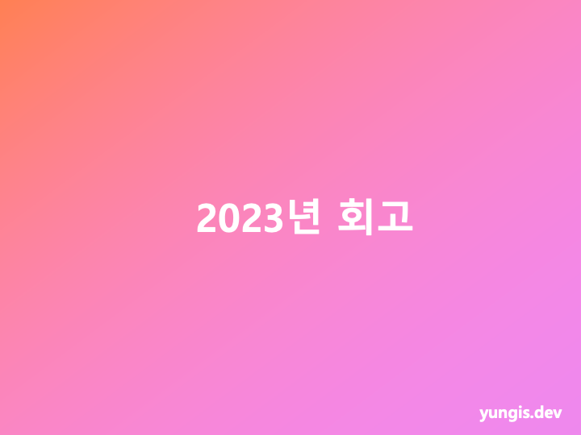
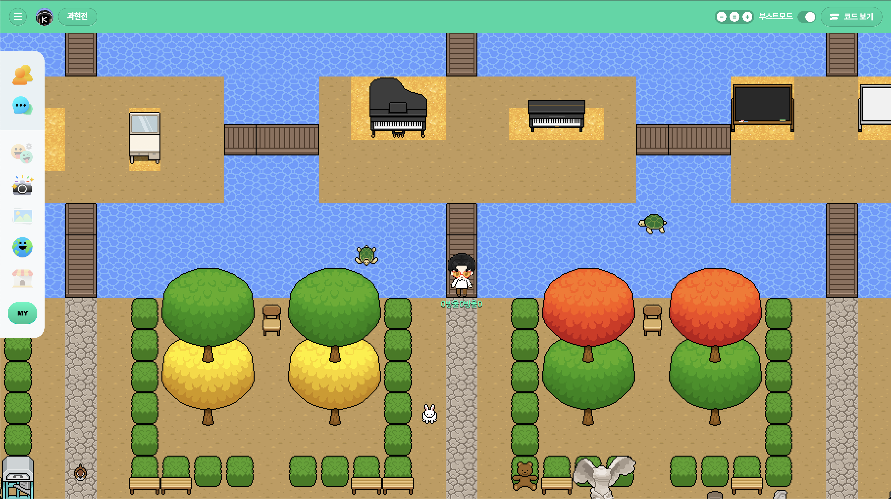
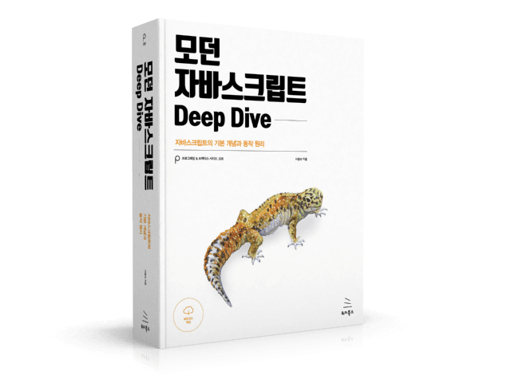
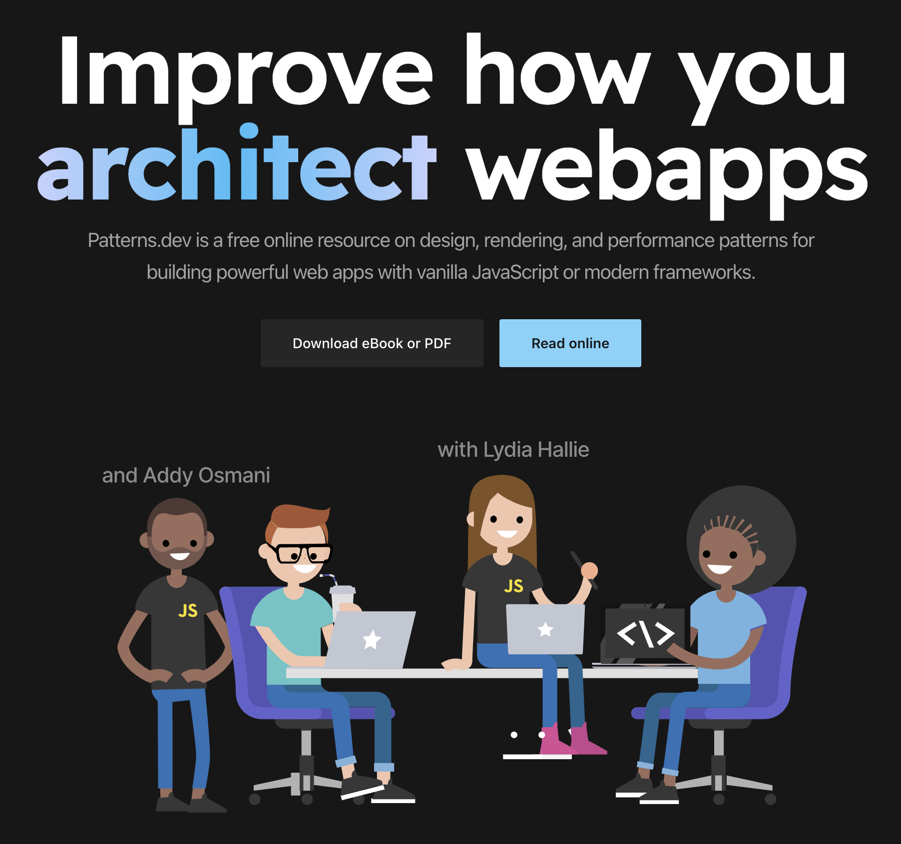
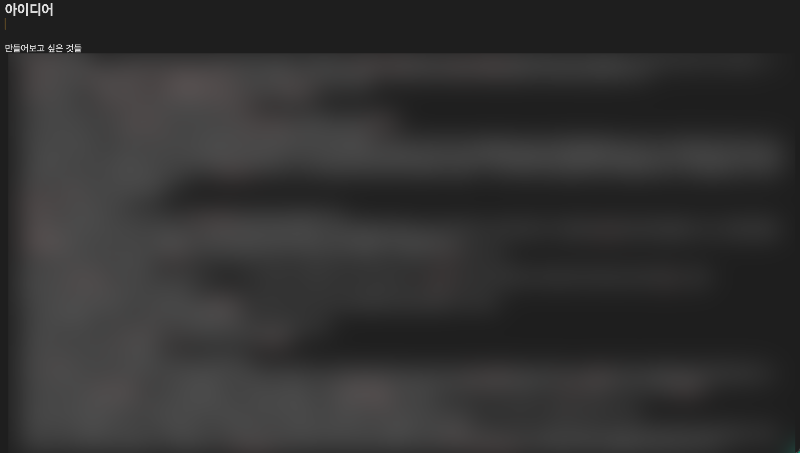

 

# 들어가며

2021년 회고 이후 회고를 처음 작성한다.
사실상 한 해만 건너뛴 셈인데, 작년에는 왜 건너뛰었을까?
기억이 명확하게 나지는 않지만 아마 작성려고 시도하긴 했던 것 같은데, 시간이 없다는 미루고 미루다 해를 넘기게 됐고 결국엔 써봤자 달라지는게 있겠느냐는 식의 어리석은 생각으로 포기했던 것 같다.
그래서 그런지 2022년은 기억에 남는 장면들이 잘 떠오르지가 않는데, 나쁘게 말하면 정말 그냥 무지성으로 일만 했던 것이다.
그렇다고 해서 2021년은 기억이 생생히 나느냐? 하면 그것도 아니고, 이렇게 회고를 해두면 2024년 이맘때가 돼서 2023년이 생생히 떠오를까? 해도 그것도 아닐 것 같다.

인간은 망각의 동물이기도 하고, 두뇌 하드웨어 스펙상으로 봐도 그렇고, 무엇보다 개인적인 성향상 지나간 일을 오래 보관하는 것을 선호하지 않아 항상 가비지 컬렉션이 필요하다.
하지만 그럼에도 불구하고, 고칠건 고치고 깨달을건 깨달아서 들고 가는게 장기적인 관점에서 좋지 않을까.
고등학교 시절 모의고사 오답노트 적듯이, 내 인생과 커리어의 오답노트를 남긴다고 생각하고 앞으로는 길게는 아니더라도 꾸준히 정리해보려고 한다.

## 개발자로서 돌아본 2023년

### 회사 안에서

#### 신규 서비스 오픈

정식으로 공개된 지 많이 지나진 않았지만 내가 소속된 개발팀 구성원의 70% 이상이 약 1년 반정도의 시간을 투입한 프로젝트가 드디어 정식으로 오픈했다.
서비스의 이름은 [엔트리 탐험하기](https://space.playentry.org/explore)로, 기존에 서비스되고 있던 엔트리의 블록 코딩을 활용할 수 있는 웹 기반 실시간 2D 그래픽 온라인 서비스이다.

_모 유저가 제작한 월드_

2022년 중순 즈음에 첫 삽을 뜨고 지금까지 프로젝트를 진행해오면서 기술적인 부분, 기획적인 부분 등 다양한 방면에서 정말 말 그대로 우여곡절도 많았지만, 클로즈 베타, 사내 공개 등을 거쳐 어찌저찌 무사히 사용자들에게 공개되어 쓰임이 생기는 모습을 보니 여러 감정들 중에서 그래도 뿌듯함이 가장 크게 들었다.

하지만 아직도 구체화되지 않은 아이디어, 개발되지 않은 스펙이 산더미처럼 쌓여있기 때문에 갈 길이 멀다.
이제 막 공개 단계이니 2024년에는 더욱 보완하고 발전시켜서 더 규모있는 서비스로 성장하는 모습을 볼 수 있다면 좋겠다.

#### 스터디

현재 소속된 회사에서는 회사 차원에서 구성원들간의 스터디를 권장하고 있다.
올 해에는 어떻게 하다보니 니즈가 맞는 분들과 몇 차례나 스터디를 진행했는데, 이에 대해 간단하게 소회를 남겨보면 좋을 것 같다.

**자바스크립트 스터디**

다른 팀 소속의 비슷한 연차의 동료분들과 함께 JS를 더 깊게 제대로 익혀보자는 취지에서 이 스터디를 시작했다.
**모던 자바스크립트 Deep Dive**라는 책을 교재로 활용해 스터디를 진행했는데, 이 책은 쪽수만 1000페이지에 달하는 굉장한 두께를 자랑하는 책이다.
그만큼 JS에 관련된 내용을 전방위적으로 다루고 있는 책인데다, [poeimaweb](https://poiemaweb.com/)을 운영하는 이웅모님이 저술하신 책이다보니 책 구성과 내용 자체는 굉장히 만족스러웠다.

스터디는 주 1회, 오프라인으로 한 자리에 모여 약 1시간동안 사전에 협의한 진도만큼의 챕터를 그 자리에서 읽고, 그 과정에서 생긴 궁금증이나 공유할만한 내용들을 약 30분에 걸쳐 토론하는 방식으로 진행했다.
이런 진행 방식이 개인적으로는 잘 맞고 효과적이라고 생각되었는데, 그 이유는 스터디 준비를 위해 별도로 할애해야 하는 소위 *"스터디를 위한 스터디"*와 같은 시간을 들이지 않아도 됐고, 다 같이 모인 자리에서 정해진 같은 분량을 소화해내는 과정이 스터디라는 목적에 더 부합한다고 느껴졌기 때문이다.

다만 이런 방식의 단점도 분명하게 체감할 수 있었는데, 하나는 스터디에 참여하는 모든 인원이 글을 읽는 속도가 동일한 것이 아니다보니 정해진 시간 안에 같은 분량을 소화해내지 못하는 인원이 생겼고, 그런 사람은 진도를 따라가기 위해 따로 시간을 할애할 수밖에 없는 부작용이 따른다는 점을 들 수 있겠다.
또 하나는, 스터디 목표로 삼은 책 자체가 워낙 두껍고 내용이 방대한데, 주 1회 1시간 30분 스터디임에도 같은 자리에서 모여 읽는 방식을 채택하다보니 완료하는 데까지 시간이 너무 오래 걸렸다는 점이다. 도중에 각자 불가피하게 스터디 날짜에 휴가를 써야 하는 날이 생기거나, 공휴일 혹은 연휴가 겹치는 등의 사유로 당초 계획했던 기간보다 완주하는 데까지 약 5주정도 시간이 지체되었다.

따라서 앞으로 또 이런 진행 방식을 스터디에 채택하게 된다면 본 스터디를 진행하기 앞서 서로 읽기 수준을 사전에 충분히 인지하고 협의할 수 있는 과정을 두면 좋을 것 같고, 공휴일이나 휴가 일정을 대략적으로 포함해 완주 기간을 넉넉하게 설정하거나 혹은 아예 기간을 타이트하게 잡고 스터디 시간이나 횟수를 늘리는 등의 방향으로 진행해볼 수도 있을 것 같다.

어쨌든 그렇게 결과적으로는 스터디를 성공적으로 마무리했으나, 시간이 반년정도 지나니 기억이 흐릿해져가는 것 같다. 아무래도 언어 자체의 철학과 구조에 대한 학습이다 보니 스터디 한 번 진행한 것 가지고는 아직 일정 수준 이상 이해했다고 하기는 어려울 것 같기도 하고, 상용 애플리케이션을 만드는 일을 하는 입장에서 평상시에 항상 사용하는 언어의 구조를 상기하면서 일하는 것도 어렵다고 생각하기 때문에, 조만간 중요하다고 체크해뒀던 부분들만이라도 복습하는 시간을 가져보면 좋을 것 같다는 생각이 들었다.

**디자인 패턴 스터디**

개인적으로 좀 반성의 감정이 드는 스터디 경험이다. 솔직히 말해서 이 스터디에 참여는 했으나 언제 시작해서 언제 끝났는지도 잘 기억이 나지 않을 뿐더러 진행 당시에 나름 열심히 참여했다고 생각하나 무엇을 얻었는지조차 자신있게 말하기 어려울 정도로 기억이 흐릿하다.

스터디는 [patterns.dev](https://www.patterns.dev) 웹사이트를 교재삼아 진행했는데, 해당 웹사이트는 영어로 작성되어있어 [한국어 버전](https://patterns-dev-kr.github.io/)도 있지만 당시에는 실제 원본 컨텐츠를 100% 번역한 것은 아닌 것으로 느꼈으며, 최근에 다시 확인해보니 원본 사이트에 새로운 컨텐츠가 업데이트되는데 번역 사이트에는 반영되지 않는 것으로 보인다.
웹사이트는 자바스크립트로 다룰 수 있는 여러가지 디자인 패턴에 대해 일반, 렌더링, 성능 섹션으로 나뉘고, 그 안에 세부적으로 개별 패턴에 대한 컨텐츠로 구성되어 있는데, 최근에는 Vanilla, React, Vue로 나뉘는 대분류 카테고리가 한 단계 더 생긴 것으로 보인다.

스터디 당시 주 1회, 스터디 참여자들 각자 본인이 원하는 컨텐츠를 선택하여 한 주동안 따로 공부하고 준비한 뒤에 스터디 시간에는 모여 자신이 담당한 내용을 발표하는 방식으로 진행되었는데, (핑계일 수도 있지만) 그런 진행 방식 때문인지 개인적으로는 스터디에 몰입하기 어려웠던 것이 아닐까 하는 생각이 든다. 개인적으로는 서로 다른 부분을 맡아 따로 준비해서 발표를 통해 진도 범위를 커버하는 방식이 가장 이상적이면서도 아이러니하게도 가장 최악의 스터디 진행 방식이 아닐까 생각된다.

당시의 기억을 좀 더 구체적으로 떠올려보면, 해당 주제에 대해 이미 글과 그림으로 잘 정리가 되어 있는 컨텐츠가 기본적으로 주어지다보니 이를 활용해서 혹은 해당 주제에 대해 더 깊게 다른 자료들을 찾아보기보다는 이미 있는 자료에 의존하게 되었던 것 같고, 그래서 결국 발표시간에는 화면의 글을 그냥 앵무새처럼 따라읽는 꼴이 되었으며, 내가 그런식으로 하다보니 다른 사람의 발표에도 귀 기울이지 못하게 되어 사실상 이도 저도 아닌 시간 낭비를 한 꼴이 되었던 것 같다.
또 다른 관점에서, 해당 스터디를 통해서 도출된 어떤 결과물이 전무하고, 어떤 결과물을 도출하려는 실질적인 노력 또한 딱히 없었으며, 하물며 주간 개인별 담당 주제 배정도 구두로 진행하고 기억에 의존하여 간단한 체크박스조차 기록하지 않았기 때문에 적극적으로 참여하기보단 솔직히 끌려다니는 형태가 되었던 것 같다.

돌이켜보면, 종합적으로 여러 방면에서 아쉬움이 남는 스터디다.
특히 이 스터디 경험을 통해 앞으로 새로운 어떤 스터디를 시작하게 된다면, 진행 방식에 대해서 충분한 고민이 필요하고 참여자들 간에도 충분한 협의와 인지가 바탕이 되어야 모두에게 시간 낭비 없이 건강한 방향으로 스터디가 진행될 수 있다는 점을 깨닫게 되었다.
또한, 자료 자체는 굉장히 좋았던 기억이 있고 최근에도 계속 업데이트가 되는 것으로 보아 시간을 내어 혼자서라도 하나씩 다시 차근차근 읽어보는 것도 좋을 것 같다는 생각이 들었다.

**플러터 스터디**

최근 들어 시작해 진행중인 스터디이다.

이전에도 크로스 플랫폼 모바일 개발에 대한 관심은 꾸준히 있었고, 그 중에도 아무래도 커리어 초기부터 React를 주로 사용하다보니 React Native에 대해서도 관심이 많았고 실제로 튜토리얼도 다뤄본 뒤로 제대로 공부해야봐야겠다는 생각을 가지고 있었다.
하지만 이러저러한 핑계로 미루던 중, 최근 1년동안 Flutter에 대한 이야기들을 자주 접하게 되어 이런 것도 있구나 인지하고 있던 차에, 팀 내 시니어 분의 스터디 모집 공고(?)를 보고 이번 기회에 한 번 찍어 먹어봐야겠다는 생각에 참여하게 되었다.

완전 최근에 시작해서 아직 스터디가 마무리되지도 않은데다 플러터에 대해 뭐가 뭔지 모르는 상황이라 코멘트하기는 어렵지만, 재미있을 것 같다는 느낌이 든다. 아이디어 노트에 모바일 앱과 관련된 것들도 꽤 있는데, 이 도구를 통해 재밌는 서비스를 만드는 계기가 됐으면 좋겠다.

#### 재택근무

나는 입사 때부터 지금까지 원격 근무를 하고 있다.
처음 입사할 당시에는 아직은 코로나가 한창일 때였기 때문에 어찌 보면 당연한 근무 정책이라고 받아들였지만, 그로부터 2년이 넘게 지난 지금은 그때와는 상황이 많이 달라져 재택근무가 당연하다고는 말하기 어려워졌다.
듣기로는 코로나가 시들해지면서 많은 기업에서 재택근무를 철회하고 기존의 전일출근제로 돌아가는 분위기로 알고있는데, 같은 시기에 내가 근무하고 있는 회사에서는 최소 주 2회 이상 사무실로의 자율 출근 방식과 전면 재택 근무 방식을 선택할 수 있도록 정책이 시행되었고, 나는 계속해서 재택근무를 선택해서 근무하고 있다.

그렇게 결정하게 된 배경에는 어떤 생각들이 작용했을까.
솔직하게 입사때부터 계속 해오던 관성이 아예 영향을 주지 않았다고는 하기 어려울 것이다. 그리고 출근 전 준비 시간, 출퇴근 이동시간, 퇴근후 정리시간 모두 없이 씻지도 않은 채 일을 할 수 있다는 시간적인 이점 또한 한 몫 했다고 할 수 있다.
사실 조금 더 구체적으로 생각해보면 담당하고 있는 업무와 관련된 대부분의 요소들에서 대면이 꼭 필요하다거나 대면으로 했을 때 더 생산성이 올라가는 것도 아니고, 개인적인 성향상 업무 집중도가 사무실에서 유의미하게 올라간다거나 하는 것도 아니었고, 업무와 관련된 동료들 또한 대부분이 원격 혼합 형태로 근무를 하고 있었기 때문에 사무실에 나간다고 업무적인 상호작용의 정도가 올라가는 것도 아니었기 때문에 앞서 언급한 재택근무의 장점들을 애써 무시하고 출근을 할 이유가 딱히 없었다고 정리할 수 있을 것 같다.

그렇다면 이쯤에서 나는 과연 재택 근무를 _"잘"_ 하고 있을까?
일단 재택근무로 인해 업무를 수행함에 있어서 불편함을 겪은 적이 없고 업무 집중도 차이도 크게 느끼지 못하고 있기 때문에 근무 시간 자체는 나름 재택 근무로도 잘 풀어가고 있다고 느끼는데, 재택근무를 통해 앞서 언급한 것처럼 출근에 비해 얻는 시간적 이득이 어마어마하게 많음에도 이를 장점으로써 제대로 활용하고있지 못한 것 같다.
이처럼 재택근무를 _잘_ 한다는 것은 단지 업무 효율 측면에서 사무실에서와 큰 격차 없이 업무를 수행하는 것에 그치는 것이 아니라, 재택근무를 통해서 얻을 수 있는 시,공간적 이점을 극도로 활용하여 업무 뿐만 아니라 개인의 성장에 녹여내는 것이 아닐까 하는 생각이 든다.

지금까지는 항상 업무 시작 직전에 일어나거나, 퇴근해야할 시간에 업무가 늘어져 비생산적으로 야근을 하게 되는 등, 생활 측면에서 재택근무를 제대로 활용하지 못한 역풍을 그대로 맞고 있었는데, 앞으로는 평상시에도 사무실에 출근을 하는 것처럼 생활 패턴을 재조정해나가는 것이 우선적인 목표로 삼아야겠다는 생각이 들었다.
이 근무 제도가 언제까지 이어질 지도 모르는 일이고, 무엇보다 다른 기업으로 이직을 염두에 둔다면 사무실로 출근하는 환경에 더 익숙해지는 것이 장기적으로 나에게 득이 될 것이라고 생각된다.

### 회사 밖에서

#### 사이드 프로젝트

언제부터인지 정확히 기억은 나지 않지만, 어떤 아이디어가 떠오르면 구체화시켜볼 가치가 있겠다는 생각이 들 때에는 그 생각이 휘발되기 전에 메모하는 버릇이 생겨 그렇게 하나하나 적어둔 아이디어가 지금까지 가지각색으로 이렇게나 많이 쌓였다.

> 공개하기는 민망하지만, 사소한 생활 속 문제 해결을 위한 아이디어부터 훗날 사업으로 뛰어들어보고 싶은 아이디어까지 다양하다.

개인적으로 개발자 실무를 처음 제대로 입문하게 되었던 산학 연계 인턴십을 수행할 당시에도 직접 체감했고, 지금도 그렇다고 생각하는건 확실히 개발 실력은 직접 뭔가 만드는 과정에서 가파른 성장을 할 수 있다는 것이다.
인턴십 당시 나는 학교 수업을 통해 갓 HTML, CSS, JS의 기초정도만 배운 수준이었고 입사 직전에 React 튜토리얼을 수강하고 그것을 완전히 이해도 하지 못한 상태였는데, 내 앞에 놓여진 문제를 어떻게 하면 해결할 수 있을까를 치밀하게 고민하고 그 문제를 나름의 방법으로 어떻게든 해결해나가는 과정에서 단지 문제 해결 능력 뿐만 아니라 거기에 사용한 기술의 숙련도가 빠르게 성장할 수 있었다.

> 물론 이와 별개로 나중에 깨닫게 된 것이지만, 위에서처럼 직접 부딪히는 경험에서 숙련도는 성장할 수 있겠으나 그 기술에 대한 깊은 이해도를 갖는 것은 전혀 다른 차원의 문제이다.
> 이러한 실전 경험을 통해 성장할 수 있는 스킬적인 면은 어느정도 제한적이라고 보이고, 그 이상의 수준에 도달하기 위해서는 어찌 보면 당연한 말이지만 그 기술의 바탕이 되는 제반 지식과 개념을 조금은 깊게 공부할 필요가 있겠다. (_나는 개인적으로 이를 좀 늦게 깨달은 편인 것 같다._)

올해에는 개인적으로 프로젝트를 하나쯤은 꼭 해야겠다는 생각에, 메모에 적어둔 여러 아이디어들 중 하나인 로또 복권 응모 번호를 생성해주는 웹사이트를 채택해서 개발을 시작했다. 개인적으로 로또 복권을 소액으로 종종 구매하기도 하고, 어차피 자동 복권을 구매할 거면 내가 직접 랜덤으로 추출한 번호를 수동으로 구매해도 좋을 것 같다는 생각에서 출발했다.
화면 설계와 디자인, 세부 기능과 관련된 기획도 직접 하고, 라이브러리를 사용하면 간단한 컴포넌트들도 직접 만들어보는 등 과정에서 다양한 문제를 마주하고 나름대로 해결하면서 진행하고 있다. 4분기에 들어서 본격적으로 작업에 들어가다보니 아직 초반에 생각했던 완성 단계에는 접어들지 않아서, 이 프로젝트에 대한 구체적인 개발 후기는 작업이 어느정도 마무리가 됐을 때 따로 정리해야겠다. ([웹사이트](https://rantto.app), [Repo](https://github.com/anthonyminyungi/rantto))

올해도 메모장에 잠자고 있는 아이디어를 최소한 1개 이상은 세상 밖으로 내놓기 위해 노력할것이며, 가능하다면 이를 통한 수익화도 꿈꾸고 있다.

#### 커리어 관리

구체적으로 어떤 특별한 계기가 있었던 것은 아니지만, 현재 재직중인 회사에 입사한 뒤부터 어느정도 담당하던 굵직한 프로젝트가 마무리되거나 직무 관련 새로운 경험을 하게 되면 그 때마다 이력서에 관련된 내용을 정리해서 업데이트하고 있다. 사실 초반엔 근시일 내에 다른 회사로의 이직을 대비하기 위해 작성했던 것 같은데, 이제는 그런 것도 일부 있지만 나중에 적으려고 하면 기억이 선명하지 않을 것이 뻔하기 때문에, 내가 맡았던 일을 까먹기 전에 조금씩 정리해두는 목적이 더 커진 것 같다. 월별, 분기별 회고 형태로 글로써 정리하면 더 좋겠지만 이력서 정리를 통해 어느정도 대체하고있는 것 같다. 앞으로는 짧은 단위의 회고도 작성하려고 노력할 필요가 있겠다는 생각이 든다.

이력서는 이전에는 본 블로그의 템플릿에 포함되어있는 마크다운 파일을 기반으로 작성하곤 했는데, 텍스트나 화면 스타일을 일부 내 입맛에 맞게 수정하고 싶거나 할 때 대응이 번거로운 등의 불편함이 있어 우선은 임시로 Notion으로 이력서를 관리하고 이를 pdf로 추출해 사용하고 있다. 가까운 미래에 직접 블로그 스타터를 제작하고 싶어 계획중에 있는데, 그 스타터 내에 나름대로 고민을 녹여 나만의 이력서 웹사이트를 만들어 정착하고 싶다.
현재는 Notion 이력서에 업데이트하는 내용을 동일하게 다른 채용 및 헤드헌팅 플랫폼(_LinkedIn, 프로그래머스, 원티드, 리멤버 등_)에도 동일하게 업데이트하고 있는데 사실 매번 여러개를 하나씩 업데이트하는 것이 좀 번거로운 부분이 있어 사용하는 플랫폼 개수를 줄이거나 더 나은 관리 방법이 있을지 고민하고 있다.

이력서를 정리하는 것에 그치지 않고 내가 현재 채용시장에서 경쟁력이 있는지, 반대로 현재 채용시장이 어떻게 돌아가고 있는지 파악하기 위해 올해에도 여러 공고에 지원서를 넣어봤고, 그 중 두 개의 공고에서는 면접까지 진행했었다. 그 과정에서 깨달은 점 두 가지 중 하나는 내가 작성한 이력서가 생각외로 효과가 있었다는 것이고, 다른 하나는 내가 면접에서 굉장히 취약하다는 점이었다. 기술 면접에서 요구되는 지식에 부족한 부분이 은근히 적지 않고, 그나마 알고있는 지식조차 긴장을 너무 많이 하는 탓에 그마저도 제대로 대답하지 못한다는 것을 알게 됐다. 이런 소득이 있었으니 앞으로는 그와 관련된 부분을 보완하는 데 노력을 기울여야겠다.

#### 블로그

블로그는 왠지 모르게 항상 마음 한켠의 빚처럼 느껴지는 활동이다. 내가 겪은 문제 해결 경험들을 글로 정리하는 것으로 스스로의 성장에 도움이 된다는 점이 매력적이지만, 그만큼 잘 정제된 글을 결과물로 도출해내야 한다는 부담감이 역설적으로 그 행동을 실천함에 있어 큰 방해요소가 되기도 하는 것 같다. 그런 부분에 있어서는 그나마 다행이라고 해야할지, 올 해에는 두 개 정도의 포스트를 등록했다.

어떤 분들은 블로그를 운영하면서 좋은 포스트를 많이 작성하고 많은 방문자를 유입시켜 광고 수익까지 올리는 분들도 있지만, 나는 아직 그정도의 그릇은 되지 못하는 것 같다. 그래도 이 활동을 놓지 않고 이어간다는 그 자체에 방점을 두고 내년에는 그래도 올해보다는 더 많은 포스트를 등록하기 위해 노력해야겠다는 생각을 한다.

## 올해 목표 점검

- `(모 대기업)`으로 이직
- `(모 대기업 근처 동네)`의 투룸으로 이사

막상 이렇게 다시 적어놓고 보니까 너무 부끄럽지만 올해에는 너무 비현실적인 목표를, 그리고 너무 단순하게 잡았던 것 같다. 사실 어찌보면 목표에 대해 크게 신경쓰지 않았던 것 같기도 하다.  
결과는 물론 이직도 실패했고, 그 기업 주변으로 이사하지도 못했다. 일단은 무엇보다 산업 전반에 깔린 경제적으로 좋지 않은 분위기의 영향으로 해당 기업에 내가 원하는 포지션의 공고가 열리지/도 않았고, 계획(보다는 희망사항)을 세울 때에는 이런 부분을 고려는 커녕 상상조차 하지 못했다.

한 해를 이렇게 다 보내고 난 뒤에 목표를 다시 보니 이렇게 허탈할 수가 없다. 그래도 목표를 이런 식으로 잡으면 큰 의미가 없다는 것을 이번에 깨달았으니 앞으로는 나에게 의미있는 목표를 더 잘 세울 수 있는 방법을 고민해나가야겠다.

## 내년 목표

그런 의미에서 내년에는 조금 더 구체적이고 명확한, 그리고 실현 가능한 수준으로 목표를 잡아보고 싶다.

- 아침형 인간 되기
  - 지금까지는 일어난지 30분도 안돼서 업무를 시작하는 경우가 많았다.
  - 최소한 평일에는 8시 이전 기상해 아침 시간을 활용하자.
- 월 초과근무시간 20시간 미만으로 줄이기
  - 올해에는 일이 많았던 탓도 있지만 너무 일하는 시간을 효율적으로 사용하지 못한 결과 업무 시간이 늘어져 야근이 잦았고, 그로 인해 초과근무를 많이 할 수밖에 없었다.
  - 내년에는 실제로 바빠서 일을 많이 하는 것은 어쩔 수 없겠지만 업무시간을 최대한 효율적으로 활용해서 불필요한 야근을 줄이자.
- 영어 회화 공부하기
  - 영어 실력은 지금보다 더 나이가 들기 전에 수능영어를 벗어나는 수준으로의 성장시켜야 한다고 생각하기 때문에 내년에는 회화 공부를 시작하자.
- 나만의 블로그 만들기
  - 현재는 다른 개발자가 제작하신 Gatsby 스타터를 커스텀해 블로그를 운영하고 있다.
  - 이 또한 사이드 프로젝트의 일환으로 나만의 블로그 스타터를 만들어 배포하고 내 블로그도 옮겨보자.
- 1개 이상의 사이드 프로젝트로 상용 프로덕트 만들기
  - 올해 제작한 프로젝트는 수익화가 어려웠는데, 내년엔 처음부터 수익화가 가능한 구조로 시작해보자.
- 10권 이상 독서하기
  - 올해에는 밀리의서재를 통해서 6권 정도의 책을 완독했다.
  - 내년에는 소유하고 있는 종이책을 포함해 10권정도 완독을 목표로 하자.
- 회고 더 자주하기
  - 지금까지는 너무 오랜 기간 텀을 두고 내 인생을 회고하고 있다고 생각된다.
  - 앞으로는 지금보다는 더 자주 돌아보며 살자. (최소 분기별)
- 구직활동에 더 적극적으로 임하기
  - 지금까지는 소위 말해 회사와 나의 상호간의 전투력 측정 개념에서 지원했다면
  - 내년에는 정말 합격해서 이직을 하겠다는 마음가짐과 그에 맞게 준비해서 지원하자.
- 일주일에 운동 더 자주하기
  - 올해에는 바쁘단 핑계로 가까운 거리의 헬스장도 주 2회 가는 것이 최대였다.
  - 내년에는 주 4회까지 횟수를 끌어올리고, 이를 달성하지 못하는 주간을 최대한 줄여보자.
- 편의점 가공식품 섭취 줄이기
  - 재택근무를 하는동안 식사를 간단하게 하고 싶은데 마땅한 방법이 없어 거의 매 끼니를 편의점 음식에 지금까지 너무 많이 의존해왔다.
  - 내년에는 이를 대체할 최대한 비용, 노력이 최적화된 레시피로 직접 요리해먹자.

## 마치며

개인 생활에 대한 회고도 포함하고 싶었지만, 분량상 이미 너무 텍스트가 많기도 하고 다시 생각해보니 전체적인 문맥에 어울리지 않는다고 생각해 개인 노트에만 정리하고 포스트에는 제외하였다.  
2024년 이맘때에는 지금보다 조금 더 나은 사람이 되어 지금은 미래인 한 해의 시간들을 뿌듯하게 돌아볼 수 있었으면 좋겠다.

Adieu 2023.
